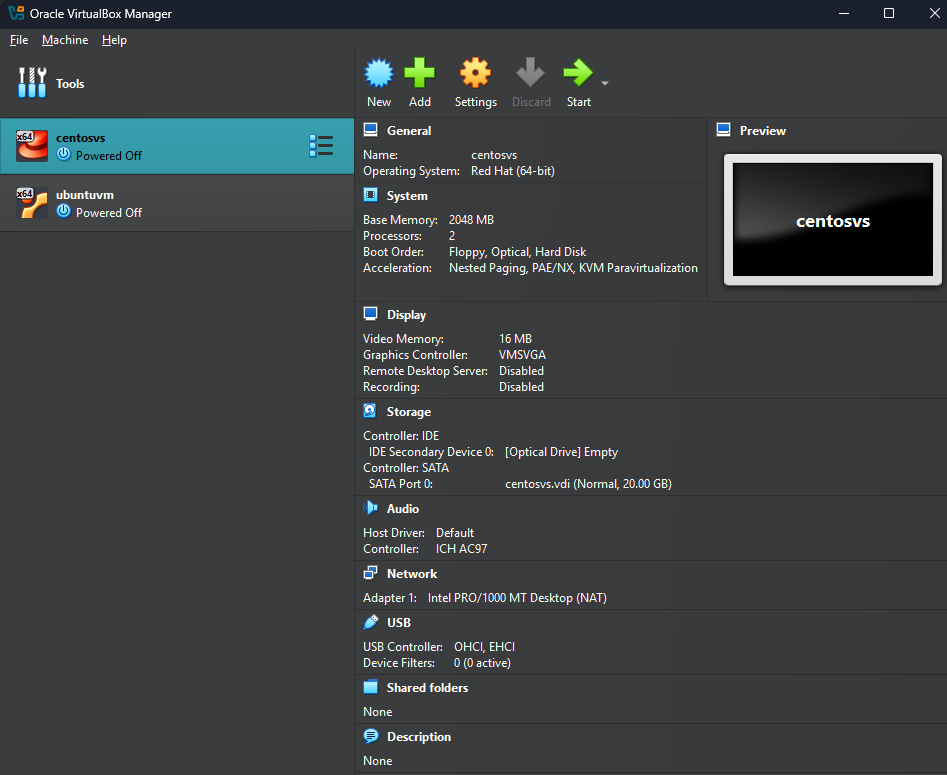
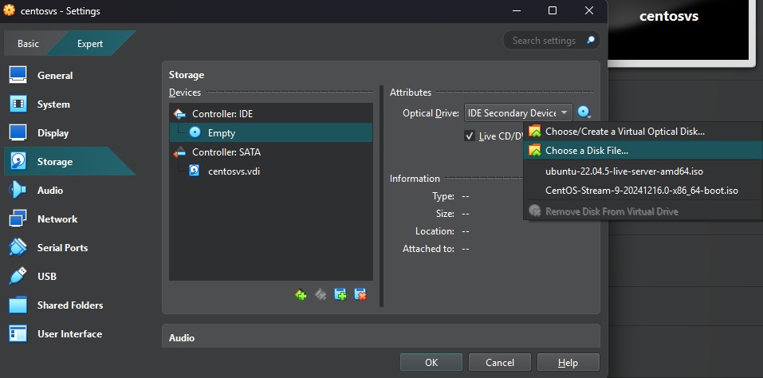
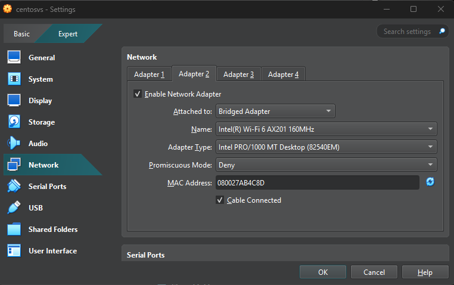
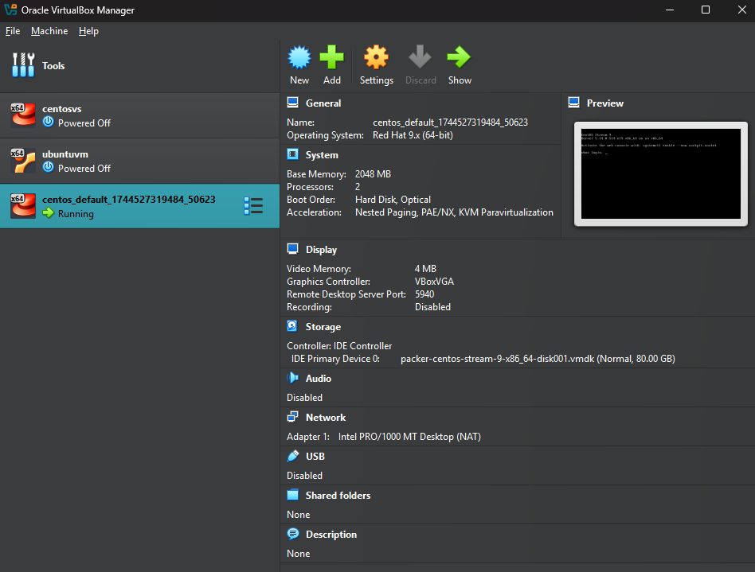

# VM Setup

**Setting Up a Linux Lab with Virtual Machines**

In traditional learning environments, setting up a Linux lab often required multiple physical machines to simulate server-client communication and multi-system networking. This setup could be expensive and time-consuming, especially when needing 5, 10, or even more machines.

Fortunately, there's a more efficient solution available today: **virtual machines**.

**What Are Virtual Machines?**

A **virtual machine (VM)** is essentially a computer within a computer. Using virtualization software, it's possible to create multiple virtual systems on a single physical machine. Each virtual system can run its own operating system, and they can be connected together to simulate a networked environment.

This approach significantly reduces the cost and complexity of building a lab. Instead of setting up physical hardware, virtual machines can be used to:

- Install and run different Linux distributions
- Configure networking between systems
- Simulate real-world server-client interactions
- Practice system administration tasks in a safe, isolated environment

In this section:

✅ You'll learn how to manually create and configure virtual machines  
✅ Then, you'll move on to automating the creation of virtual machines for faster and more consistent setups

This virtual lab environment will be used throughout the Linux section and future projects, providing a practical and scalable way to gain hands-on experience with Linux.

---

## 1️⃣ Understanding Virtualization: The Foundation of Cloud Computing and Containers

Virtualization is a core concept that underpins modern cloud computing and containerization technologies like Docker. It allows **one physical machine to run multiple operating systems simultaneously**, enabling better resource utilization, scalability, and system isolation.

Before virtualization, running services like Apache HTTP Server, MySQL, or Tomcat required physical servers. Each major service ideally ran on a separate machine to avoid conflicts and ensure security and stability—this principle is known as **isolation**. However, it often led to **underutilized resources** and high costs in terms of hardware, energy, and maintenance.

### The Problem with Physical Servers

- **One main service = One server**
- **Over-provisioning** was common: Teams would install more RAM, CPU, and storage than needed to prepare for peak loads.
- **Underutilization** became a norm: Most servers ran well below their capacity.
- **High capital and operational expenses**: Procuring, setting up, and managing physical servers was costly and time-consuming.

### The Breakthrough: Virtualization

With the introduction of virtualization platforms like **VMware**, it became possible to run multiple isolated **virtual machines (VMs)** on a single physical server. Each VM acts like a real computer, complete with its own operating system, applications, and virtual hardware.

This allowed for:

- Better resource utilization
- Improved scalability and flexibility
- Easier backup, recovery, and replication
- Lower infrastructure and energy costs

### Key Virtualization Concepts

- **Virtual Machine (VM):** A software-based simulation of a physical computer. Multiple VMs can run on a single physical machine.
- **Host Operating System:** The OS installed on the physical computer.
- **Guest Operating System:** The OS installed within a virtual machine.
- **Snapshot:** A backup feature that captures the current state of a VM for quick restore or rollback.
- **Hypervisor:** The software that enables virtualization by creating and managing virtual machines.

### Types of Hypervisors

| Type                    | Description                            | Use Case                       | Examples                              |
| ----------------------- | -------------------------------------- | ------------------------------ | ------------------------------------- |
| **Type 1 (Bare Metal)** | Runs directly on hardware              | Production environments        | VMware ESXi, Xen, Microsoft Hyper-V   |
| **Type 2 (Hosted)**     | Runs on top of an OS as an application | Learning, testing, development | Oracle VirtualBox, VMware Workstation |

### Why It Matters

Virtualization makes it possible to:

- Simulate multi-node networks on a single laptop
- Practice Linux and server configurations without expensive hardware
- Easily reset or replicate systems using snapshots
- Scale and distribute workloads effectively in cloud environments

In the upcoming sections, virtual machines will be created both manually and automatically to simulate real-world infrastructure. This will lay the groundwork for hands-on practice with Linux and other tools throughout the course.

---

## 2️⃣ Creating Virtual Machines for Linux Practice

Before diving into hands-on Linux practice, it’s essential to set up a virtual environment. In this section, we’ll walk through the process of creating **two Linux virtual machines (VMs)**—one based on **CentOS** and the other on **Ubuntu**, two widely-used Linux distributions. The deeper differences between these will be covered later in the Linux section.

### Two Methods to Create VMs

There are **two approaches** for setting up virtual machines:

1. **Manual Setup**  
   This is a step-by-step, wizard-based method where users create the VM and install the operating system interactively. It provides an understanding of every configuration involved in setting up a virtual environment.

2. **Automated Setup**  
   In this method, a configuration file (typically a `Vagrantfile`) is created, and a single command is used to bring up a VM. It's much faster and more efficient, especially when dealing with multiple machines.

> ⚠️ **Important Principle:**  
> Always **learn the manual process** before automating it. Understanding each step in detail helps build a strong foundation. Automation is simply a way to streamline manual tasks using tools or scripts.

### System Requirements

To follow along with the setup, ensure the following:

- A **64-bit computer**
- A **stable, high-speed internet connection**
- Operating System: Windows 10/11, macOS (Intel or M1/M2 chip), or Linux

Even if you're using a Linux desktop, you'll still need to create Linux VMs as part of the practice environment.

> Later in the course, we’ll move to **cloud-based infrastructure (AWS)**, but for initial hands-on experience, local VMs are essential.

### Prerequisites

Ensure that the tools mentioned in the [prerequisites](/doc/02.%20Prerequisites.md) section are already installed. For the manual and automated setup, different tools are required:

#### Manual VM Setup

- **Oracle VM VirtualBox** (Hypervisor for Windows, macOS Intel, and Linux)
  > _Note: VMware or other hypervisors are not recommended for this course._
- **ISO Files** for CentOS and Ubuntu (Linux installation images)
- **SSH Clients** such as Git Bash or PuTTY (for accessing VMs via terminal)

#### Automated VM Setup

- **VirtualBox** (as above)
- **Vagrant** (Tool for automating VM creation)
- For macOS M1/M2 users: An alternate virtualization tool is covered in a separate section

### What You'll Do in the Labs

There are **two hands-on labs** in this section:

1. **Manual Lab:**

   - Create a VM in VirtualBox
   - Attach the Linux ISO
   - Install the OS interactively

2. **Automated Lab:**
   - Write a `Vagrantfile` specifying the desired Linux box
   - Run `vagrant up` to provision the VM automatically

Both methods help build a strong foundational understanding of virtualization and VM provisioning. Now, let’s get started with the manual setup!

---

## 3️⃣ Setting Up a Virtual Machine on Windows

In this section, we'll walk through the process of setting up a virtual machine (VM) on Windows. This guide is specifically tailored for Windows users, as macOS users won’t have access to the same settings for virtualization.

### Prerequisites: Enabling Virtualization and Disabling Windows Features

Before starting the setup, there are a few essential steps to complete:

1. **Enable Virtualization in the BIOS**:  
   To get started, you'll need to enable virtualization in your BIOS settings. This is crucial for running virtual machines on your system. The method to access BIOS varies by manufacturer, so depending on whether you're using an HP, Lenovo, or other brand, the key to press (such as F2, F12, Delete, or Esc) may differ. Once inside the BIOS, look for options such as “Intel VT-x,” “Secure Virtual Machine,” or simply “Virtualization,” and enable them. Save your changes and exit BIOS.

2. **Disable Conflicting Windows Features**:  
   On Windows, certain features might interfere with virtualization. To ensure a smooth setup:
   - Go to the Start menu, search for “Windows Features,” and open the "Turn Windows features on or off" menu.
   - Uncheck the following options:
     - **Microsoft Hyper-V**
     - **Windows Hypervisor Platform**
     - **Windows Subsystem for Linux**
     - **Docker Desktop**
     - **Virtual Machine Platform**
   - After unchecking these options, click OK and reboot your system.

By completing these steps, you'll avoid common errors that could occur during the VM setup.

### VM Setup Process in VirtualBox

Now, let's dive into setting up the virtual machine using Oracle VirtualBox.

1. **Install Oracle VirtualBox**:  
   If you haven’t already installed Oracle VirtualBox, make sure you do so from the official website. After installation, you can check the version by clicking on the “Help” tab and selecting “About VirtualBox.”

2. **Create a New Virtual Machine**:

   - Open VirtualBox and click on the "New" button (gear icon).
   - Enter the name of your VM (e.g., “centosvm” for a CentOS VM).
   - Select the type as "Linux," the subtype as "Red Hat," and the version as "64-bit" (make sure VT-x is enabled if you only see 32-bit).
   - Set the amount of memory (RAM) for your VM. For instance, 2GB (2048MB) is recommended, but you can reduce it if your computer has limited resources.
   - Select the number of CPUs (two CPUs is ideal for better performance).

3. **Configure Storage and Disk Size**:

   - When setting the hard disk, choose a dynamically allocated disk with a maximum size of 20GB. This ensures that the disk grows as needed rather than pre-allocating the entire size upfront.

4. **Create the Second Virtual Machine (Ubuntu)**:  
   Repeat the process for the Ubuntu VM, selecting the type as "Ubuntu" and the version as "64-bit." This VM will have a default disk size of 25GB.



You can check your current Operating system IP configuration using the `ipconfig` command in Windows.

```log
Wireless LAN adapter Wi-Fi:

   Connection-specific DNS Suffix  . : bbrouter
   Link-local IPv6 Address . . . . . : fe80::3dad:c04a:1fe1:403%13
   IPv4 Address. . . . . . . . . . . : 192.168.1.7
   Subnet Mask . . . . . . . . . . . : 255.255.255.0
   Default Gateway . . . . . . . . . : 192.168.1.1
```

### 3.a. Installing CentOS Stream 9

Next, we’ll install CentOS on the CentOS VM.

1. **Download CentOS ISO**:  
   Search for “CentOS Stream 9 ISO download” on Google, and choose the file named "boot.iso" (around 1GB in size). Once downloaded, save it on your computer.

2. **Attach the ISO to the VM**:  
   In VirtualBox, select your CentOS VM, then click on "Settings." Under the "Storage" section, click the empty disk icon, choose "Choose a disk file," and select the CentOS ISO. Make sure to enable the "Live CD/DVD" option.



3. **Network Configuration - Bridged Adapter**:  
   To enable the VM to connect to your network, use a bridged adapter. In the network settings of the VM, select "Adapter 2" and attach it to your physical network adapter (Wi-Fi or Ethernet). Make sure "Cable Connected" is enabled.



In the System => Motherboard section, Change the **Pointing Device** to **USB Tablet**.


4. **Start the VM and Install CentOS**:  
   Once everything is set up, start the CentOS VM and follow the on-screen instructions to begin installation. You will need to select the language, installation destination (the 20GB virtual hard disk), and configure the network settings.

   Note: On clicking the VM, the mouse control will go to the VM. To release the control use Right Control (Ctrl) button.

5. **Set Up Hostname and Root Password**:  
   During installation, set a hostname (e.g., "centosvm") and a root password. These are crucial for accessing the system later.

6. **Finalize Installation**:  
   Once the installation is complete (which can take around 10-15 minutes), restart the VM to apply the changes to the system and **remove the ISO** file to avoid booting into the installation screen again. The VM will now boot into CentOS.

### Post-Installation Configuration

1. **Network Configuration**:  
   After booting into CentOS, use the command `ip addr show` to confirm that your VM has received an IP address in the same range as your host machine’s network.

2. **SSH Access to VM**:  
   To access the VM remotely, use SSH. Open a terminal/Git Bash on your host machine (Windows) and run the following command:

   ```bash
   ssh centosuser@192.168.1.10
   ```

   Replace “centosuser” with your username and “192.168.1.10” with the IP address of your VM (Bridge Adapter IP). Enter your password when prompted, and you’ll be logged into the CentOS VM.

3. **Shutdown the VM**:  
   Once you’re done with the setup and testing, you can shut down the VM by right-clicking on it in VirtualBox and selecting “ACPI Shutdown.”

This completes the setup of your CentOS virtual machine. By following these steps, you’ve created a virtual environment on your Windows system that will serve as a foundation for learning and experimenting with Linux.

### 3.b. Installing Ubuntu Server on a Virtual Machine

Now, let's go through the process of installing Ubuntu Server on a virtual machine.

1. **Download the Ubuntu ISO**  
   First, download the Ubuntu 22.04 LTS (Jammy Jellyfish) server ISO. Make sure you select the **server installation image**, not the desktop version. Once you’ve located the ISO, click to download it. This may take a moment, so feel free to pause your screen while the download completes.

2. **Prepare the Virtual Machine**  
   After the download finishes, proceed with setting up your virtual machine.

   - Open your VM settings and go to the **Storage** tab.
   - In the storage section, click the CD icon in the "Controller: IDE" section and select the Ubuntu 22 ISO file you just downloaded.

   Next, configure the network settings:

   - Go to the **Network** tab, enable **Adapter 2**, and choose **Bridged Adapter**. Select the network adapter connected to your router (typically, your wireless adapter).
   - Click **OK** to save the settings.

3. **Start the Installation**  
   Now, start the virtual machine, and the Ubuntu installation process will begin. Follow the on-screen prompts, mostly selecting **Next** for default options.

   - **Language**: Choose **English** and hit **Enter**.
   - **Updates**: Select **Continue without updating** and press **Enter**.
   - **Disk Partitioning**: When asked about partitioning, use the **Tab** key to navigate to **Done**, then press **Enter**.
   - **Network Configuration**: Ensure both network adapters show up, with IP addresses visible. Once confirmed, hit **Done** and continue.

4. **Set up User Details**  
   You will be prompted to enter your personal details:

   - **Full Name**: Choose your name.
   - **Server Name**: You can name your server (e.g., "Ubuntuvm").
   - **Username**: Set a username (e.g., "DevOps").
   - **Password**: Choose a secure password and confirm it.

   Once entered, use the **Tab** key to select **Done** and proceed.

5. **Install OpenSSH Server**  
   During the installation, make sure to select **OpenSSH Server**. This option allows you to SSH into the server later. If you miss this step, you won’t be able to access your server remotely. To select it, use the spacebar to toggle the checkbox and hit **Done**.

6. **Complete the Installation**  
   After configuring the user and SSH settings, the installation will begin. This process can take around 10-15 minutes. Once it finishes, you’ll be prompted to reboot the VM. Instead of rebooting, we’ll power off the VM at this point.

   - Power off the VM by selecting **ACPI Shutdown** from the VM menu.
   - In the VM settings, go to **Storage**, and remove the Ubuntu ISO from the virtual drive.

7. **Start the Virtual Machine**  
   After the VM is powered off, click **Start** to boot it up again. It might take a little time for the VM to come online. Once it does, log in using the username and password you created.

8. **Check IP Address**  
   Once logged in, use the command `ip addr show` to find the server’s IP address. For example, it might be `192.168.1.11`.

9. **SSH into the Server**  
   Open Git Bash on your local machine and type the following command to SSH into the server:

   ```bash
   ssh username@192.168.1.11
   ```

   Enter the password for your username, and you should now be logged into the Ubuntu server.

10. **Shutdown and Wrap Up**  
    You can now exit from the VM and power it off.

This concludes the Ubuntu Server installation process on a virtual machine. In the next lectures, we’ll explore how to automate this entire process for faster setup. Stay tuned!

---

## 4️⃣ Getting Started with Vagrant: Simplifying Virtual Machine Management

In this section, we'll dive into a powerful tool called **Vagrant**, which helps automate the creation and management of virtual machines (VMs).

At its core, **Vagrant is a VM lifecycle automation tool**—it handles everything from spinning up VMs, configuring them, and eventually tearing them down. However, it’s important to understand that Vagrant is _not_ a replacement for virtualization platforms like **VirtualBox** or **VMware**. Instead, it works **on top of these hypervisors** to orchestrate VM creation and configuration.

### Why Vagrant?

Managing VMs manually can be tedious. You often have to:

- Go through long OS installation steps
- Allocate resources like CPU and RAM manually
- Install software and apply configurations one by one
- Repeat the process on multiple machines or share steps via documentation

This is not only **time-consuming**, but also prone to **human error**, especially when setting up multiple VMs or replicating environments across systems.

This is where **Vagrant shines**.

### Vagrant Boxes: Prebuilt VM Images

Vagrant simplifies everything by using **prebuilt images called "boxes"**, which are available on [Vagrant Cloud](https://app.vagrantup.com/boxes/search). These boxes eliminate the need for OS installation from scratch. Once a box is downloaded, you can spin up as many VMs from it as you want.

All configuration details are stored in a **`Vagrantfile`**—a simple, editable text file where you define the VM's specs (CPU, RAM, IP, etc.), provisioning scripts, and more.

### Basic Vagrant Workflow

Here’s a quick overview of working with Vagrant:

1. **Create a project folder**
2. **Run `vagrant init <box-name>`** to generate a `Vagrantfile`
3. **Customize your `Vagrantfile`** as needed
4. **Start your VM with `vagrant up`**
5. **SSH into it with `vagrant ssh`**
6. **Stop (`vagrant halt`) or destroy (`vagrant destroy`) as needed**

### Architecture Overview

When you run `vagrant up`:

- Vagrant reads the `Vagrantfile`
- Checks if the specified box exists locally; if not, it downloads it from Vagrant Cloud
- Uses the default hypervisor (typically VirtualBox) to create and configure the VM

### Hands-On: Setting Up Your First VM

Let’s walk through setting up a CentOS 9 VM using Vagrant:

1. **Open Git Bash (on Windows) or Terminal (on macOS)**
2. Navigate to or create a folder where your VM files will live (e.g., `mkdir vagrant-vms`)
3. Inside that folder, create two subfolder for the VM (e.g., `mkdir centos ubuntu`). Go inside the `centos` folder using the `cd centos` command.
4. Go to [Vagrant Cloud](https://app.vagrantup.com) and search for a box (e.g., `eurolinux-vagrant/centos-stream-9`)
5. Initialize the VM:

   ```bash
   vagrant init eurolinux-vagrant/centos-stream-9
   ```

   You should see the `Vagrantfile` in the current directory. Use the `cat Vagrantfile` command to check its contents. You will find this line:-

   ```ruby
   config.vm.box = "eurolinux-vagrant/centos-stream-9"
   ```

6. Start the VM:

   ```bash
   vagrant up
   ```

   > ⚠️ You may need to disable antivirus, disconnect VPNs, or switch networks if you encounter issues during startup.

7. Check box and VM status:
   ```bash
   vagrant box list
   vagrant status
   ```

Once the VM is running, you can even see it listed in the **VirtualBox UI**, although all interactions should ideally happen through Vagrant commands.

```bash
$ vagrant status
Current machine states:

default                   running (virtualbox)

The VM is running. To stop this VM, you can run `vagrant halt` to
shut it down forcefully, or you can run `vagrant suspend` to simply
suspend the virtual machine. In either case, to restart it again,
simply run `vagrant up`.
```



### a. Working with Your Vagrant VMs

Once your VM is set up with Vagrant, it's time to get comfortable interacting with it.

To log into your VM, simply run:

```bash
vagrant ssh
```

This command uses SSH under the hood and logs you into the VM. Notice how the terminal prompt changes — it now shows `vagrant` as the user, indicating you're inside the VM.

```log
vks@program MINGW64 /c/workspace/devops/vagrant-vms/centos (vmsetup)
$ vagrant ssh
This box was generated by EuroLinux

Any suggestions are welcome at https://github.com/EuroLinux/cloud-images-rfc/

Happy using.
To delete this message use:
echo '' > /etc/motd
[vagrant@vbox ~]$
```

To confirm, you can use:

```bash
whoami
```

This returns the current user — `vagrant` in this case. The `pwd` command will show you're in the `/home/vagrant` directory.

Want to switch to the root user?

```bash
sudo -i
```

Again, notice the prompt change. You’re now the `root` user. To exit back to the `vagrant` user, type `exit`. Run `exit` again to leave the VM entirely and return to your host system.

```log
[vagrant@vbox ~]$ whoami
vagrant
[vagrant@vbox ~]$ sudo -i
[root@vbox ~]# whoami
root
[root@vbox ~]# exit
logout
[vagrant@vbox ~]$ exit
logout
```

#### Managing the VM Lifecycle

To manage the VM's state, Vagrant provides several simple commands:

- **Power off the VM**

  ```bash
  vagrant halt
  ```

- **Start or bring up the VM**

  ```bash
  vagrant up
  ```

- **Reboot the VM (useful when you update the `Vagrantfile`)**
  ```bash
  vagrant reload
  ```

Note: Changes to the `box` name in the `Vagrantfile` won’t apply with just a reload. You’ll need to destroy and recreate the VM in that case.

#### Deleting and Recreating the VM

To completely remove the VM:

```bash
vagrant destroy
```

You'll be prompted for confirmation. Once destroyed, you can recreate the VM using `vagrant up`. Check the status with `vagrant status`.

Remember: These commands need to be executed **from the folder containing your `Vagrantfile`**.

#### Working with Multiple VMs

To see the status of all Vagrant VMs on your machine:

```bash
vagrant global-status
```

You can prune stale entries (from deleted VMs) with:

```bash
vagrant global-status --prune
```

You’ll see details like folder path, VM name, and current state (running, poweroff, etc.).

### b. Creating Additional VMs (Ubuntu Example)

Let’s create another VM, this time using Ubuntu:

1. Navigate to your desired directory:

   ```bash
   cd ../ubuntu
   ```

2. Initialize the Ubuntu box:

   ```bash
   vagrant init ubuntu/jammy64
   ```

3. Start the VM:

   ```bash
   vagrant up
   ```

4. Log in:
   ```bash
   vagrant ssh
   ```

#### Helpful Extras

- **List all downloaded boxes on your machine**

  ```bash
  vagrant box list
  ```

- **View your command history**
  ```bash
  history
  ```

You can use arrow keys (↑/↓) to scroll through previously entered commands. This becomes super handy over time.

### Final Tips

- Always **power off** your VMs with `vagrant halt` before shutting down your host machine (Windows).
- Manage everything through Vagrant, not VirtualBox directly, to avoid inconsistencies.
- **You can safely delete manually created VirtualBox VMs now — we’ll stick with Vagrant moving forward**.
- Keep the CentOS and Ubuntu Vagrant VMs ready — we’ll use them extensively in the Linux section.

---
