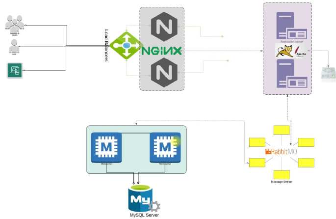

# Project Setup - Manual Process

This is the manual process for setting up a new project. Welcome to your first hands-on project! You’ll be working with VProfile, a Java-based web application made up of multiple services. Unlike traditional setups like WordPress, where Apache and MySQL might run on a single virtual machine, VProfile takes a more realistic, production-style approach - you'll deploy each service on its own virtual machine, across five separate VMs.

This project is designed to mirror real-world scenarios where developers maintain a local copy of the product to test, experiment, and troubleshoot. Get ready to dive into a practical experience that reflects how things work in the field. Let’s get started!

Project Link: [VProfile](https://github.com/vikas9-dev/vprofile-project)

---

You're right! Let’s revise that section to include a clear explanation of the **application flow**, so it fully captures how the VProfile stack works from the user request down to the backend services. Here's the improved H2 blog section with everything integrated:

---

## 1. Setting Up the VProfile Web Stack Locally: Your DevOps Lab Foundation

In this project, you'll set up a **multi-tier web application stack** called **VProfile** on your local machine using virtual machines. This hands-on setup mirrors real-world infrastructure and prepares you for advanced DevOps tasks like refactoring, containerization, and Kubernetes deployments.

There are two main goals:

1. **Establish a baseline** for upcoming DevOps projects.
2. **Create a local lab environment** for experimentation and R&D.

Think of this like replicating your workplace setup—where you deal with services like MySQL, Apache, Nginx, Tomcat, and message brokers. Making changes in production can feel risky. That's why a **local, automated, repeatable setup** is crucial. We'll use tools like **VirtualBox** for virtualization, **Vagrant** for automation, **Git Bash** for CLI and version control, and optionally an **IDE** like Sublime Text or VS Code.

### Project Architecture & Application Flow

The VProfile application is a **Java-based social networking site** composed of several services, each running on its own virtual machine:

- **Nginx**: Acts as a **load balancer**. When a user opens a browser and enters the app's IP (acting as the URL), Nginx receives the request first.
- **Tomcat**: Nginx routes the request to **Apache Tomcat**, which hosts the Java web application.
- **MySQL**: If the user logs in, the app queries **MySQL** to retrieve or store credentials.
- **Memcached**: Before hitting MySQL, the request checks **Memcached** for cached data to reduce DB load and improve performance.
- **RabbitMQ**: Though used as a dummy service in this setup, it simulates real-world complexity. RabbitMQ is a **message broker** used to decouple and asynchronously connect services.



Here’s a simplified **request flow**:

1. **User opens the browser** and enters the IP address (which points to Nginx).
2. **Nginx** forwards the request to **Tomcat**.
3. Tomcat serves the **Java web application**, which may need user data.
4. Before querying **MySQL**, the app checks **Memcached** for cached user info.
5. If data isn’t in the cache, the app queries **MySQL**, retrieves the data, and stores it in **Memcached** for future requests.
6. **RabbitMQ** is connected to Tomcat to simulate message-driven architecture, helping you practice managing interconnected services.

### Why Automate?

Setting this up manually is complex and not repeatable. That’s why we automate everything using **Vagrant** and **provisioning scripts**. This lets you:

- Recreate the stack on demand
- Save time and reduce human error
- Safely experiment without affecting production
- Build confidence in troubleshooting real environments

By the end of this project, you’ll not only understand how a full-stack web app works behind the scenes, but also gain practical DevOps experience in automating and managing infrastructure. This is your **foundation project**—everything you learn here will carry forward into future projects with Docker, Kubernetes, Jenkins, Ansible, and more. Let’s get into the architecture and start building your local DevOps lab.

---

## 2. VM Setup

Take a clone of the [VProfile](https://github.com/vikas9-dev/vprofile-project) project and checkout to the `local` branch.

### Prerequisite
1. Oracle VM Virtualbox
2. Git bash or equivalent editor
3. Vagrant
4. Vagrant plugins

Execute below command in your computer(git bash/terminal) to install hostmanager plugin:-
```
$ vagrant plugin install vagrant-hostmanager
```
To check whether the vagrant-hostmanager plugin is already installed on your Windows system, you can use the following command in your terminal or command prompt:

```
$ vagrant plugin list
```
This will display a list of all installed Vagrant plugins. Look for vagrant-hostmanager in the output. 

In the current project, create a new directory `03_vprofile/manual` and copy the manual `Vagrantfile` from the `local` branch to this directory. Check the [`Vagrantfile`](../03_vprofile/manual/Vagrantfile).

### Vagrantfile

This project uses a **multi-VM Vagrantfile** to spin up the entire stack. It defines **five virtual machines**:

- **db01** – MySQL database  
- **mc01** – Memcached  
- **rmq01** – RabbitMQ  
- **app01** – Tomcat server  
- **web01** – Nginx load balancer  

Each VM is assigned a specific hostname and memory allocation. By default, these are optimized for machines with lower RAM (600MB for backend VMs and 800MB for Tomcat and Nginx), but if you have **8GB+ or ideally 16GB RAM**, feel free to bump each VM's memory to **1024MB (1GB)**.

- **CentOS 9** is used for all VMs except the Nginx VM.
- **Ubuntu** is used for the Nginx VM (`web01`), mainly due to compatibility and lightweight requirements.
- The only difference between Intel-based and Apple Silicon setups lies in the **box names** used in the Vagrantfile.

The `db01.vm.hostname = "db01"` line defines the hostname for the MySQL VM. The same goes for the other VMs, such as `mc01.vm.hostname = "mc01"` and `rmq01.vm.hostname = "rmq01"`.

### Host Manager Plugin

In the Vagrantfile, there are two global settings:
```
config.hostmanager.enabled = true 
config.hostmanager.manage_host = true
```
- The `config.hostmanager.enabled = true` setting tells Vagrant to enable the **Host Manager plugin**. Without this, the plugin won’t do anything even if it's installed. 
- The `config.hostmanager.manage_host = true` setting tells Vagrant to manage the host's hostname and DNS entries. This tells the plugin to modify the host machine's `/etc/hosts` (or `C:\Windows\System32\drivers\etc\hosts` on Windows) to add entries for each VM you’ve defined — using their hostnames and private IPs. In our case, it Will Add Entries Like:-

   ```
   192.168.56.15  db01
   192.168.56.14  mc01
   192.168.56.13  rmq01
   192.168.56.12  app01
   192.168.56.11  web01
   ```
- Why It’s Useful:
   - Instead of remembering or typing IP addresses like `http://192.168.56.11`, you can just go to http://web01 in your browser (from your host machine).
   - **Great for setups where VMs need to talk to each other using hostnames (and you don't want to manually edit hosts files)**.
- Behind the Scenes: The `vagrant-hostmanager` plugin will hook into your `vagrant up`, `vagrant reload`, and `vagrant provision` commands. It checks the hostname and IP of each VM. Then it updates the host machine's hosts file (not the guest VMs’).
Sure! Here's the corrected and clarified version of your explanation:
- By default, setting `config.hostmanager.manage_host = true` ☑️ enables updating the **host machine’s** `hosts` file.  
- To update the `/etc/hosts` file inside **guest VMs**, you can use `config.hostmanager.manage_guest = true`.  
  🔍 However, **`manage_guest` is enabled by default** in most plugin versions — so unless you explicitly disable it (i.e., set it to `false`), the guest VMs' `hosts` files **will be updated automatically**.
- ✅ Therefore, **with just `manage_host = true`**, both host and guests typically get updated — assuming the plugin version follows the common defaults.


### Launching the Environment

To get started:

1. **Open Git Bash** (Windows/Linux) or **Terminal** (macOS).
2. Navigate to your project folder. Example:
   ```bash
    cd c/workspace/devops/03_vprofile/manual/
   ```
3. List files to confirm the Vagrantfile is there:
   ```bash
   ls
   ```
4. **Clean up any stale VMs** before bringing up the environment:
   ```bash
   vagrant global-status
   vagrant destroy # run this in the folder shown for active VMs
   vagrant global-status --prune
   ```
5. Start provisioning:
   ```bash
   vagrant up
   ```

> ⚠️ Note: Some systems may ask for your local computer password — this is not the VM password, just your own system credentials.

### Understanding the Host Manager Plugin

You'll notice two important global settings in the Vagrantfile:
```ruby
config.hostmanager.enabled = true
config.hostmanager.manage_host = true
```

These lines ensure that Vagrant automatically maps hostnames like `app01`, `db01`, etc., to their respective IPs in your machine’s **hosts file**. This allows the VMs to communicate by name instead of IP, just like they would in a real production setup.

To verify this:

1. SSH into one of the VMs:
   ```bash
   vagrant ssh web01
   ```
2. Check the hostname:
   ```bash
   hostname
   ```
3. View the hosts file:
   ```bash
   cat /etc/hosts
   ```

You’ll see entries like:
```
192.168.56.11  db01
192.168.56.12  mcache01
```

This setup mimics a real DNS resolution process but locally using the hosts file.

### 🧠 **What is a hosts file?**

The `hosts` file is a simple text file on your machine that maps **hostnames** (like `myapp.local`) to **IP addresses** (like `192.168.56.10`).

### 🧭 **How does it work?**

When you type a URL or hostname into your browser:

1. 🔍 Your computer **checks the `hosts` file first**.
2. If it finds a match, it uses the IP address listed there.
3. If not, it moves on to ask a DNS server (like Google DNS).

### Quick Sanity Test

Once VMs are up, you can run a simple ping test between them to confirm connectivity:
```bash
ping db01 -c 4
```

Try pinging all other services from each VM. If you notice any timeouts or failures, simply reboot the affected VM:
```bash
vagrant reload <vm-name>
```

This manual provisioning setup gives you a strong foundation to install services one-by-one, understand interdependencies, and prepare for later stages involving automation, Docker, and Kubernetes.

### Bringing Services Up in the Right Order

Once the VMs are running, they’re just **bare OS instances**. You’ll manually install and configure services next. The **recommended startup sequence** is:

1. MySQL (`db01`)
2. Memcached (`mcache01`)
3. RabbitMQ (`rmq01`)
4. Tomcat (`app01`)
5. Nginx (`web01`)

> ✅ This order ensures all dependencies are resolved before the frontend (Nginx) starts.

When shutting everything down, reverse the order: **stop Nginx first**, followed by app servers and databases.

This order isn't always mandatory, but it's a good practice—especially in real-time environments where services like Memcached depend on MySQL being available.

---

## 3. 🗄️ Setting Up the Database for the VProfile Project

In this section, we’ll walk through the process of setting up the database VM for the **VProfile project**. If you're continuing from the previous lecture, feel free to jump right into the steps. However, if you’ve taken a long break, it’s a good idea to run a `vagrant reload` to reboot all the VMs and ensure everything’s running smoothly.

We’ll be using **MySQL (MariaDB)** as our database engine. Here's a concise breakdown of the setup:

Login to the db vm
```bash
$ vagrant ssh db01
```

Verify Hosts entry, if entries missing update the it with IP and hostnames
```bash
# cat /etc/hosts
```

Update OS with latest patches
```bash
# dnf update -y
```

Set Repository
```bash
# dnf install epel-release -y
```

Install Maria DB Package
```bash
# dnf install git mariadb-server -y
```

Starting & enabling mariadb-server
```bash
# systemctl start mariadb
# systemctl enable mariadb
```

**Secure the database** using `mysql_secure_installation`. This tool guides you through steps like:
   - Setting a root password (`admin123` for this demo)
   - Removing anonymous users
   - Disabling remote root login
   - Removing the test database
   - Reloading privilege tables

```bash
# mysql_secure_installation
```

Set DB name and users.
```bash
# mysql -u root -padmin123
```
```bash
mysql> create database accounts;
mysql> grant all privileges on accounts.* TO 'admin'@'localhost' identified by 'admin123';
mysql> grant all privileges on accounts.* TO 'admin'@'%' identified by 'admin123';
mysql> FLUSH PRIVILEGES;
mysql> exit;
```

Let us understand what's happening in the above commands.
```sql
GRANT ALL PRIVILEGES ON accounts.* TO 'admin'@'localhost' IDENTIFIED BY 'admin123';
```
- **Purpose**:  
  Grants **all permissions** (like SELECT, INSERT, UPDATE, DELETE, etc.) on **all tables** (`*`) in the **`accounts`** database to a user named **`admin`**, but **only when connecting from `localhost`** (i.e., from inside the same machine where MySQL is installed).
- **Creates the user** if it doesn't already exist, and sets the password to `admin123`.

```sql
GRANT ALL PRIVILEGES ON accounts.* TO 'admin'@'%' IDENTIFIED BY 'admin123';
```
- **Purpose**:  
  Grants the same permissions to the **same user (`admin`)**, but this time allows login from **any remote host** (the `%` is a wildcard for any IP).
- **Why needed?**  
  Your app (e.g., from another VM like `app01`) will connect to the DB, so you must allow remote access.

```sql
FLUSH PRIVILEGES;
```
- **Purpose**:  
  Applies all the changes you just made to user accounts and privileges **immediately** without restarting MySQL.
- Think of it like clicking "Save" after making permission changes.

| Command | Scope | From Where | Password | Purpose |
|--------|-------|------------|----------|---------|
| `admin@localhost` | Local only | Same VM | `admin123` | Useful for testing or CLI |
| `admin@%` | Remote access | Any machine | `admin123` | Needed for app VM to connect |
| `FLUSH PRIVILEGES` | Applies all changes to privilege tables immediately |

Download Source code & Initialize Database.
```bash
# cd /tmp/
# git clone -b local https://github.com/vikas9dev/vprofile-project.git
# cd vprofile-project
# mysql -u root -padmin123 accounts < src/main/resources/db_backup.sql
# mysql -u root -padmin123 accounts
mysql> show tables;
mysql> exit;
```
Restart mariadb-server
```bash
# systemctl restart mariadb
```
[Optional] Starting the firewall and allowing the mariadb to access from port no. 3306
```bash
# systemctl start firewalld
# systemctl enable firewalld
# firewall-cmd --get-active-zones
# firewall-cmd --zone=public --add-port=3306/tcp --permanent
# firewall-cmd --reload
# systemctl restart mariadb
```
At this point, your database is fully configured and ready for the application to connect.

⚠️ The firewall-related commands are skipped here since we’ll cover firewalls in a separate section. For now, they’re not essential for this setup.

---

## 4. Memcached Setup

Login to the Memcache vm
```bash
$ vagrant ssh mc01
```
Verify Hosts entry, if entries missing update the it with IP and hostnames
```bash
# cat /etc/hosts
```
Update OS with latest patches
```bash
# dnf update -y
```
Install, start & enable memcache on port 11211
```bash
# sudo dnf install epel-release -y
# sudo dnf install memcached -y
# sudo systemctl start memcached
# sudo systemctl enable memcached
# sudo systemctl status memcached
# sed -i 's/127.0.0.1/0.0.0.0/g' /etc/sysconfig/memcached
# sudo systemctl restart memcached
```

By default, Memcached listens **only on `127.0.0.1`**, which means:
- ❌ It can **only be accessed from the same machine**.
- ✅ Safe for local dev, but not usable by apps running on **other VMs**.

We’re running a **multi-VM setup with Vagrant** (like `app01` connecting to `mc01`), so we **need Memcached to be reachable** over the private network. Hence:

- `0.0.0.0` tells Memcached to listen on **all interfaces**, including the private IP (like `192.168.56.14`).

In real-world deployments, this should be combined with:
- **firewall rules** (to limit which IPs can connect)
- **auth mechanisms or network isolation** (since Memcached doesn't support built-in auth)

[Opional] Starting the firewall and allowing the port 11211 to access memcache
```bash
# systemctl start firewalld
# systemctl enable firewalld
# firewall-cmd --add-port=11211/tcp
# firewall-cmd --runtime-to-permanent
# firewall-cmd --add-port=11111/udp
# firewall-cmd --runtime-to-permanent
```
Must execute the below command to start memcache on port 11211:-
```bash
# sudo memcached -p 11211 -U 11111 -u memcached -d
```

| Option | Meaning |
|--------|---------|
| `sudo` | Runs the command as a superuser (needed for binding to ports or switching users). |
| `memcached` | The command to start the Memcached daemon. |
| `-p 11211` | **TCP port** to listen on (default is 11211, so this might be redundant unless changed). |
| `-U 11111` | **UDP port** to listen on (default is also 11211, but here it's changed to 11111). |
| `-u memcached` | Runs the server as the `memcached` user (for security). |
| `-d` | Run Memcached in the **background (daemon mode)**. |

⚙️ Why is this used?

- To start Memcached **manually** with specified ports and under the correct user.
- Useful when:
  - You're not using systemd or init to manage the service.
  - You need to quickly start it with different port configurations.

---

## 5. RabbitMQ Setup

Login to the RabbitMQ vm
```bash
$ vagrant ssh rmq01
```
Verify Hosts entry, if entries missing update the it with IP and hostnames
```bash
# cat /etc/hosts
```
Update OS with latest patches
```bash
# dnf update -y
```
Set EPEL Repository
```bash
# dnf install epel-release -y
```
Install Dependencies
```bash
# sudo dnf install wget -y
# dnf -y install centos-release-rabbitmq-38
# dnf --enablerepo=centos-rabbitmq-38 -y install rabbitmq-server
# systemctl enable --now rabbitmq-server
```
Setup access to user test and make it admin
```bash
# sudo sh -c 'echo "[{rabbit, [{loopback_users, []}]}]." > /etc/rabbitmq/rabbitmq.config'
# sudo rabbitmqctl add_user test test
# sudo rabbitmqctl set_user_tags test administrator
# rabbitmqctl set_permissions -p / test ".*" ".*" ".*"
# sudo systemctl restart rabbitmq-server
```
Starting the firewall and allowing the port 5672 to access rabbitmq
```bash
# sudo systemctl start firewalld
# sudo systemctl enable firewalld
# firewall-cmd --add-port=5672/tcp
# firewall-cmd --runtime-to-permanent
# sudo systemctl start rabbitmq-server
# sudo systemctl enable rabbitmq-server
# sudo systemctl status rabbitmq-server
```

---

## 6. Tomcat Setup

Login to the tomcat vm
```bash
$ vagrant ssh app01
```

Verify Hosts entry, if entries missing update the it with IP and hostnames
```bash
# cat /etc/hosts
```

Update OS with latest patches
```bash
# dnf update -y
```

Set Repository
```bash
# dnf install epel-release -y
```

Install Dependencies
```bash
# dnf -y install java-17-openjdk java-17-openjdk-devel
# dnf install git zip wget -y
```

Change dir to `/tmp`, and download the Tomcat Package
```bash
# cd /tmp/
# wget https://archive.apache.org/dist/tomcat/tomcat-10/v10.1.26/bin/apache-tomcat-10.1.26.tar.gz
# unzip apache-tomcat-10.1.26.tar.gz
```

Add tomcat user
```bash
# useradd --home-dir /usr/local/tomcat --shell /sbin/nologin tomcat
```

Copy data to tomcat home dir
```bash
# cp -r /tmp/apache-tomcat-10.1.26/* /usr/local/tomcat/
```

Make tomcat user owner of tomcat home dir
```bash
# chown -R tomcat.tomcat /usr/local/tomcat
```

Setup systemctl command for tomcat
Create tomcat service file
```bash
# vi /etc/systemd/system/tomcat.service
```

Update the file with below content

```bash
[Unit]
Description=Tomcat
After=network.target
[Service]
User=tomcat
Group=tomcat
WorkingDirectory=/usr/local/tomcat
Environment=JAVA_HOME=/usr/lib/jvm/jre
Environment=CATALINA_PID=/var/tomcat/%i/run/tomcat.pid
Environment=CATALINA_HOME=/usr/local/tomcat
Environment=CATALINE_BASE=/usr/local/tomcat
ExecStart=/usr/local/tomcat/bin/catalina.sh run
ExecStop=/usr/local/tomcat/bin/shutdown.sh
RestartSec=10
Restart=always
[Install]
WantedBy=multi-user.target
```

Reload systemd files
```bash
# systemctl daemon-reload
```

Start & Enable service
```bash
#  systemctl enable --now tomcat
```

Enabling the firewall and allowing port 8080 to access the tomcat
```bash
# systemctl start firewalld
# systemctl enable firewalld
# firewall-cmd --get-active-zones
# firewall-cmd --zone=public --add-port=8080/tcp --permanent
# firewall-cmd --reload
```

### Code Build & Deployment

Maven Setup
```bash
# cd /tmp/
# wget
https://archive.apache.org/dist/maven/maven-3/3.9.9/binaries/apache-maven-3.9.9-bin.zip
# unzip apache-maven-3.9.9-bin.zip
# cp -r apache-maven-3.9.9 /usr/local/maven3.9
# export MAVEN_OPTS="-Xmx512m"
```

Download Source code
```bash
# git clone -b local https://github.com/vikas9dev/vprofile-project.git
```

Update configuration
```bash
# cd vprofile-project
# vim src/main/resources/application.properties
# Update file with backend server details
```

Build code
Run below command inside the repository (vprofile-project)
```bash
# /usr/local/maven3.9/bin/mvn install
```

Deploy artifact
```bash
# systemctl stop tomcat
# rm -rf /usr/local/tomcat/webapps/ROOT*
# cp target/vprofile-v2.war /usr/local/tomcat/webapps/ROOT.war
# systemctl start tomcat
# chown tomcat.tomcat /usr/local/tomcat/webapps -R
# systemctl restart tomcat
```
---

## 7. Nginx Setup

```bash
Login to the Nginx vm
$ vagrant ssh web01
$ sudo -i
```

Verify Hosts entry, if entries missing update the it with IP and hostnames
```bash
# cat /etc/hosts
```

Update OS with latest patches
```bash
# apt update
```

Install nginx
```bash
# apt install nginx -y
```

Create Nginx conf file
```bash
# vi /etc/nginx/sites-available/vproapp
```

Update with below content
```
upstream vproapp {
   server app01:8080;
}
server {
   listen 80;
   location / {
      proxy_pass http://vproapp;
   }
}
```

Remove default nginx conf
```bash
# rm -rf /etc/nginx/sites-enabled/default
```

Create link to activate website
```bash
# ln -s /etc/nginx/sites-available/vproapp /etc/nginx/sites-enabled/vproapp
```

Restart Nginx
```bash
# systemctl restart nginx
```
---

## 8. Validate Application

Open a browser and visit the url http://192.168.56.11/. Use username: `admin_vp` and use the same for the password also.


