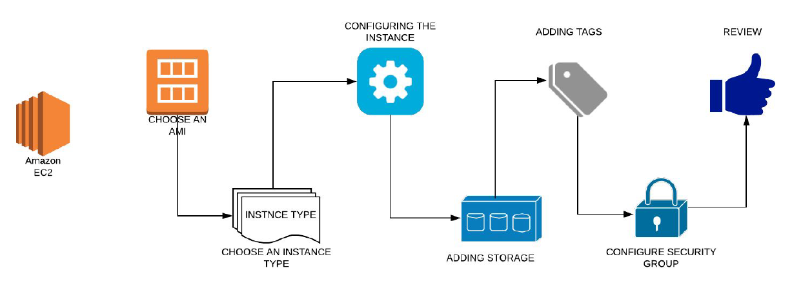

# Cloud Computing

## 1. From Virtualization to Cloud Computing: Understanding the Evolution

Picture a data center filled with hundreds or even thousands of servers—an immense pool of computing power supporting an organization and its branches. Traditionally, these physical servers are virtualized using hypervisors, allowing the virtualization team to create virtual machines (VMs) and allocate them to employees as needed. If someone in the organization required compute resources, they'd request it through the virtualization team, which—often in collaboration with data center operations—would work around the clock to provision and maintain virtual machines or storage.

The larger the company, the more complex and labor-intensive the administration of this virtualized infrastructure becomes. This was the norm before the rise of cloud computing.

Cloud computing takes this concept further. Instead of relying on internal teams to manually assign virtual resources, users access a self-service portal—through a web interface or command line—where they can instantly create and manage their own virtual machines, storage, or services. This shift means compute resources are available on-demand, accessible over the internet.

If such a virtualized platform is built for internal organizational use, it’s known as **private cloud computing**. If it's offered to the public—where anyone can sign up with a credit card—it’s called **public cloud computing**. Major players like **AWS**, **Microsoft Azure**, and **Google Cloud** dominate this public cloud space.

In this course, we’ll focus on **AWS Cloud**. According to AWS, cloud computing is _“on-demand delivery of IT resources over the Internet with pay-as-you-go pricing.”_ You don’t need to purchase or manage hardware; you can simply access compute power, storage, and databases as needed.

Today, over 90% of organizations use cloud computing—and for good reason:

- **Agility**: Get started quickly by signing up and launching resources in minutes.
- **Elasticity**: Scale resources up or down as required.
- **Cost Efficiency**: Pay only for what you use, reducing unnecessary expenses.
- **Global Reach**: Leverage data centers across the globe to serve international users effortlessly.

### Types of Cloud Computing Services

In this course, we’ll explore various AWS services across the three main cloud service models:

- **Infrastructure as a Service (IaaS)**: You manage the OS and apps, AWS manages the infrastructure. Example: **EC2** (virtual servers).
- **Platform as a Service (PaaS)**: AWS manages the platform—just select what you need. Example: **RDS** for managed databases like Oracle.
- **Software as a Service (SaaS)**: Simply subscribe and use. Everything is managed for you.

---

## 2. Getting Started with AWS: Global Infrastructure, Regions, and Hands-On Setup

Welcome to the AWS sessions! In this updated guide, we'll explore AWS's global infrastructure, its expansive reach across the world, and how you can leverage this to build and deploy your own systems. To follow along, ensure you've:

- Created an **AWS Free Tier** account
- Set up billing alarms
- Configured an **IAM user**

This course is designed to be **hands-on**, with minimal theory. When necessary, we'll use slides or diagrams to explain concepts, but our primary focus will be direct interaction with AWS services.

### The Scale and Spread of AWS in 2025

As of 2025, AWS stands as the largest public cloud provider, with a significant global presence. Its infrastructure comprises:

- **36 launched regions**
- **114 availability zones (AZs)**
- **700+ CloudFront points of presence (POPs)**
- **13 regional edge caches**

AWS has announced plans for 12 more availability zones and 4 additional regions in New Zealand, the Kingdom of Saudi Arabia, Taiwan, and the AWS European Sovereign Cloud.

In India, AWS has committed nearly \$13 billion to expand its data-center infrastructure by 2030, highlighting its dedication to the region.

### Understanding AWS Infrastructure Components

- **Regions**: Geographical areas like North California, Tokyo, or Frankfurt. Each region consists of multiple availability zones and is isolated from others to ensure fault tolerance and stability.
- **Availability Zones (AZs)**: Isolated locations within a region, each comprising one or more data centers with redundant power, networking, and connectivity. This design allows us to build highly available and fault-tolerant applications.
- **Local Zones**: Extensions of AWS regions that place compute, storage, database, and other services closer to large population centers, industries, and IT centers for low-latency access.
- **Edge Locations**: Used primarily for content delivery via AWS CloudFront, these small data centers cache data close to end-users for faster performance.
- **Wavelength Zones**: Infrastructure deployments that bring AWS services to the edge of the 5G network, minimizing latency to deliver applications that require single-digit millisecond latencies.
- **Ground Stations**: AWS's satellite communication infrastructure, allowing you to control satellite communications, process data, and scale operations without having to worry about building or managing ground station infrastructure.

See More:- https://aws.amazon.com/about-aws/global-infrastructure/, https://aws.amazon.com/about-aws/global-infrastructure/regions_az/

By distributing your infrastructure across multiple AZs, you can achieve high availability and resilience. For instance, deploying two web servers in each of two AZs ensures that even if one zone faces an outage, your service remains available.

Regions also help with compliance and data residency regulations. If your project requires data to remain within a specific country or jurisdiction, AWS's global presence ensures you can meet that requirement without building your own data centers.

### Navigating the AWS Console and Services

Log into the **AWS Management Console** using your IAM user credentials (avoid using your root account for daily operations). AWS offers over **200 fully-featured services**, and while that can seem overwhelming, you only need to focus on the ones relevant to your role or use case.

Some examples include:

- **Compute**: EC2, Lambda, Elastic Beanstalk
- **Storage**: S3, EFS, Glacier
- **Databases**: RDS, DynamoDB, ElastiCache
- **Networking**: VPC, Route 53, CloudFront
- **Developer Tools**: CodeCommit, CodeBuild, CodeDeploy, CodePipeline
- **Monitoring and Management**: CloudWatch, CloudTrail, AWS Config
- **Security and Identity**: IAM, Cognito, KMS.

Our course focuses mainly on **SysOps, DevOps**, and **developer services**, providing a solid foundation in AWS. Once you're confident with these, exploring other services like security, analytics, or AI/ML will become more approachable.

### Choosing the Right AWS Region

While you're free to choose any region, we recommend using **U.S.-based regions** like North Virginia or North California. They are generally more cost-effective compared to regions like Singapore, Mumbai, or Tokyo. Although we'll be using AWS Free Tier for most exercises, there may be instances where charges apply. We'll alert you ahead of time and guide you on how to clean up resources afterward to avoid unnecessary costs.

---

## 3. Introduction to EC2: The Backbone of AWS Compute Services

Welcome! In this section, we’ll dive into **Amazon EC2 (Elastic Compute Cloud)** — one of the most essential and widely used services in AWS.

**EC2** provides scalable virtual machines in the cloud, enabling you to run applications with flexibility, reliability, and control. Think of EC2 as a way to launch and manage virtual servers on demand, where you can easily scale compute resources like CPU, memory, storage, and network capacity based on your application’s needs.

You only pay for what you use, making it cost-efficient. Whether you need to upgrade from 8 GB to 16 GB of RAM or scale down, EC2 adapts to your usage patterns. This elasticity is one of its defining features.

### Integration with Other AWS Services

EC2 seamlessly integrates with many other AWS services such as **S3**, **EFS**, **RDS**, **DynamoDB**, and **Lambda**. This deep integration allows you to build highly scalable and interconnected systems with ease.

### EC2 Pricing Models

Here are the main EC2 pricing options:

- **On-Demand Instances**: Pay for compute capacity by the hour or second. Great for development and testing. We'll be using this model (via the free tier) throughout our course.
- **Reserved Instances**: Commit to using EC2 for 1 or 3 years in exchange for significant discounts.
- **Spot Instances**: Bid for unused EC2 capacity at steep discounts. Ideal for flexible and fault-tolerant applications, though instances can be terminated if outbid.
- **Dedicated Hosts**: Physically isolated servers for your use only — suitable for compliance-heavy workloads but expensive.

### Key Components of an EC2 Instance

To launch an EC2 instance, you’ll need the following:

- **AMI (Amazon Machine Image)**: A pre-configured template (similar to a Vagrant box) that defines your operating system and software.
- **Instance Type**: Defines the hardware specifications (CPU, memory, network performance, etc.).
- **EBS (Elastic Block Store)**: Acts as your instance’s hard drive. You can use default storage or add more based on your needs. EBS volumes persist independently from the instance.
- **Tags**: Key-value metadata used for resource management, billing, and filtering.
- **Security Groups**: Virtual firewalls that control inbound and outbound traffic to your instance.
- **Key Pair**: For authentication — typically SSH keys for Linux or used to decrypt the admin password for Windows.

### Launching an EC2 Instance

Launching an EC2 instance is a simple, wizard-driven process:

1. Choose an **AMI**.
2. Select the **instance type**.
3. Configure instance settings like networking, permissions, and bootstrap scripts.
4. Define **EBS storage**.
5. Add **tags** as needed.
6. Choose or create a **security group**.
7. Review and select a **key pair** for secure login.

Once launched, your EC2 instance is ready to use.

---
