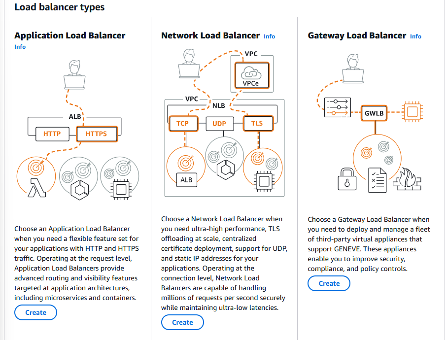

# Understanding AWS Elastic Load Balancing (ELB)

Welcome to the "AWS Load Balancers (ELB)" lecture! In this session, we'll explore what a load balancer is, why it's essential, how it works, and the different types of load balancers AWS offers.

To begin, imagine a scenario where you're running multiple web servers. Why would you need more than one? In real-world applications, a single server often can't handle all the traffic due to performance and maintenance constraints. Having a cluster of web servers allows you to scale out for higher capacity or scale in to save costs. It also lets you perform updates without disrupting the user experience.

However, with multiple servers, users still need a single point of access — that’s where a load balancer comes in. A load balancer acts as an intermediary, receiving user requests on a specific frontend port (like 80 or 443) and routing them to backend servers based on certain rules. It distributes network traffic efficiently, improves performance, and ensures high availability.

Elastic Load Balancing distributes incoming application or network traffic across multiple targets, such as Amazon EC2 instances, containers, and IP addresses, in multiple Availability Zones.


In AWS, you don’t need to set up your own load balancer software — Elastic Load Balancing (ELB) does the job for you. There are four types of load balancers available:

1. **Classic Load Balancer (CLB):** A simple option that operates at Layer 4 (TCP level). It forwards requests based on IP addresses and port numbers, making it suitable for basic applications. It takes request on front end port (443) and routes to the backend port (80).

2. **Application Load Balancer (ALB):** Operating at Layer 7 (HTTP/HTTPS level) of the OSI model, it understands URLs and enables intelligent request routing. For example, requests to `/videos` can be directed to a different set of servers than those to `/home`. This is the most commonly used load balancer in AWS for web applications, and we’ll be using it frequently in this course.


3. **Network Load Balancer (NLB):** Also a Layer 4 load balancer, but designed to handle millions of requests per second. It provides a **static IP** and is ideal for high-performance needs. While powerful, it's also more costly and will be beyond the scope of this course. Sometime it puts in-front of the Application Load Balancer.

4. **Gateway Load Balancer (GLB):** Operating at Layer 3, this is used for advanced scenarios involving third-party virtual appliances like firewalls and intrusion detection systems. It preserves all network packet metadata and is mainly for users with deep AWS networking experience, so it won’t be covered in depth here.

Learn more about [ELB](https://docs.aws.amazon.com/elasticloadbalancing/).

We’ll also touch on related concepts like Amazon Machine Images (AMIs) and launch templates as we set up our infrastructure.

---

## Setting Up a Website on EC2 and Configuring a Load Balancer

In this section, we’ll walk through setting up a website from [tooplate.com](https://tooplate.com) on an EC2 instance, creating a custom AMI, setting up a launch template, and finally configuring an Application Load Balancer to distribute traffic across multiple instances.

### Step 1: Launching the EC2 Instance

1. Navigate to the **EC2 Dashboard** in AWS.
2. Click **Launch Instance** and name it `web01`.
3. Choose an OS (Amazon Linux, Ubuntu, or CentOS). For this demo, we’ll use **Amazon Linux** (RPM-based).
4. Select **t2.micro** as the instance type.
5. Either use existing key pair or Create a new key pair (e.g., `web-dev-key`) and download it.
6. Configure the security group:
   - Allow **SSH (Port 22)** from your IP.
   - Allow **HTTP (Port 80)** from your IP (for initial testing).
7. In **Advanced Details**, paste the below user data script to automate website setup.
8. Launch the instance.

```bash
#!/bin/bash

# Variable Declaration
URL='https://www.tooplate.com/zip-templates/2098_health.zip'
ART_NAME='2098_health'
TEMPDIR="/tmp/webfiles"

yum --help &> /dev/null

if [ $? -eq 0 ]
then
   # Set Variables for CentOS
   PACKAGE="httpd wget unzip"
   SVC="httpd"

   echo "Running Setup on CentOS"
   # Installing Dependencies
   echo "########################################"
   echo "Installing packages."
   echo "########################################"
   sudo yum install $PACKAGE -y > /dev/null
   echo

   # Start & Enable Service
   echo "########################################"
   echo "Start & Enable HTTPD Service"
   echo "########################################"
   sudo systemctl start $SVC
   sudo systemctl enable $SVC
   echo

   # Creating Temp Directory
   echo "########################################"
   echo "Starting Artifact Deployment"
   echo "########################################"
   mkdir -p $TEMPDIR
   cd $TEMPDIR
   echo

   wget $URL > /dev/null
   unzip $ART_NAME.zip > /dev/null
   sudo cp -r $ART_NAME/* /var/www/html/
   echo

   # Bounce Service
   echo "########################################"
   echo "Restarting HTTPD service"
   echo "########################################"
   systemctl restart $SVC
   echo

   # Clean Up
   echo "########################################"
   echo "Removing Temporary Files"
   echo "########################################"
   rm -rf $TEMPDIR
   echo

   sudo systemctl status $SVC
   ls /var/www/html/

else
    # Set Variables for Ubuntu
   PACKAGE="apache2 wget unzip"
   SVC="apache2"

   echo "Running Setup on CentOS"
   # Installing Dependencies
   echo "########################################"
   echo "Installing packages."
   echo "########################################"
   sudo apt update
   sudo apt install $PACKAGE -y > /dev/null
   echo

   # Start & Enable Service
   echo "########################################"
   echo "Start & Enable HTTPD Service"
   echo "########################################"
   sudo systemctl start $SVC
   sudo systemctl enable $SVC
   echo

   # Creating Temp Directory
   echo "########################################"
   echo "Starting Artifact Deployment"
   echo "########################################"
   mkdir -p $TEMPDIR
   cd $TEMPDIR
   echo

   wget $URL > /dev/null
   unzip $ART_NAME.zip > /dev/null
   sudo cp -r $ART_NAME/* /var/www/html/
   echo

   # Bounce Service
   echo "########################################"
   echo "Restarting HTTPD service"
   echo "########################################"
   systemctl restart $SVC
   echo

   # Clean Up
   echo "########################################"
   echo "Removing Temporary Files"
   echo "########################################"
   rm -rf $TEMPDIR
   echo

   sudo systemctl status $SVC
   ls /var/www/html/
fi
```

Wait a few minutes, then check the instance’s public IP in a browser. If the website doesn’t load:

- Verify the security group allows HTTP traffic from your IP.
- SSH into the instance and ensure Apache (`httpd`) is running.

### Step 2: Creating a Custom AMI

Once the website is running:

1. Select the instance, go to **Actions** > **Image and Templates** > **Create Image**.
2. Name it (e.g., `health-AMI`) and create the image.
3. Wait for the AMI to become available (status changes from _pending_ to _available_). On average, building an Amazon Machine Image (AMI) in AWS takes about 5 to 10 minutes, depending on the multiple factors.

**Additional Options:**

- Copy the AMI to another region for cross-region deployments.
- Share the AMI with other AWS accounts or make it public.

It was the manual process of creating AMI, AWS also gives you the option to create AMI automatically through EC2 image builder where we can create pipeline and build the images automatically.

### Step 3: Creating a Launch Template

To streamline future instance launches:

1. Navigate to **Launch Templates** in the EC2 Dashboard.
2. Provide a name (e.g., `health-template-v1`) and description.
3. Select your custom AMI (`health-AMI`) from "\*My AMIs" => Owned by me.
4. Configure instance details (e.g., `t2.micro` (free tier), key pair, security group).
5. Add tags (e.g., Name:`web00`) for identification.
6. Save the template.

Now, you can launch identical instances in seconds by selecting the template and modifying tags (e.g., `web02`, `web03`).

Launch an instance by selecting the template and modifying tags (e.g., Name: `web02`).

### Step 4: Setting Up a Load Balancer

**A. Create a Target Group:** (It is group of EC2 instances with health checks)

1. Navigate to **Target Groups** under **Load Balancing**. Choose target type: _Instances_.
2. Specify:
   - **Name**: `health-TG`
   - **Protocol**: HTTP (Port 80)
   - **Health Check Path**: `/` (root URL)
   - Inside Advance health check settings
   - **Health check port**: Traffic port (80). If your application runs on a different port, change this by selecting "override" and specifying the port.
   - **Healthy/Unhealthy Thresholds**: 2 checks
   - Timeout: 5 seconds
   - **Interval**: 30 seconds (All checks will be sent every 30 seconds)
3. Register your instances (`web01`, `web02`) and click on "Include as pending below" then you will see them in "Review targets".
4. Create the target group.



**B. Configure the Load Balancer:**

1. Go to **Load Balancers** and create an **Application Load Balancer**.
2. Set:
   - **Name**: `health-ELB`
   - **Scheme**: Internet-facing
   - **Load Balancer IP address type**: IPv4
   - **Network Mapping**: Select at least two for high availability. (Select all of them for high availability).
   - **Security Group**: Remove the default security group and create a new one (`health-elb-sg`) allowing HTTP (Port 80) from anywhere both IPv4 and IPv6.
3. In Listeners and routing, Attach the target group (`health-TG`) to route traffic to instances. So the load balancer will listen to the port 80 and route traffic to the target group which are also running on the port 80 (different instances).
4. Create the load balancer.

Initially load balancer will be in the provisioning state. It may take a while to become active. You can check it by going to the EC2 Dashboard and clicking on the load balancer.

The load balancer will provide one DNS name with a public IP address (e.g., `health-elb-1509503725.us-east-1.elb.amazonaws.com`) which can be found in "Details" section after selecting the load balancer. Once load balancer is in active state, copy the DNS name and paste it in your browser. It may give you a **504 Gateway Timeout** error.

**C. Troubleshooting Access Issues:**  
If the load balancer URL returns a **504 Gateway Timeout**:

1. Check the target group’s health status—instances may be marked _unhealthy_.
2. While creating the instances, we have use security groups to allow HTTP (Port 80) traffic from only MY IP therefore load balancer is not able to access the instances. Edit the **instance security group** to allow HTTP (Port 80) traffic from the load balancer’s security group. To do so, add rule 
   - Port 80
   - Source: search for load balancer security group, and select it
   - Description: "Allow HTTP (Port 80) traffic from load balancer security group".
   - Save the rule.
3. Wait for health checks to pass (≈1 minute), then refresh the load balancer URL.

In the target groups you can register additional instances by clicking on "Include as pending below" and then you will see them in "Review targets". Similarly, you can also deregister instances from the target group however it won't remove immediately from the load balancer, it will drain the request first.

### Step 5: Cleanup (Optional)

To avoid unnecessary charges:

1. Delete the **load balancer** (load balancers are not completely free) and **target group** (or you can keep it as creating Target Groups in AWS does not incur a direct cost — they are free resources, charges only apply when Target Groups are used with an active Elastic Load Balancer (ELB)).
2. Terminate **instances** .
3. You can keep the AMI/snapshot if reused later. However, it is using snapshot of 8 GB and free tier available only till 30 GB of storage overall.

### Key Takeaways

- **AMI**: Captures instance state for quick replication.
- **Launch Templates**: Simplify instance deployment with predefined settings.
- **Load Balancers**: Distribute traffic and improve availability.
- **Security Groups**: Critical for controlling access between services.

Experiment with registering/deregistering instances and adjusting health checks. In the next section, we’ll explore auto-scaling for dynamic workloads!
