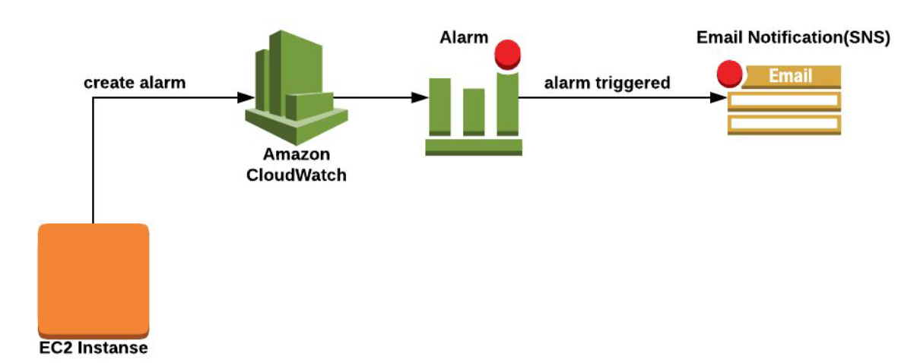
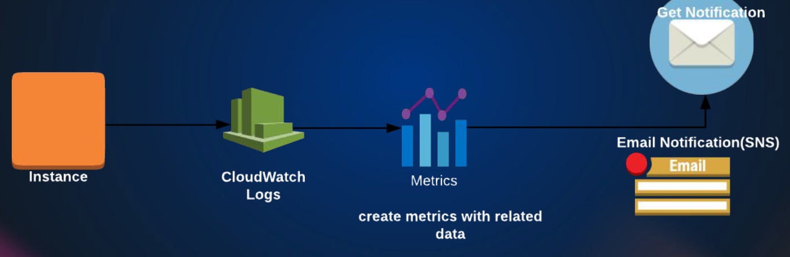

# Understanding AWS CloudWatch: Metrics, Alarms, and Notifications

Welcome to the AWS CloudWatch session! While CloudWatch began as a basic monitoring service, it has grown into a comprehensive observability tool that now includes logging, event tracking, and much more.

- Matrics: Key performance indicators for your AWS environment.
- Events: Key events that occur in your AWS environment.
- Logs: Centralized logging for your AWS environment.

At its core, CloudWatch is still primarily used to monitor the performance of your AWS environment. When you use any AWS service in a region—like EC2, EBS, or RDS—CloudWatch automatically starts collecting standard performance metrics for those services. These are similar to "checks" in traditional monitoring tools and include key indicators such as CPU utilization, disk I/O, and network activity.

For example, an EC2 instance comes with a built-in **Monitoring** tab that displays metrics such as:

* CPU Utilization
* Status Checks
* Network In/Out
* Network Packets In/Out
* Disk Read/Write
* Disk Read/Write Operations

Likewise, EBS volumes provide metrics like:

* Read/Write Bandwidth
* Read/Write Throughput



All these metrics are available out-of-the-box, but you can also define **custom metrics** tailored to your application’s specific needs. Once metrics are in place, you can create **alarms** based on predefined thresholds. For example, you might configure an alarm to trigger if CPU utilization exceeds 60%. These alarms can then be linked to Amazon SNS (Simple Notification Service) to send you email notifications or trigger automated actions.

CloudWatch also tracks **events**, such as launching or terminating an EC2 instance, creating a volume, or taking snapshots. These events can be used to trigger actions, often through AWS Lambda, enabling reactive automation.



Another powerful feature is **CloudWatch Logs**. Although EC2 instances don’t stream logs to CloudWatch by default, you can install an agent at the OS level to forward logs. This allows centralized logging, which can then be used to generate insights, set metrics, and even define alarms based on log patterns.

In this session, we'll focus on **CloudWatch metrics**, setting up **alarms**, and configuring **email notifications** for EC2 instances using **Amazon SNS** (Simple Notification Service). This involves three key AWS services:

* **EC2**: Generates performance metrics.
* **CloudWatch**: Collects metrics and sets alarms.
* **SNS**: Sends notifications based on alarm triggers.

In the next part of this AWS series, we’ll dive deeper into working with CloudWatch Logs and setting up alarms based on log data. For now, let’s get started with setting up metric-based alarms!

---

## Simulating High CPU Usage and Creating CloudWatch Alarms

For this exercise, we'll simulate high CPU usage on an EC2 instance and create a CloudWatch alarm based on CPU utilization. You can use any Linux AMI, such as Amazon Linux, Ubuntu, or CentOS 7. In this example, we’ll use **Amazon Linux** and a simple tool called `stress` to generate CPU load.

First, launch your EC2 instance. You can use a launch template if you have one. Once the instance is up and running, give it a few minutes—CloudWatch takes time (sometimes up to 10 minutes) to begin displaying metrics under the **Monitoring** tab. These metrics are automatically created by CloudWatch and include CPU utilization, status checks, network traffic, and disk operations.

By default, CloudWatch collects metrics at 5-minute intervals. If you want more granular data, you can enable **Detailed Monitoring**, which records metrics every minute. This option is not free, but the charges are minimal and it's useful for more responsive alerting (not required for this exercise). To enable it, go to your instance’s Monitoring tab and click **Manage Detailed Monitoring**.

Next, SSH into your instance using the correct key and user (e.g., `ec2-user` for Amazon Linux), switch to the `root` user using `sudo -i`, and install the `stress` tool:

Install stress: `sudo dnf install stress -y`

The `stress` tool allows you to simulate CPU, I/O, and memory load. You can use `stress` command to see the available options. To stress the CPU, run:
`nohup stress -c 4 -t 300 &`

The command `nohup stress -c 4 -t 300 &` does the following:

* `stress`: Runs the **stress testing tool** to put load on system resources.
* `-c 4`: Spawns **4 CPU stress workers** (i.e., simulates 4 busy CPU cores).
* `-t 300`: Runs the stress test for **300 seconds** (5 minutes).
* `nohup`: Ensures the process **keeps running even after you log out** or close the terminal.
* `&`: Runs the command **in the background**, allowing you to continue using the terminal.

In short: it stresses the CPU with 4 workers for 5 minutes in the background, and it keeps running even if you disconnect.

This command will create 4 CPU-intensive processes for 5 minutes in the background. Use `top` to monitor CPU usage.

You can also create a shell script (`stress.sh`) that alternates between stressing and sleeping to create visible spikes in your CloudWatch graph:

```bash
#!/bin/bash
sleep 60
stress -c 2 -t 60
sleep 30
stress -c 2 -t 30
```

Make the script executable and run it in the background:
`chmod +x stress.sh && nohup ./stress.sh &`

Now, go back to the EC2 Monitoring tab or directly to the CloudWatch service. After a few minutes, you’ll see a graph forming based on CPU usage.

To create a CloudWatch alarm:

1. Go to **CloudWatch > Alarms > All Alarms**.
2. Click **Create Alarm**.
3. Choose the **CPUUtilization** metric for your EC2 instance (under **Per-Instance Metrics**). Note: select your instance, if not available the wait for few minutes. There will be multiple instances with matric name "CPUUtilization".
4. Set the threshold—e.g., **greater than 60% for 5 minutes**. In Conditions => Threshold => "Static", choose "Greater than".
5. In notification => choose "In alarm". 
6. Either select an existing SNS topic or create a new one with your email address, confirm the subscription from mail.
7. Name the alarm something like `Warning | High CPU Web01 healthy`. In alarm description => "Warning | High CPU Web01 healthy".
8. Create the alarm.

Optionally, you can configure actions like rebooting or stopping the instance if the alarm state is triggered—this can be useful if high CPU prevents you from accessing the instance via SSH.

After creating the alarm, CloudWatch will evaluate the data. If CPU usage remains above your threshold for the defined period, it will transition to the **ALARM** state and send an email notification via SNS.

Common mistake: Make sure you’ve selected the correct EC2 instance when creating the alarm. If you accidentally choose a terminated instance, CloudWatch will show "Insufficient data" and the alarm won't trigger. You can fix this by editing the alarm and selecting the correct running instance.

Lastly, remember:

* The alarm needs continuous high CPU usage for 5 minutes to trigger.
* You can create multiple alarms, e.g., a warning at 60% and a critical alert at 80%.
* AWS allows up to 10 alarms under the free tier.

Once you're done experimenting, delete the alarms and terminate your instance. This hands-on experience will be valuable when we later explore auto scaling, where alarms play a crucial role in triggering scaling actions.

---