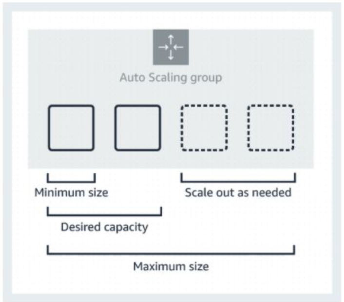
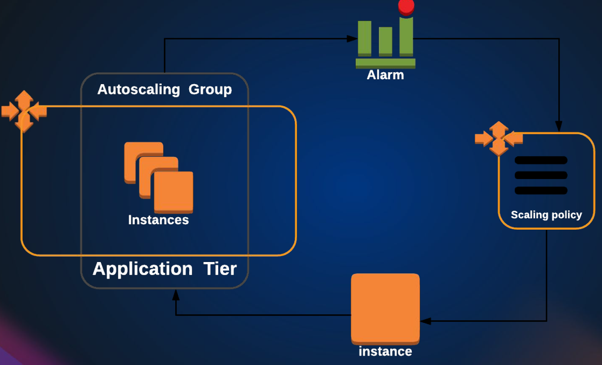
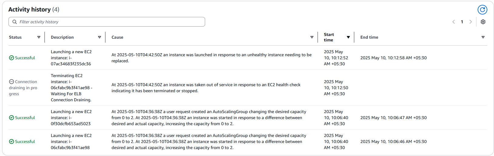

# Auto Scaling Group

Welcome to the Auto Scaling section of AWS! If you're already familiar with EC2 and CloudWatch, you're in a great position—this service builds naturally on those concepts and is surprisingly straightforward once you understand the basics.

> [Amazon Auto Scaling](https://aws.amazon.com/autoscaling/) is a service that automatically monitors and adjusts compute resources to maintain performance for applications hosted in the AWS.
> Alarm monitors CloudWatch metrics for instances.

At its core, AWS Auto Scaling helps you maintain application performance and control costs by automatically adjusting the number of EC2 instances in your environment. It works closely with Amazon CloudWatch, using custom alarms based on metrics like CPU utilization to determine when to scale up or down. For example, if your instances exceed a CPU threshold, Auto Scaling can automatically add more capacity. When the load drops, it can remove unnecessary instances to save on costs.

The Auto Scaling Group (ASG) uses a launch configuration or a launch template—just like those used in previous EC2 or ELB setups—to know how to launch new instances. To define how scaling should happen, ASGs rely on **scaling policies**. You can configure step scaling policies such as: if CPU usage goes over 60%, add two instances; if it hits 80%, add four; and as usage drops, scale down accordingly. Alternatively, you can allow AWS to manage these adjustments dynamically.

> A launch configuration/Template is an instance configuration template that an Auto Scaling group uses to launch EC2 instances.
> Scaling policy is used to increase and decrease the number of running instances in the group dynamically to meet changing conditions.

When setting up your Auto Scaling Group, you’ll define key parameters: **minimum**, **desired**, and **maximum** capacity. For example, setting a minimum of 1 ensures at least one instance always runs, while the desired capacity determines how many instances are normally active. The maximum size acts as a cap to prevent over-scaling and keep your costs in check.

- AWS Auto Scaling is free.
- AWS Auto Scaling is enabled by Amazon CloudWatch and carries no additional fees. Service fees for your application resources and Amazon CloudWatch apply.

In the upcoming sections, we’ll design and implement an Auto Scaling Group powered by a launch configuration. We’ll also explore how CloudWatch alarms trigger scaling actions and how policies control the creation and termination of instances. Ready to get hands-on? Let’s dive in!

**How to Set Up an Auto Scaling Group (ASG) in AWS**

Auto Scaling Groups (ASGs) help maintain application availability by automatically adjusting the number of EC2 instances based on demand. In this guide, we’ll walk through setting up an ASG with a **launch template** and a **load balancer** for high availability.

## **Prerequisites**

Before creating an Auto Scaling Group, ensure you have:

1. **A Launch Template**

   - If you followed the Load Balancer guide, you should already have one.
   - If not, create a new launch template with your desired AMI, instance type, and security settings.
     1. Navigate to **Launch Templates** in the EC2 Dashboard.
     2. Provide a name (e.g., `health-template-v1`) and description.
     3. Select your custom AMI (`wave-web-img-efs`) from "\*My AMIs" => Owned by me.
     4. Configure instance details (e.g., `t2.micro` (free tier), key pair, security group).
     5. Add tags (e.g., Name:`web00`) for identification.
     6. Save the template.

2. **A Load Balancer & Target Group**
   - Since ASG manages instances dynamically, we need a target group to distribute traffic.

## **Step 1: Create a Target Group**

1. Go to **EC2 Dashboard > Target Groups > Create Target Group**.
2. Configure:
   - **Target type**: _Instances_
   - **Target Group Name**: `health-TG`
   - **Protocol**: HTTP (Port 80)
   - **Health Check Path**: `/` (root URL)
   - Inside Advance health check settings
   - **Health check port**: Traffic port (80). If your application runs on a different port, change this by selecting "override" and specifying the port.
   - **Healthy/Unhealthy Thresholds**: 2 checks
   - Timeout: 5 seconds
   - **Interval**: 30 seconds (All checks will be sent every 30 seconds)
   - Currently, there are no instances available. So don't select any instances in the target group
   - **Create** the target group (no instances needed yet—ASG will add them).

## **Step 2: Set Up a Load Balancer**

1. Navigate to **EC2 > Load Balancers > Create Load Balancer**.
2. Choose **Application Load Balancer (ALB)**.
3. Configure:
   - **Name**: `health-elb`
   - **Scheme**: Internet-facing
   - **Load Balancer IP address type**: IPv4
   - **Listeners**: HTTP:80
   - **Availability Zones**: Select at least two for redundancy (Select all of them for high availability).
   - **Security Group**: Allow HTTP traffic (e.g., port 80). Remove the default security group and create a new one (`health-elb-sg`) allowing HTTP (Port 80) from anywhere both IPv4 and IPv6.
4. **Forward traffic** to the target group (`health-TG`). In Listeners and routing, Attach the target group (`health-TG`) to route traffic to instances. So the load balancer will listen to the port 80 and route traffic to the target group which are also running on the port 80 (different instances).
5. **Create** the load balancer.

## **Step 3: Create the Auto Scaling Group**

### **Basic Configuration**

1. Go to **EC2 > Auto Scaling Groups > Create Auto Scaling Group**.
2. **Name**: `healthy-ASG`
3. **Launch Template**: Select your existing template (`health-template-v1`).

### **Instance Distribution**

- Select **multiple Availability Zones** (at least two for fault tolerance). => Select all.

### **Load Balancer Integration**

- **Attach to an existing load balancer**.
- Select the target group (`health-TG`).
- **Health Check Type**: Enable both **EC2** and **ELB** health checks.
  - **EC2**: Basic instance-level checks.
  - **ELB**: Application-level health checks (recommended for web apps).
  - **Interval**: 300 seconds

### **Capacity Settings**

- **Minimum capacity**: `1` (ASG will never go below this).
- **Desired capacity**: `2` (ideal number of running instances).
- **Maximum capacity**: `4` (hard limit to prevent excessive scaling).

Most of the people use minimum and desired capacity as same value.

### **Scaling Policies (Optional)**

- **Target Tracking Scaling Policy**:
  - **Metric**: Average CPU Utilization.
  - **Target value**: `50` (scale out if >50%, scale in if <50%).
- **Disable scale-in** if you prefer manual termination. Uncheck it.

### **Notifications & Tags**

- **SNS Notifications**: Get alerts for scaling events.
- **Tags**: Add `Name: web-server` for better tracking.

### **Review & Create**

- Verify all settings and **Create Auto Scaling Group**.

## **Step 4: Verify & Test Auto Scaling**

1. **Check Instances**:

   - ASG will launch instances to match the desired capacity (2).
   - Verify in **EC2 Instances** and **Target Group (health-TG)**.

2. **Simulate Failure**:

   - Terminate an instance or stop its HTTP service (`sudo systemctl stop httpd`).
   - ASG will detect the unhealthy instance and replace it automatically.

   - **Note**: If you terminate an instance, it might take a few minutes before ASG notices the change.

3. **Scaling Test**:
   - Generate CPU load (e.g., stress test) to trigger scaling.
   - Observe ASG launching new instances when CPU exceeds 50%.

## **Step 5: Updating Instances (Instance Refresh)**

Never modify running instances manually—always update via the launch template.

1. **Create a new launch template version** (e.g., updated AMI or config).
2. In **ASG > Details > Edit**:
   - Select the new launch template version.
3. **Start Instance Refresh**:
   - **Minimum healthy percentage**: `80%` (ensures minimal downtime).
   - ASG will replace instances gradually.

## **Best Practices**

✔ **Ephemeral Instances**: Never store data locally—use **EFS** or **S3**.  
✔ **Logging**: Stream logs to **CloudWatch** for centralized monitoring.  
✔ **Scaling Policies**: Fine-tune based on metrics (CPU, memory, custom CloudWatch alarms).

## **Cleanup**

To avoid unnecessary charges:

1. **Delete Auto Scaling Group** (terminates all instances).
2. **Delete Load Balancer & Target Group**.
3. Optionally, remove **launch templates, security groups, and key pairs**.

## **Conclusion**

Auto Scaling Groups ensure your application remains available and cost-efficient by dynamically adjusting capacity. By integrating with load balancers and using proper health checks, you can build a resilient AWS infrastructure.

**Next Steps**:

- Experiment with **scheduled scaling** for predictable traffic patterns.
- Explore **mixed instances policies** for cost optimization.

---
