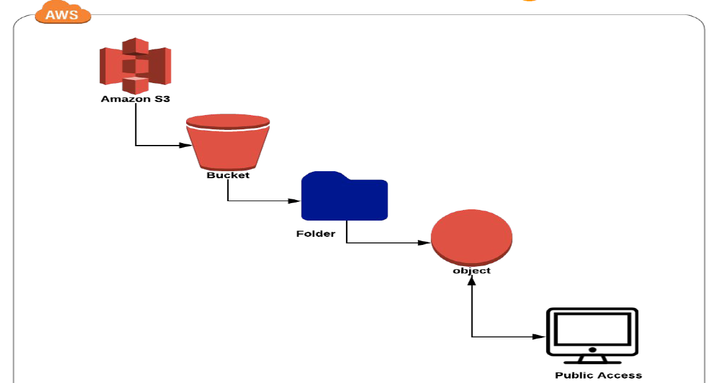
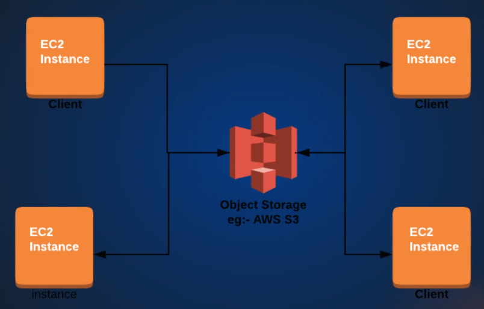
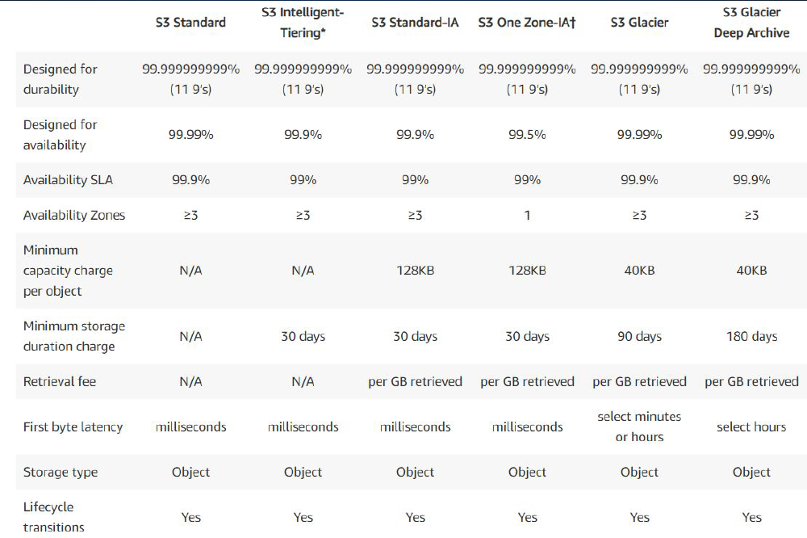
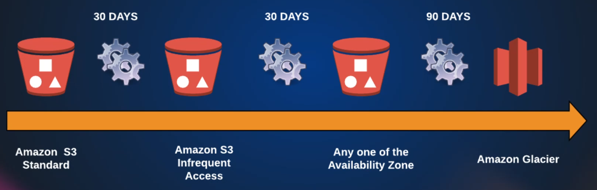
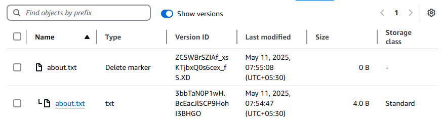
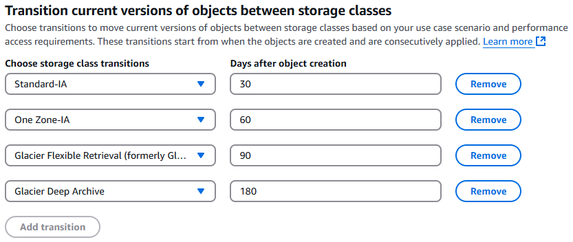
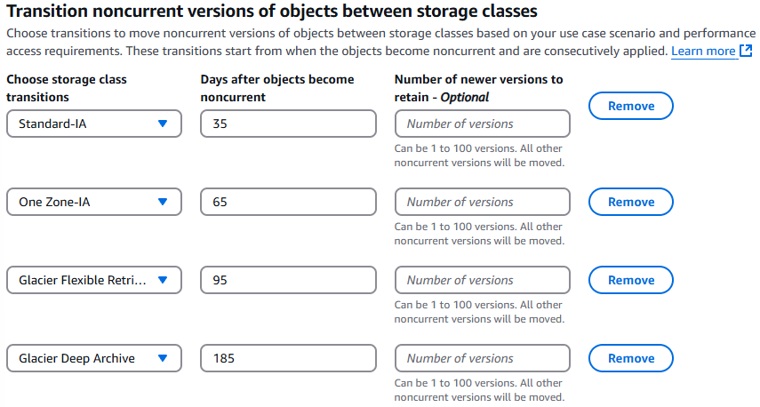
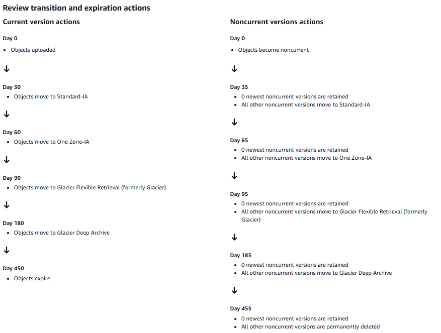
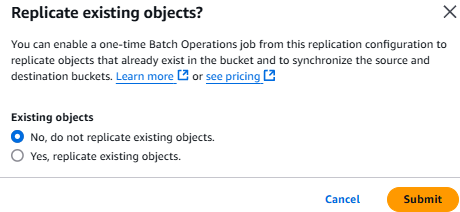

# Amazon S3

Amazon Simple Storage Service (S3) is storage for the internet. You can use Amazon S3 to store and retrieve any amount of data, at any time, from anywhere on the web.

## Understanding Amazon S3: The Simple Storage Service

Amazon S3 (Simple Storage Service) is one of AWS's most popular and oldest services. As the name suggests, it’s incredibly easy to use while offering powerful storage capabilities for countless use cases.

### What is Amazon S3?

S3 is a cloud-based **object storage service** accessible over the internet. Think of it like **Google Drive or Dropbox**, but far more advanced. You can store **unlimited data** in an S3 bucket and access it from anywhere.

- It is Object-Based Storage.
- Data is replicated across multiple data centers (facilities).
- Unlimited Storage.
- Amazon stores data as objects within buckets.
- **Bucket name has to be unique on the internet**

#### Key Concepts:

- **Bucket** – The top-level storage container (like a folder). It is a logical unit of storage in AWS.
- **Object** – The actual data (files, images, videos, etc.) stored inside a bucket.
- **Unique Bucket Names** – Since each bucket gets a unique endpoint, names must be globally distinct.

### Storage Classes & Cost Optimization

S3 offers multiple storage tiers to balance cost and performance:

1. **S3 Standard** – General purpose storage of frequently accessed data. Fast access and object replication in multi-AZ.
2. **S3 Infrequent Access (IA)** – Lower cost for less frequent retrieval (still multi-AZ). Long-lived, but less frequently accessed data. Slow access.
3. **S3 One Zone-IA** – Cheaper, but data is stored in only one Availability Zone (no redundancy). It is for data that is accessed less frequently, but requires rapid access when needed. Slow access, no object replication.
4. **S3 Intelligent Tiering** – Automatically moves data to most cost-effective tiers based on usage.
5. **S3 Glacier** - Low cost storage class for data archiving.
6. **Glacier Deep Archive** – lowest cost storage, retrieval takes hours time of 12 Hrs.

### Lifecycle Policies for Automated Data Management

You can also define rules to **automatically transition or expire objects** based on age. Example:

- Move logs to **Infrequent Access** after 30 days.
- Shift to **Glacier** after 90 days.
- Delete after 1 year.

### S3 Charges

S3 charges per GB per month. It's a pay-as-you-go service, so you pay only when you use it. It depends on the following fields:

- Storage Class
- Requests
- Tiers
- Data Transfer
- Region Replication

### Hands-On Exercise: Creating an S3 Bucket

1. **Create a Bucket** – Ensure the name is globally unique.
   - Bucker type: **General Purpose**.
   - Object ownership: **ACLs disabled**.
2. **Enable Versioning** – Protects against accidental deletions. Enable it to keep old versions. Create the bucket.
3. **Upload Objects** – Choose storage classes (Standard, IA, etc.) per file.
4. **Manage Access** – Use ACLs or bucket policies to control visibility.

### Security & Access Control

By default, S3 buckets and objects are **private**. To make data public:

1. **Enable ACLs** (Access Control Lists) in bucket settings. S3 => Go into Bucket => Select Bucket => Permissions => Object Ownership => Edit => **ACLs Enabled** => "I acknowledge .." => Save.
2. **Disable "Block Public Access"** (only if required). S3 => Go into Bucket => Select Bucket => Permissions => Block Public Access => Edit => Uncheck "Block all public access" => Save.
3. **Set permissions** at the object or bucket level. S3 => Go into Bucket => Select Object/Objects => Actions => Make Public using ACL.

### Common Use Cases

- **Static Website Hosting** – Serve HTML, CSS, and media files directly from S3.
- **Application Data Storage** – EC2 instances can store files in S3 instead of local disks.
- **Backup & Archiving** – Use lifecycle policies to automate cost-efficient storage.

In upcoming sessions, we’ll explore **hosting a website on S3** and diving deeper into advanced features like **cross-region replication** and **event notifications**.

---

## Hosting a Static Website on Amazon S3 – Step-by-Step Guide

In this section, we'll walk through how to host a static website using an Amazon S3 bucket—one of the most popular and cost-effective solutions for serving websites and media files. S3 isn’t just for static sites; many dynamic applications also use it to store and serve public assets like images, documents, and videos.

We'll start by downloading a static website template from [Tooplate](https://www.tooplate.com/), extract it, and prepare it for upload. Once extracted, all files will be uploaded to a newly created S3 bucket. We'll actually create **two S3 buckets**—one to host the website and another to store **access logs**, which are useful for tracking user activity and request metadata (like IP addresses, user agents, etc.).

### Creating the Website Bucket

1. Go to the S3 service in the AWS Console.
2. Create a bucket (e.g., `barista123cafe`), and **enable versioning**—this will allow you to track and manage changes to your files over time.
3. After creating the bucket, upload your extracted website files. You can use drag-and-drop for simplicity.
4. Make the files **public**:

   - Under **Permissions**, disable “Block all public access.”
   - In Object Ownership, Enable **ACLs** (Access Control Lists), click on "I acknowledge ..".
   - Select all objects, and under **Actions**, choose "Make public using ACL."

### Enabling Static Website Hosting

1. Navigate to the **Properties** tab of your bucket.
2. Scroll down to **Static website hosting** and enable it.
3. Set `index.html` as the index document and optionally set `error.html` as the error document.
4. Once enabled, AWS will provide a **URL** to access your hosted website as "Bucket website endpoint".

### Logging Access Requests

To track access logs:

1. Create a second S3 bucket (e.g., `barista908accesslogs`) for storing logs. Use only lowercase characters.
2. In your primary website bucket, go to **Properties** > **Server access logging**, and enable it.
3. Set the newly created bucket as the **destination** for logs. AWS will automatically add the necessary bucket policy.
4. Now you can see the logs in your newly created bucket. It will take some time to populate, so you may see an empty directory.

### Understanding Versioning in S3

Versioning in S3 is powerful but requires caution:

- When versioning is enabled, deleting a file places a **delete marker** on it—it doesn’t remove the file itself. To see the delete marker you have to click on "show versions".
- If you enable the "show versions" view then while deleting a file, it will be deleted permanently.

- If you delete the marker, then the file will remain as it as. Only delete marker will be removed.
- Overwriting a file results in multiple versions, each stored separately.
- To reduce storage costs, you must **permanently delete all versions**, not just the latest one.

For example, deleting `about-this-template.txt` places a delete marker. You can view and restore earlier versions using the **"Show versions"** toggle. Similarly, if you upload a new version of `index.html`, you must manually make it public again. If the new version causes issues (like a "403 Forbidden" error), simply delete that version to revert to the previous one.

### Final Thoughts

Hosting a static website on S3 eliminates the need for EC2 instances, load balancers, or traditional web servers like Apache. It’s simple, scalable, and integrates easily with custom domains and DNS configuration. Just remember: with versioning enabled, S3 stores every file version indefinitely—so use it wisely to avoid unnecessary storage costs.

---

## Mastering S3 Bucket Lifecycle Rules and Disaster Recovery: A DevOps Essential

In this lecture, we dive into powerful features of Amazon S3 that help reduce costs, ensure compliance, and support disaster recovery—key responsibilities for any DevOps engineer or cloud architect.

Start by navigating to the **Management** tab of your S3 bucket, where you’ll find **Lifecycle Rules**. These rules let you automate the transition of objects between storage classes based on their age. For example, frequently accessed data can remain in the **Standard** class, while older, less-accessed objects can be moved to **Infrequent Access**, **One Zone-IA**, or even **Glacier Deep Archive** to cut storage costs dramatically.

You can configure rules for both **current and non-current versions** of objects, which is critical in versioned buckets. Without addressing non-current versions, outdated files will continue to consume space—and costs. You can also **expire** (delete) objects after a set duration and automatically remove **incomplete uploads**, further optimizing your storage.

Here's a typical transition strategy:

- Move to **Standard-IA** after 30 days
- Shift to **One Zone-IA** after 60 days
- Transition to **Glacier Flexible Retrieval** after 90 days
- Archive to **Glacier Deep Archive** after 180 days
- Expire objects after 450 days
- Permanently delete non-current versions after 455 days
- Delete incomplete uploads after 15 days

S3 Bucket => Management => Create lifecycle rule

- Lifecycle rule name: CostEffectiveTransitions
- Choose a rule scope: Apply to all objects in the bucket
- Lifecycle rule actions: Select all
- Transition current versions of objects between storage classes
  - Standard to IA: 30 days
  - IA to One Zone-IA: 60 days
  - One Zone-IA to Glacier Flexible Retrieval: 90 days
  - Glacier Flexible Retrieval to Glacier Deep Archive: 180 days

- Transition noncurrent versions of objects between storage classes
  - Standard to IA: 35 days
  - IA to One Zone-IA: 65 days
  - One Zone-IA to Glacier Flexible Retrieval: 95 days
  - Glacier Flexible Retrieval to Glacier Deep Archive: 185 days

- Expire objects after: 450 days
- Permanently delete noncurrent versions of objects after: 455 days
- Delete incomplete uploads after: 15 days

Once lifecycle rules are in place, it's equally important to plan for **disaster recovery**. Even though S3 stores data across multiple availability zones, compliance often requires data replication to another **region**. You can do this via **Cross-Region Replication (CRR)**. Simply:

- Create a bucket in another region. Select another region and create the bucket.
- Enable versioning in both source and destination bucket.
- In the source bucket, inside Management, set up a **Replication Rule**. 
    - Name: DisasterRecoveryBarista908
    - Status: Enabled
    - Filter: Select all objects
    - Destination: Select the destination bucket (It can be in the same AWS account or different AWS account).
    - IAM Role: Select the option to create new role.
    - Destination storage class: Select a different storage class (e.g., One Zone-IA) for the destination to keep costs low
    - Optionally enable features like encryption, replication metrics, or delete marker replication

Keep in mind that replication applies to new objects by default, though there’s now an option to replicate existing ones—only do this if your use case justifies the added cost.

Finally, once your experimentation is complete, **clean up** by deleting lifecycle and replication rules, emptying the bucket (select the bucket and click on "Empty" option, it will delete all objects permanently), and then deleting the bucket itself. This ensures no lingering costs or configurations remain.

These S3 features are commonly used in production environments, and understanding them will not only help you in real-world projects but also give you an edge in interviews. As you explore more AWS services like VPCs, the relevance of S3’s capabilities will become even clearer.

---
