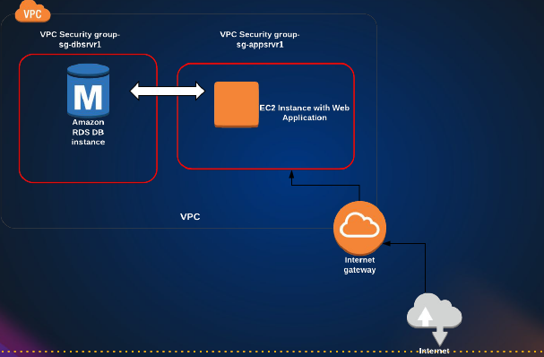

# Introduction to AWS RDS: Simplifying Database Administration  

Managing a relational database involves numerous complex tasks
- setting up the database 
- applying patches 
- continuous monitoring
- performance tuning 
- backups 
- scaling 
- security 
- hardware upgrades 
- storage management

AWS RDS (Relational Database Service) automates most of these tasks, allowing you to focus on your application rather than database administration.  

Amazon Relational Database Service is a distributed relational database service. It provides a fully managed database that you can use to build and run applications.

## Key Features of AWS RDS  

1. **High Availability with Multi-AZ Deployment**  
   - RDS allows you to deploy databases across multiple Availability Zones (AZs).  
   - In a Multi-AZ setup, AWS automatically provisions a primary database and a standby replica. If the primary fails, the standby takes over seamlessly.  

2. **Read Replicas for Performance Scaling**  
   - Unlike Multi-AZ (which ensures high availability), read replicas improve read performance.  
   - Applications can direct read queries to replicas, reducing load on the primary database.  

3. **Automated Backups & Point-in-Time Recovery**  
   - Regular backups ensure data durability.  
   - In case of failures, you can restore to a specific point in time.  

4. **Security & Compliance**  
   - Built-in encryption (at rest and in transit).  
   - Integration with AWS Identity and Access Management (IAM) for fine-grained access control.  

5. **Easy Scaling**  
   - Vertically (upgrading instance types) or horizontally (adding read replicas).  
   - Storage auto-scaling adjusts capacity based on demand.  

6. **Managed Maintenance & Patching**  
   - AWS handles database engine updates and OS patches.  

## Common Use Case: Private Database Access  
A typical RDS deployment involves:  
- Running an RDS instance within a **private subnet** in your VPC.  
- Allowing only **EC2 instances** (e.g., web servers) to access the database internally.  
- Blocking **public internet access** to enhance security.  



## Getting Started with RDS  

1. **Navigate to AWS Console** → Search for **RDS**.  
2. **Click "Create Database"** and choose between:  
   - **Standard Create** (full control over configurations).  ✅
   - **Easy Create** (quick setup with default settings).  
3. **Select a Database Engine** (MySQL, PostgreSQL, Aurora, etc.). Choose **MySQL** ✅. The **Aurora** version of RDS (AWS’s high-performance DB) offers **5x MySQL** and **3x PostgreSQL** throughput at lower costs. But let us focus on MySQL for now. 
   - MySQL Engine version: **8.0.41** (keep default).
   - Template: **Free tier**
4. DB Settings:
   - DB instance identifier: **vprofilerds**
   - Master username: **admin**
   - Credentials Management: **Self Managed**
   - Master password: auto-generate
5. **Configure Settings:**  
   - **Instance Type** (e.g., `db.t4g.micro` for free tier).  
   - **Storage** (GP2 SSD recommended).  
   - **Space** minimum 20 GB.
6. **Connectivity:**:
   - **Compute Resource**: Don't connect to an **EC2 compute instance**. We will do it manually later.
   - Public Access: **No**.
   - VPC Security Groups: Create new
      - New VPC security group name: **vprofilerds-sg**
   - In additional details, database port: **3306**
7. **Database authentication**: Password Authentication.
8. **Additional Configuration**:
   - Initial database name: accounts
   - Backup: Not required for now.
   - Encryption: Not required for now.
   - Delete Protection: Enable. Note: If you enable this, then you cannot delete the database without disabling it first.

It will show notification that the database is being created. There click on "View credential details" and note the master username and password. 

## Launching an EC2 Instance 
Go to the EC2 Console and launch an EC2 instance.
- Name: mysqlClient
- AMI: Choose any (e.g. Ubuntu)
- Instance type: t2.micro (free tier)
- Choose existing key-pair or create new one.
- Security Group: `rdssqlclient` (We need only ssh)
- Launch the instance

## Connecting to the Database
- Go to the RDS section
- Once the database is available, note the **endpoint**.  
- In the security group, add an inbound rule to allow traffic from your EC2 instance (i.e. add the security group of used in the EC2 instance `rdssqlclient`), and delete the existing rule.
- SSH into the instance and `sudo -i`, `apt-get update`.
- Install the mysql-client (`apt install mysql-client -y`)
- Use an **EC2 instance** with MySQL client (`mysql -h [endpoint] -u admin -p`) to connect.  

```bash
mysql> show databases;
+--------------------+
| Database           |
+--------------------+
| accounts           |
| information_schema |
| mysql              |
| performance_schema |
| sys                |
+--------------------+
```

**Clean up**
- Delete the EC2 instance.
- Delete the RDS instance.

## Best Practices on Using RDS 
- **Disable public access** unless absolutely necessary.  
- **Enable encryption** for sensitive data.  
- **Monitor performance** using CloudWatch.  
- **Delete unused instances** to avoid unnecessary costs.  

## Conclusion  

AWS RDS simplifies database management by automating administrative tasks, ensuring high availability, and providing scalable solutions. Whether you're running a small application or a large-scale enterprise system, RDS offers a reliable, secure, and cost-effective database service.  
