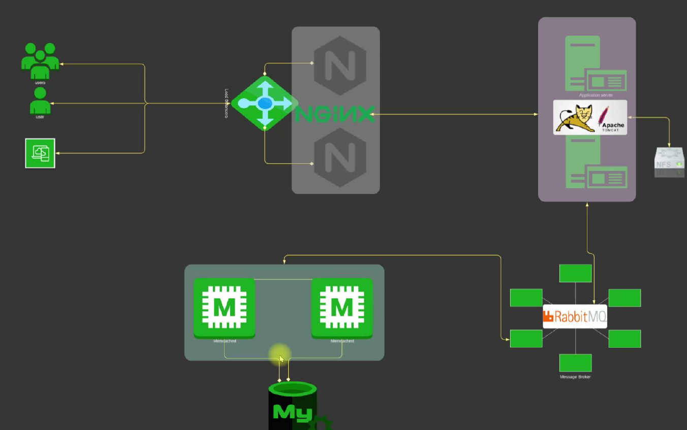
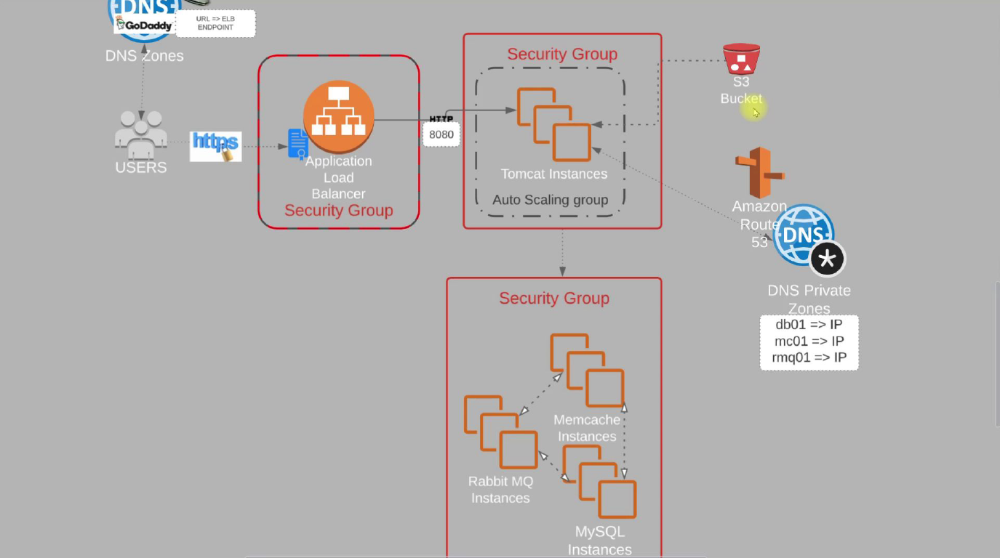
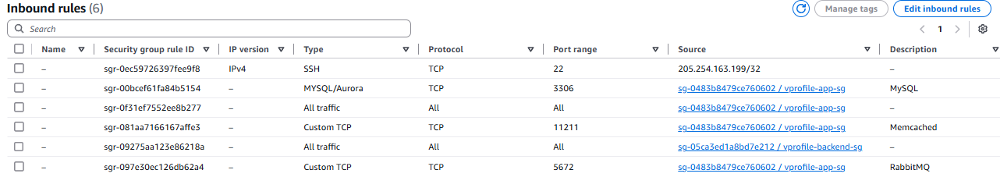

# AWS Cloud for Project Set Up | Lift & Shift

Welcome to the Lift and Shift Cloud Migration Project!

In this blog, we’ll walk you through an AWS cloud computing project focused on migrating an existing multi-tier web application—**vProfile**—from a local environment to the AWS cloud. This is a classic **lift and shift** scenario, where we move the application as-is to the cloud without redesigning it, enabling faster migration with minimal changes.

In our previous project, we deployed vProfile using **Vagrant** on a local multi-tier stack. Now, we’re taking that same architecture and hosting it on **AWS**, bringing it closer to a production-ready cloud setup. By the end of this project, you'll gain hands-on experience in migrating workloads to the cloud using a lift and shift strategy.

The scenario mirrors real-world enterprise setups: you have numerous application services—like Postgres, Oracle, Tomcat, LAMP Stack, DNS, and more—running across physical or virtual machines in a traditional data center. Managing such an environment requires multiple teams, including virtualization, operations, monitoring, and system administration. Scaling this infrastructure is complex, costly, and often heavily manual.

Cloud computing offers a powerful solution. With AWS, you can eliminate upfront infrastructure costs, leverage a pay-as-you-go model, automate processes, and scale dynamically. It brings flexibility, efficiency, and cost control to your infrastructure, allowing you to focus more on your application and less on maintenance.

In this project, we’ll use various AWS services to build and run our environment:

- **EC2 instances** for Tomcat, RabbitMQ, Memcached, and MySQL
- **Elastic Load Balancer (ELB)** to route HTTPS traffic securely
- **Auto Scaling Groups (ASG)** to scale Tomcat instances based on demand
- **Amazon S3** and **EFS** for storage solutions
- **Route 53** for private DNS resolution
- Supporting services like **IAM**, **ACM** (Amazon Certificate Manager), and **EBS**



We’ll replicate the vProfile application stack—Nginx, Apache, Tomcat, RabbitMQ, Memcached, and MySQL—on the AWS Cloud. The architecture will ensure secure communication, high availability, and scalability. Users will access the application through a URL managed via **GoDaddy DNS**, pointing to an **HTTPS-enabled Load Balancer** protected by **Amazon Certificate Manager**. The load balancer will direct traffic to Tomcat instances, which in turn will communicate with backend services through internal DNS records managed in **Route 53**.

Throughout the project, we’ll set up EC2 instances using user data scripts, configure security groups, build the application locally, store artifacts in S3, and automate deployments. Finally, we’ll create an Auto Scaling Group to manage Tomcat instances dynamically based on load.



By the end, you’ll not only have migrated a full-stack application to the AWS cloud but also understand how to architect and manage such environments with real-world AWS services and best practices.

**FLOW OF EXECUTION**

1. Login to AWS Account
2. Create Key Pairs
3. Create Security groups (for tomcat, load balancer and backend services)
4. Launch Instances with user data \[BASH SCRIPTS]
5. Update IP to name mapping in Route 53
6. Build Application from source code
7. Upload to S3 bucket
8. Download artifact to Tomcat EC2 Instance
9. Setup ELB with HTTPS \[Cert from Amazon Certificate Manager]
10. Map ELB Endpoint to website name in GoDaddy DNS
11. Verify
12. Build Auto Scaling Group for Tomcat Instances

Project GitHub repository: [vprofile-project](https://github.com/vikas9dev/vprofile-project/tree/awsliftandshift)

---

## 1. Security Groups & Key Pairs

### Setting Up Security Groups and Key Pairs in AWS

In this section, we'll walk through the essential steps to configure **security groups** and **key pairs**—two critical components when launching secure and functional AWS environments.

#### 🔐 Security Groups

We'll create **three security groups**, each serving a distinct purpose in our architecture:

1. **Load Balancer Security Group** (`vprofile-ELB-SG`)

   - **Purpose**: Allows public internet traffic to reach the application load balancer.
   - **Inbound Rules**:

     - HTTP (port 80) — from anywhere both IPv4 and IPv6.
     - HTTPS (port 443) — from anywhere both IPv4 and IPv6. It is enabled for secure traffic using an SSL certificate from AWS Certificate Manager.

   - **Outbound Rules**: Leave as default (open).

2. **Application (Tomcat) Security Group** (`vprofile-app-sg`)

   - **Purpose**: Protects the Tomcat application servers.
   - **Inbound Rules**:

     - Custom TCP - Port 8080 — allow traffic **only from the load balancer** security group.
     - Port 22 (SSH) — allow access **from your IP** to enable SSH.

   - Tip: If your public IP changes (e.g., on broadband), update this rule accordingly.

3. **Backend Services Security Group** (`vprofile-backend-sg`)

   - **Purpose**: Secures MySQL, Memcached, and RabbitMQ instances.
   - **Inbound Rules**:

     - Port 3306 (MySQL)
     - Port 11211 (Memcached)
     - Port 5672 (RabbitMQ)
     - All allowed **only from the Tomcat security group**.
     - Port 22 — SSH allowed **from your IP**.
     - Add a rule for **all traffic from tomcat**. In source choose the Tomcat security group.
     - Create the security group.

     Once the security groups are created, edit the inbound rules to:-

     - Add a rule for **all traffic from itself** to allow inter-service communication (e.g., Memcached to MySQL). In source choose the Backend Services Security Group (self).



#### 🔑 Key Pair Creation

Next, create a key pair to securely SSH into your EC2 instances:

- **Name**: e.g., `vprofile-prod-key`
- **Key Type**: `RSA`
- **Format**: Use `.pem` for Git Bash/Terminal, or `.ppk` for PuTTY users.
- Save the file securely as it will not be downloadable again.

By carefully defining security groups and understanding how services communicate, you prevent exposing your infrastructure to unnecessary risks. As a DevOps engineer, mastering this layer of networking and access control is fundamental. Next, we’ll move on to provisioning EC2 instances and deploying the services.

---

## 2. Launch EC2 Instances

**Setting Up EC2 Instances for VProfile Project**

In this lecture, we’ll set up four EC2 instances:

1. **MySQL** – For database operations.
2. **Memcache** – For caching.
3. **RabbitMQ** – For message queuing.
4. **Tomcat** – For application deployment.

We’ll provision these instances and configure services using **user data scripts**. Proper **security group assignments** are crucial:

- MySQL, Memcache, and RabbitMQ go into the **backend security group**.
- Tomcat goes into the **app security group**.
- Later, we’ll introduce a **load balancer** in its own security group.

### Step 1: Clone the Source Code

First, clone the repository from GitHub:

```bash
git clone -b awsliftandshift --single-branch https://github.com/vikas9dev/vprofile-project
```

Inside the `UserData` folder (Updated in the [07_aws_profile](/07_aws_vprofile)), we’ll use scripts for each service:

- **MySQL**: Installs MariaDB, sets up databases, and configures users.
- **Memcache**: Installs and configures Memcached to allow remote connections.
- **RabbitMQ**: Configures repositories, installs dependencies, and sets up users.
- **Tomcat (Ubuntu)**: Installs Tomcat 10 (simpler than CentOS setup).

### Step 2: Launch EC2 Instances

#### **MySQL Instance**

- **Name**: `vprofile-db01`.
- **Tags**:
  - `Name:` `vprofile-db01` with resource type `instances` and `Volumes`
  - `Project: vprofile` with resource type `instances` and `Volumes`
- **AMI**: Amazon Linux 2023
- **Instance Type**: `t2.micro` (Free Tier eligible)
- **Key Pair**: `vprofile-prod-key`
- **Security Group**: `vprofile-backend-sg`
- **User Data**: Copy the [`mysql.sh`](/07_aws_vprofile/mysql.sh) script.

#### **Memcache Instance**

- **Name**: `vprofile-mc01`. Similar Tags as MySQL.
- **AMI**: Amazon Linux 2023
- **Security Group**: `vprofile-backend-sg`
- **User Data**: Copy the [`memcache.sh`](/07_aws_vprofile/memcache.sh) script.

#### **RabbitMQ Instance**

- **Name**: `vprofile-rmq01`. Similar Tags as MySQL.
- **AMI**: Amazon Linux 2023
- **Security Group**: `vprofile-backend-sg`
- **User Data**: Copy the [`rabbitmq.sh`](/07_aws_vprofile/rabbitmq.sh) script.

#### **Tomcat Instance**

- **Name**: `vprofile-app01`. Similar Tags as MySQL.
- **AMI**: Ubuntu 24.04 LTS. Here we will use Ubuntu instead of Amazon Linux.
- **Security Group**: `vprofile-app-sg`
- **User Data**: Copy the [`tomcat-ubuntu.sh`](/07_aws_vprofile/tomcat-ubuntu.sh) script.

### Step 3: Verify Services

After launching, SSH into each instance and check service status:

- **MySQL**: `systemctl status mariadb`. Go inside the MySQL DB:- `mysql -u admin -p accounts` use password `admin123`, `show databases;`, and `show tables;`.
- **Memcache**: `systemctl status memcached`
- **RabbitMQ**: `systemctl status rabbitmq-server`
- **Tomcat**: Will be verified in the next lecture.

If any service fails, **terminate and relaunch** the instance—troubleshooting isn’t necessary since everything is automated via user data.

In the next section, we’ll configure **private DNS entries** and prepare for load balancer setup. For now, **stop the instances** if you’re taking a break to avoid unnecessary costs.

---

## 3. Update IP to name mapping in Route 53

**Configuring Private DNS for VProfile Backend Services**

Our VProfile application (running on **app01**) needs to connect to three backend services:

- **MySQL** (`db01`)
- **Memcache** (`mc01`)
- **RabbitMQ** (`rmq01`)

### Why DNS Instead of IP Addresses?

In the `application.properties` file, we reference these services by hostnames (e.g., `db01`). Hardcoding IPs is **not recommended** because:

- If an instance is replaced, its IP changes, requiring manual updates.
- Using DNS names ensures **scalability** and **maintainability**.

### Setting Up Private DNS with AWS Route 53

Since `/etc/hosts` isn’t scalable, we’ll use **AWS Route 53** for internal DNS resolution. Go to Route 53 => Dashboard => Create Hosted Zone.

1. **Create a Private Hosted Zone**:

   - **Domain**: `vprofile.in` (or any custom name matching `application.properties`).
   - **Type**: **Private Hosted Zone** (for internal resolution). The "Public Hosted Zone" used for external DNS. But here we are using internal DNS to resolve private IP address.
   - **VPC**: Attach to your default VPC (e.g., `us-east-1`).
   - **Create**.

2. **Add A Records**:
   - For each backend instance (`db01`, `mc01`, `rmq01`), create an **A record** mapping the hostname to its **private IP** (e.g., `db01.vprofile.in` → `172.31.X.X`), not the public IP.
   - For MySQL:-
     - Record Name: `db01`
     - Record Type: **A** (for IPv4)
     - Record Value: `172.31.X.X`
     - Create the record.
   - Repeat the same process for Memcache and RabbitMQ.

### Verification

SSH into `app01` (Ubuntu) and test DNS resolution:

```bash
ping -c 4 db01.vprofile.in
```

Ensure replies match the expected private IPs. Also check for `mc01`, and `rmq01`.

> **Note**: While `app01` doesn’t strictly need a DNS entry (since the load balancer will route traffic), we’ve added it for completeness. Add it in Route 53 as well.

- Record Name: `app01`
- Record Type: **A** (for IPv4)
- Record Value: `172.31.X.X`
- Create the record.

With DNS configured, our application can reliably resolve backend services **without IP hardcoding**. In the next lecture, we’ll prepare for load balancer integration.

---

## 4. Building and Deploying the VProfile Artifact

In this section, we'll:

1. **Build the WAR artifact** locally using Maven and JDK.
2. **Upload it to an S3 bucket** using AWS CLI.
3. **Deploy it to the Tomcat server** (`app01`) by fetching it from S3.

### Prerequisites

- **Local Machine**:
  - Maven (`3.9.9`) and JDK (`17`) installed.
  - AWS CLI configured with IAM user credentials (for S3 access).
- **AWS Setup**:
  - **S3 Bucket**: Go to S3 => Buckets => Create Bucket => `vprofile-las-artifacts<account-id>` => Create. Created (`vprofile-las-artifacts<account-id>`) to store the WAR file.
  - **IAM User**: Configure with `S3FullAccess` (credentials stored securely). Go to IAM => Users => Create User:-
    - User Name: `vprofile-s3-admin`
    - Attach Policies Directly
    - Choose `S3FullAccess`
    - Create User.
    - Click on the create user, and go to the Security Credentials tab to download the access key and secret key.
    - Create Access Key.
    - Choose CLI => Next
    - Create Access Key => Download CSV file.
  - **Create IAM Role**: In IAM, go to the roles section =>
    - Create Role
    - Trust Entity: AWS Service
    - Use Case: EC2
    - Attach Policy: AmazonS3FullAccess
    - Role name: `s3-admin`
    - Create Role
  - **IAM Role Update**: Attached to `app01` for S3 access without hardcoded keys. Go to the instances, Select the `app01` instance => Action => Security => Modify IAM Role => Choose `s3-admin` from the dropdown => Update IAM Role.

### Step 1: Build the Artifact

1. **Verify Configurations**:
   - Ensure `application.properties` points to DNS names (e.g., `db01.vprofile.in`). Note: Ensure that you are update src/main/resources/application.properties file but not the user-data/application.properties file.

```properties
jdbc.url=jdbc:mysql://db01.vprofile.in:3306/accounts?useUnicode=true&characterEncoding=UTF-8&zeroDateTimeBehavior=convertToNull
memcached.active.host=mc01.vprofile.in
rabbitmq.address=rmq01.vprofile.in
```

2. **Run Maven Build**:
   ```bash
   mvn -version
   mvn install
   ```
   This generates `vprofile-v2.war` in the `target/` folder. Before proceeding check the `application.properties` file inside the `target/vprofile-v2/WEB-INF/classes` folder.

### Step 2: Upload to S3

1. **Configure AWS CLI**:
   ```bash
   aws configure
   ```
   Enter the IAM user’s (`vprofile-s3-admin`) access key, secret key, and default region (`us-east-1`). If you entered the wrong key then you can edit it in the `~/.aws/credentials` file. We can also update the region and output through the `~/.aws/config` file.
2. **Upload the WAR File**:
   ```bash
   ls
   aws s3 cp target/vprofile-v2.war s3://vprofile-las-artifacts825765386084/
   aws s3 ls s3://vprofile-las-artifacts825765386084/
   ```

### Step 3: Deploy to Tomcat

1. **SSH into `app01`** and `sudo -i`.
2. **Install AWS CLI (if missing)**:
   ```bash
   sudo snap install aws-cli --classic
   ```
3. **Fetch the Artifact**:
   ```bash
   aws s3 cp s3://vprofile-las-artifacts825765386084/vprofile-v2.war /tmp/
   ```
4. **Deploy**:
   - Stop Tomcat:
     ```bash
     systemctl stop tomcat10
     systemctl daemon-reload
     systemctl stop tomcat10
     ```
   - Remove default app. The default app is `/var/lib/tomcat10/webapps/ROOT`.
     ```bash
     ls /var/lib/tomcat10/webapps/
     rm -rf /var/lib/tomcat10/webapps/ROOT
     ```
   - Copy the WAR file with renaming it as `ROOT.war`:
     ```bash
     cp /tmp/vprofile-v2.war /var/lib/tomcat10/webapps/ROOT.war
     ls /var/lib/tomcat10/webapps/
     ```
   - Start Tomcat. While starting Tomcat, it will extract the WAR file:
     ```bash
     systemctl start tomcat10
     ls /var/lib/tomcat10/webapps/
     ```

### Verification

- Check `/var/lib/tomcat10/webapps/ROOT/` for extracted files.
- In the next section, we’ll configure the **load balancer** to route traffic to `app01`.

> **Security Note**:
>
> - Never expose AWS keys in code/public repos.
> - Rotate/delete keys if accidentally leaked.
> - Use IAM roles (not keys) for EC2 instances whenever possible.

---

## 5. Load Balancer & DNS

**Testing and Configuring the Load Balancer for VProfile**

Before setting up Auto Scaling, we need to ensure our application is accessible via the **Application Load Balancer (ALB)**. Here’s how we test and configure it:

### **1. Verify Tomcat Accessibility**

- **Update Security Group**:
  - Allow inbound traffic on **port 8080** from your IP (temporarily) in the `vprofile-app-sg`.
  - Access `http://<app01-public-ip>:8080` in a browser.
  - If the login page loads, Tomcat is running correctly.

### **2. Create a Target Group**.

Go to the load balancing section and create a target group.

- **Target Type**: Instance.
- **Name**: `vprofile-las-tg`
- **Protocol**: HTTP
- **Port**: `8080` (Tomcat’s default port)
- In advance health check, **Health Check**:
  - **Override** default port `80` → `8080`.
- **Register Targets**:
  - Attach `vprofile-app01` (ensure port `8080` is selected).
- Create the target group.

### **3. AWS Certificate Manager**

To listen on port 443 (HTTPS), we need an SSL certificate. This should be done at the very beginning.

- **Create a Certificate**:
  - Request a public certificate.
  - Domain name: `*.vikas9dev.xyz`
  - Validation Method: DNS.
  - Key Algorithm: RSA 2048 (default).
  - Add tags: `Name=vikas9dev.xyz`.
  - Request the certificate.

**Validate** the certificate via DNS.

- Select the certificate => Go to Domains.
- Copy CNAME name & CNAME value.
- Add a **CNAME record** in your DNS provider (e.g., GoDaddy) pointing to the ALB’s DNS name.
  - Go to GoDaddy.
  - Manage Domain.
  - Add New record.
  - Type: `CNAME`.
  - Name: `<CNAME-Name>`. Remove the domain part. If it was `546456.vikas9dev.xyz.` then keep only `546456`.
  - Value: `<CNAME-Value>`. Remove the full stop at the end.
  - Save.

Now AWS ACM service will be checking if CNAME-Name resolves to the CNAME-Value. It may take some time especially if the domain is purchased newly then it may take 48 hours.

### **4. Set Up the Load Balancer**

- Load balancer types: Application Load Balancer (ALB).
- **Name**: `vprofile-las-elb`
- **Scheme**: Internet-facing.
- **Network Mapping**: Select all the subnets/Availability Zones (at least two).
- **Security Group**: Attach the `vprofile-ELB-SG`.
- **Listeners**:
  - **HTTP (Port 80)**: Routes to `vprofile-las-tg` target group.
  - **HTTPS (Port 443)**: Requires an **ACM certificate** (if using a custom domain). To add this, click on "Add Listener", Protocol: HTTPS, Port: 443, Target Group: `vprofile-las-tg`.

> **Note**: If you don’t have a domain, skip HTTPS. Access the ALB via its DNS name (e.g., `http://<ALB-DNS>`).

- Default SSL/TSL server certificate:
  - Certificate Source: From ACM.
  - Certificate (from ACM): Select the certificate.
- Create the load balancer.
- The load balancer will be accessible via its DNS name (e.g., `http://<ALB-DNS>`). Copy the DNS name for later use.

### **4. Configure DNS (Optional for HTTPS)**

- For a custom domain (e.g., `vikas9dev.xyz`):
  - Add a **CNAME record** in your DNS provider (e.g., GoDaddy) pointing to the ALB’s DNS name (e.g., `vprofile-las-elb-123456789.us-east-1.elb.amazonaws.com`).
  - Type: `CNAME`.
  - Name: vprofileapp
  - Value: `<ALB-DNS>`

So now we can access the app via `https://vprofileapp.vikas9dev.xyz`.

### **5. Validate Functionality**

- **Check Target Health**:
  - In the **Target Groups** console, verify `app01` shows **"Healthy"**.
  - If **"Unhealthy"**, check:
    - Tomcat service status (`systemctl status tomcat10`).
    - Security group rules (allow `8080` from ALB’s SG).
    - Health check port (`8080`).
- **Test Access**:
  - **HTTP**: `http://<ALB-DNS>` → Should display the login page.
  - **HTTPS**: `https://vprofileapp.vikas9dev.xyz` → Shows a valid certificate.

### **6. Verify Backend Services**

- **Database**: Successful login confirms MySQL connectivity. Use user `admin_vp` with password `admin_vp`.
- **Memcache**:
  - View a user profile → First attempt fetches from DB, second from cache.
- **RabbitMQ**: Check for active queues (if applicable).

### **Next Steps**

In the next section, we’ll configure **Auto Scaling** to dynamically adjust instance capacity based on traffic.

> **Troubleshooting Tips**:
>
> - If the ALB fails to route traffic, recheck **security groups**, **health checks**, and **listener rules**.
> - For HTTPS issues, ensure the ACM certificate is **issued for the correct domain** and attached to the ALB.

---

## 6. Auto Scaling Group

In this section, we'll configure **Auto Scaling** to automatically adjust the number of application instances based on traffic. Here's how we set it up:

### **1. Create an AMI (Amazon Machine Image)**

- **From `app01`**:
  - Go to **EC2 > Instances**, select `app01`, then **Actions > Image and Templates > Create Image**.
  - **Name**: `vprofile-app-ami`
  - **Description**: "AMI for Auto Scaling deployment"
  - Once created, verify in **EC2 > AMIs** (takes a few minutes).

### **2. Set Up a Launch Template**

- **Name**: `vprofile-las-app`
- **AMI**: Select the newly created `vprofile-app-ami`.
- **Instance Type**: `t2.micro` (Free Tier eligible).
- **Key Pair**: `vprofile-prod-key`.
- **Security Group**: `vprofile-app-sg` (allows HTTP/8080 from ALB).
- **Tags**:
  - `Name: vprofile-app01`
  - `Project: vprofile` (ensure volumes are also tagged).
- In advance details, **IAM Instance Profile**: Optional (for CI/CD automation). Add `s3-admin` role.
- Create Launch Template.

### **3. Configure the Auto Scaling Group (ASG)**

- **Name**: `vprofile-las-app-asg`
- **Launch Template**: Use the one created above.
- **VPC & Subnets**: Spread across all Availability Zones for high availability.
- **Load Balancer Integration**:
  - Attach to the existing **Target Group** (`vprofile-las-tg`).
  - Enable **Elastic Load Balancing health checks** (ensures unhealthy instances are replaced).
- **Group Size**:
  - **Desired Capacity**: `1` (initially).
  - **Minimum**: `1` (never scales below this).
  - **Maximum**: `4` (caps scaling during peak traffic).
- **Scaling Policies**:
  - **Target Tracking Scaling Policy**: Scale based on **CPU utilization** (e.g., add instances if >50%).
  - Optionally disable **scale-in** if needed.
- Instance maintenance policy: No Policy.
- **Instance Protection**:
  - Disabled (allows ASG to replace unhealthy instances automatically).
- Notifications: Select the appropriate SNS topic.

### **4. Enable Session Stickiness (For VProfile Only)**

- **Why?** The app doesn’t share session data across instances.
- **Solution**:
  - Go to **Target Groups > Attributes > Edit**.
  - Enable **Stickiness** (uses cookies to route users to the same instance).

### **5. Clean Up Old Instances**

- **Deregister `app01`** from the Target Group.
- **Terminate `app01`**—ASG will launch a replacement automatically.

### **Verification**

- Check the **Target Group** to confirm the new instance is **Healthy**.
- Access the application via the **Load Balancer URL** to ensure seamless traffic routing.

### **Next Steps**

In the final section, we’ll validate the full setup and summarize key learnings.

> **Pro Tip**:
>
> - Use **SNS notifications** to alert on scaling events (prerequisite: set up SNS in the **IAM section**).
> - For production, consider **multi-zone deployments** and **custom scaling metrics** (e.g., request count).

---

## 7. Validate & Summarize

**Finalizing the VProfile Project: Validation and Cleanup**

Congratulations on reaching the final stage of the VProfile migration! Let’s validate the deployment and clean up resources to avoid unnecessary charges.  

### **1. Validate the Deployment**  
- **Access the Application**:  
  - **Without a Domain**: Use the **Load Balancer DNS name** (e.g., `http://<ALB-DNS>`).  
  - **With a Domain**: Use your registered URL (e.g., `https://vprofileapp.yourdomain.com`).  
- **Login & Test Functionality**:  
  - **Credentials**: `admin_vp` / `admin_vp`.  
  - **Verify Services**:  
    - **Database**: Successful login confirms MySQL connectivity.  
    - **Memcache**: Refresh a user profile—first fetch from DB, subsequent from cache.  
    - **RabbitMQ**: Check for active queues (if applicable).  
  - **Stickiness Check**:  
    - If logged out on refresh, enable **stickiness** in the **Target Group** (critical for session persistence).  

### **2. Auto Scaling Group (ASG) Verification**  
- **Instance Management**:  
  - Only **ASG-managed instances** should exist (original `app01` terminated).  
  - Confirm instances are **Healthy** in the **Target Group**.  
- **Scaling Test**:  
  - Simulate load (e.g., with `stress-ng`) to trigger scaling (CPU >50%).  Login to the `app01` instance to check CPU usage. `sudo apt-get install stress -y` then `nohup stress -c 4 -t 300 &` then `top`.

### **3. Cleanup Steps**  
1. **Delete Auto Scaling Group**:  
   - Terminates managed instances automatically.  
2. **Remove Load Balancer & Target Group**:  
   - Navigate to **EC2 > Load Balancers/Target Groups** → Delete.  
3. **Clean Route 53 Entries**:  
   - Delete all records in the **Private Hosted Zone** before deleting the zone itself.  
4. **Delete AMI & Snapshots**:  
   - **Deregister AMI** → Delete associated **EBS Snapshot**.  
5. **S3 Bucket Cleanup**:  
   - **Empty** → **Delete** the artifact bucket (`vprofile-las-artifacts`).  
6. **EC2 Instance Cleanup**:  
   - **Deregister** → **Terminate** the `app01` instance.
7. **Security Groups & Key Pairs**:  
   - Remove unused resources (optional).  

### **Key Takeaways**  
- **Lift-and-Shift Migration**: Replicated the local setup on AWS using EC2 instances.  
- **Automation**: Used **user data scripts**, **S3 for artifacts**, and **ASG for scalability**.  
- **Best Practices**:  
  - Private DNS (Route 53) over hardcoded IPs.  
  - IAM roles (not keys) for EC2 instances.  
  - HTTPS via ACM certificates.  

### **Next Steps**  

In the upcoming project, we’ll **re-architect VProfile** using managed AWS services (e.g., RDS, ElastiCache) to reduce operational overhead.  

---
