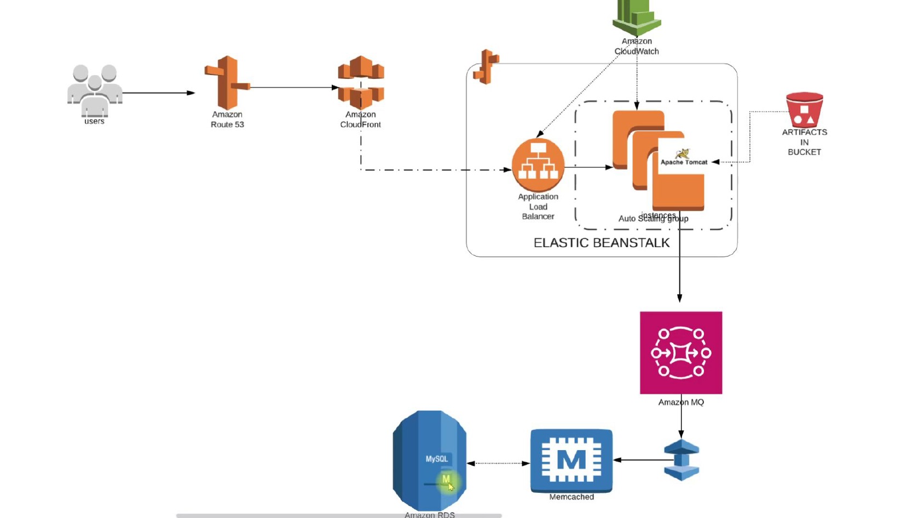

# AWS Re-Architect Web App on AWS Cloud (PAAS & SAAS)

## 1. Refactoring with AWS Project

In our previous project, we deployed the vProfile application stack both on a local machine and on AWS Cloud using the lift-and-shift strategy. Now, we’re taking it a step further by refactoring and rearchitecting our services to enhance agility, scalability, and performance.

### Why Refactor?

Imagine managing an application with services running on physical machines, virtual machines, or even cloud-based EC2 instances. You’re juggling databases, web servers, network services (DNS, DHCP), and more. This setup demands multiple teams—cloud computing, virtualization, datacenter operations, monitoring, and sysadmins—just to keep things running. The operational overhead is immense, with challenges like uptime struggles, scaling difficulties, high capital and operational expenditures, and manual, time-consuming processes.

By leveraging AWS’s **Platform-as-a-Service (PaaS)** and **Software-as-a-Service (SaaS)** offerings instead of traditional Infrastructure-as-a-Service (IaaS), we can drastically reduce operational complexity. Cloud-managed services provide automation, flexibility, and elasticity, with scaling handled by AWS—all on a pay-as-you-go model.

### AWS Services We’ll Use

Instead of manually managing EC2 instances, we’ll use:

- **Elastic Beanstalk** for deploying our Tomcat application (handling EC2, load balancing, auto-scaling, and artifact storage in S3).
- **RDS** for managed MySQL databases (automated backups, scaling, and high availability).
- **ElastiCache** in place of Memcached.
- **Amazon MQ** (ActiveMQ) instead of RabbitMQ.
- **Route 53** for DNS management.
- **CloudFront** as a global Content Delivery Network (CDN).

### Architecture Overview

1. **User Flow**:

   - A user accesses our URL, resolved via **Route 53** to a **CloudFront** endpoint (for fast global delivery).
   - Requests route to an **Application Load Balancer (ALB)** in Elastic Beanstalk, which forwards traffic to EC2 instances in an auto-scaling group.
   - **CloudWatch** monitors performance, triggering scaling as needed.

2. **Backend Services**:
   - **Amazon MQ** (messaging), **ElastiCache** (caching), and **RDS** (database) replace self-managed VMs.
   - Security groups control access between Beanstalk instances and backend services.



### Execution Steps

1. **Setup**:

   - Log in to AWS and create a key pair for Beanstalk instances.
   - Configure security groups for backend services (RDS, ElastiCache, Amazon MQ).

2. **Backend Deployment**:

   - Launch RDS, ElastiCache, and Amazon MQ.
   - Initialize the RDS database via an EC2 instance.

3. **Beanstalk Configuration**:

   - Deploy the Beanstalk environment (auto-creating EC2, ALB, and scaling policies).
   - Update health checks to `/login` and enable HTTPS (443) on the ALB.
   - Update security groups of backend to allow traffic from Bean security group.
   - Update security groups of backend to allow internal traffic.

4. **Application Deployment**:

   - Build the artifact with updated endpoints (RDS, Amazon MQ, ElastiCache).
   - Deploy to Beanstalk and verify.

5. **Final Touches**:
   - Set up **CloudFront** with an SSL certificate for HTTPS.
   - Update DNS records in Route 53 or GoDaddy.
   - Test the full stack via the live URL.

By refactoring, we achieve a **scalable, low-overhead infrastructure** with automated scaling, managed services, and global performance. Ready to dive in? Let’s get started on the AWS console!

---

## 2. Configuring Security Groups and Key Pairs for the Refactored Stack

In our refactored AWS architecture, **Elastic Beanstalk** will automatically provision EC2 instances to host the vProfile application, along with two security groups:

1. **Application Security Group** – For the EC2 instances running the app.
2. **Load Balancer Security Group** – For the ALB (Elastic Beanstalk auto-configures rules to allow traffic from the ALB to the instances).

### Backend Security Group Setup

For **Amazon MQ (ActiveMQ), RDS, and ElastiCache**, we’ll create a dedicated **Backend Security Group** with two critical rules:

1. **Internal Communication**: Allow all traffic _within the same security group_ so backend services (RDS, cache, messaging) can interact seamlessly. Create the security group with name `vprofile-rearch-backend-sg` without any rules. Once the security group is created, then edit the inbound rules to allow "All Traffic" from _its own Security Group ID_.
2. **Beanstalk Access**: Later, we’ll add a rule to permit traffic from the Beanstalk instance security group (ensuring the app can connect to the backend).

### Key Pair for Troubleshooting

While Beanstalk manages EC2 instances, we’ll create a **PEM key pair** (`vprofile-rearch-key.pem`) for emergency SSH access—useful for debugging.

With this setup, our backend services can securely communicate, and Beanstalk will later integrate via security group updates. Next up: **launching the RDS instance!**

---

## 3. Setting Up a Managed MySQL Database with Amazon RDS

In our application modernization journey, we're replacing self-managed MySQL on EC2 with **Amazon RDS**, AWS's fully managed relational database service. This shift eliminates database maintenance burdens while providing enterprise-grade availability, scalability, and security. Here's our comprehensive implementation approach:

### Architectural Foundations

**a. Parameter Groups for Fine-Tuned Control**
We will create a custom DB parameter group (`vProfile-RDS-Rearch-ParaGroup`) specifically configured for MySQL 8.0. This gives us granular control over 300+ database parameters without needing server access. While we're using defaults initially, this setup allows future performance tuning as our application scales.

Go to the AWS RDS section => Parameter Groups => Create Parameter Group => Name: vProfile-RDS-Rearch-ParaGroup => Engine: MySQL Community => Parameter group family: MySQL 8.0 => Type: DB Parameter Group => Create

**b. Network Isolation Strategy**
Our dedicated DB subnet group spans multiple Availability Zones, establishing the foundation for high availability. Though we're currently using a single instance (for cost optimization), this design allows seamless transition to Multi-AZ deployment when needed. The database is completely isolated from public internet access, with connectivity restricted to:

- Our Beanstalk application tier
- Designated backend services
- Authorized administrative EC2 instances

Go to the AWS RDS section => Subnet Groups => Create Subnet Group => Name: vProfile-RDS-Rearch-SubnetGroup => VPC: Choose Default => Availability Zones: Add all AZs (default) => Subnets: Add all subnets => Create

### RDS Configuration Details

**🚀 Database Configuration Details**

Here's your enhanced content with perfectly matched emojis for maximum clarity and technical accuracy:

**🔧 Database Configuration Details**

- **🛠️ Creation Method**: Standard Create
- **⚙️ Engine**: MySQL 8.0.41 (maintained and patched by AWS 🛡️)
- **🏷️ Template**: Free Tier 🆓
- **🌐 Availability & Durability**: Single AZ DB instance 📍
- **🏷️ DB instance identifier**: `vprofile-rds-rearch`
- **👨💻 Master username**: `admin`
- **🔑 Credentials Management**: Self Managed
- **🎲 Auto Generate Password**: Yes ✅
- **💻 Compute**: db.t4g.micro (Free Tier eligible 🆓, 2 vCPUs 🖥️, 1GB RAM)
- **💾 Storage**: 20GB GP2 SSD (baseline 3,000 IOPS ⚡, scalable to 16,000 📈)
- **⚙️ Additional Storage Configuration**: ⚙️❌ Disable storage autoscaling
- **🔌 Connectivity**: 🚫 Don't connect to an EC2 compute instance (we'll do it manually later ✋)
- **🌐 VPC**: Use the default VPC 🏠
- **🛰️ DB Subnet group**: `vProfile-RDS-Rearch-SubnetGroup` (pre-created) 🔄
- **🌍 Publicly accessible**: No 🚫
- **🛡️ VPC Security Groups**:
  - ➖ Remove default
  - ➕ Add `vprofile-rearch-backend-sg` security group 🔒
- **📍 Availability Zone**: No Preference (default) ⚙️
- **🔐 Database Authentication**: Password Authentication 🔑

**⚙️ Additional Configuration**:

- **🗃️ Initial DB Name**: `accounts`
- **⚙️ DB Parameter group**: `vProfile-RDS-Rearch-ParaGroup` (pre-created) 🔧
- **💾 Backup**: Not required for now ⏸️
- **🔏 Encryption**: Keep default 🔄

**✅ Final Steps**:

- **🖱️ Create** button to launch instance 🚀
- **📋 View Credential Details** from the banner - Store securely! 🔒 (Password cannot be retrieved later) ⚠️

**Key Security Notes**:

- 🚫 Database is not publicly accessible
- 🔒 Uses dedicated security group
- 🔏 Encrypted by default
- 🔑 Credentials available only during creation

**Key Highlights**:

- 🆓 Free Tier eligible configuration for cost savings
- 🔄 Single AZ setup for development environments
- ⚡ Scalable storage performance when needed
- 📈 High availability for production deployments
- 🛡️ AWS-managed security and patching

---

## 4. 🚀 Setting Up ElastiCache Memcached for High-Performance Caching

In our cloud modernization journey, we're now configuring **Amazon ElastiCache** 🏗️ to replace our self-managed Memcached instances. This fully managed service delivers blazing-fast 🚀 in-memory caching while eliminating operational overhead. Here's our step-by-step implementation: Search for the ElastiCache. Let us first create Parameter group and Subnet Group.

### 🔧 Pre-Configuration Setup

**1. Parameter Group Creation**

- Name: `vprofile-cache-parameter-group` ⚙️
- Family: **Memcached 1.6** engine (tested and verified for vProfile compatibility ✅)
- Create 🎉.
- Open the created parameter group and you can see the default 150+ parameters.

**2. Subnet Group Configuration**

- Name: `vprofile-rearch-cache-subgrp` 🌐
- VPC: Use the default VPC 🏠
- Subnets: By default all the subnets are selected 🔄
- Create 🛡️

### ⚡ Cache Cluster Deployment

Go to the ElastiCache Dashboard and create a cache cluster: Create cache => Select Create Memcached.

**Core Specifications**:

- **Deployment Option**: "Design your own cache" 📊 & "Standard Create"
- **Location**: AWS Cloud
- **Name**: `vprofile-rearch-cache`
- **Engine**: Memcached 1.6.22 (latest stable version 🔝)
- **Port**: 11211 (matches application properties 🔌)
- **Parameter Group**: `vprofile-cache-parameter-group` (pre-created)
- **Node Type**: cache.t2.micro (Free Tier eligible 🆓 - 0.5GB RAM) - Choose the smallest one.
- **Number of nodes**: 1 (default)
- **Subnet Group**: `vprofile-rearch-cache-subgrp` (pre-created)
- **Availability Zone**: No Preference (default)
- **Security Groups**: Manage => ➕ Add `vprofile-rearch-backend-sg` security group 🔒
- **Maintenance Window**: No preference (temporary environment)
- **Create**: Launch the cache cluster 🚀

**Advanced Options**:

- Disabled SNS notifications (enable for production monitoring 📢)
- Verified all settings before creation 👁️

### 🚦 Creation Process

The cluster takes ~5-10 minutes to initialize ⏳. During this time:

- AWS provisions the specified compute resources 💻
- Configures networking according to our specifications 🌐
- Applies our custom parameter group settings ⚙️

"**AWS bills for ElastiCache like a hotel room - you pay for every hour it's reserved, whether you sleep there or not.**" 🏨💳. No "pausing" or "stopping" mechanism exists. Node type (cache.t2.micro = ~$0.018/hr ≈ $13/month). Additional charges for: - Data transfer (if applicable), - Backup storage (if enabled).

🛑 Cost Control Options:
**DELETE When Not Needed**

- Terminate via AWS Console → ElastiCache → Delete Cluster
- Recreate later (loses all cached data)

---

## 5. 🚀 Setting Up Amazon MQ (RabbitMQ) for Your Application  

Instead of manually setting up RabbitMQ on an EC2 instance, you can use **Amazon MQ**, a fully managed message broker service from AWS. It supports both **Apache ActiveMQ** and **RabbitMQ**, making it super easy to get started!  

### 🔍 Steps to Create a RabbitMQ Broker  

1. **Search for Amazon MQ** in AWS and select the service.  
2. Click **"Create Broker"** and choose **RabbitMQ** as your broker type.  
3. Select **Single Instance Broker** (for cost efficiency, though clustered deployment is recommended for production).  
4. **Configure Broker Settings:**  
   - **Name:** Give it a meaningful name (e.g., `VProfile-ReArch-RabbitMQ`).  
   - **Instance Type:** Choose the smallest (`mq.t3.micro`) to save costs.  
   - **Credentials:** Set a username (`rabbit`) and a strong password. **Save these!** (You’ll need them for your `application.properties`.)  
5. **Additional Settings:**  
   - **Access Type:** Select **Private Access** (since your servers will access it within the same VPC).  
   - **VPC & Subnet:** Use the **default VPC** if no custom setup exists.  
   - **Security Group:** Attach the security group you created earlier (`vprofile-rearch-backend-sg`).  
6. **Review & Create:** Double-check all settings and hit **"Create Broker."**  

⚠️ **Note:** Broker creation may take a few minutes (approx 20 minutes).  

### 🔜 Next Steps  
While the broker initializes, we still need to **set up the database schema** on RDS. We’ll cover that in the next section—stay tuned! 🎬

---

## 6. 🛠️ Initializing the RDS Database for VProfile  

Since our **Amazon RDS MySQL instance** is private (not publicly accessible), we need an **EC2 instance in the same VPC** to connect and initialize the database. Here’s how to set it up:  

### 🔹 Step 1: Launch a Temporary EC2 Instance 
- **Name:** Give it a name like `vprofile-rearch-rds-client`. 
- **AMI:** Ubuntu Server 24.04  
- **Instance Type:** `t2.micro` (cost-effective)  
- **Key Pair:** Use an existing one or create a new key for SSH access.  
- **Security Group:** Create a new SG (`VProfile-MySQL-Client-SG`) with **SSH (Port 22) restricted to your IP**.  
- **Launch:** Launch the instance.

### 🔹 Step 2: Allow EC2 to Access RDS  
- Go to the **RDS Security Group** (`vprofile-rearch-backend-sg`).  
- Edit **Inbound Rules** → Add **MySQL (3306)** and allow traffic from the **EC2 instance’s Security Group** (`VProfile-MySQL-Client-SG`).  

### 🔹 Step 3: Install MySQL Client & Git  
SSH into the EC2 instance and run:  
```bash
sudo apt update && sudo apt install mysql-client git -y
```  

### 🔹 Step 4: Connect to RDS & Initialize Schema  
- **Get RDS Endpoint** from AWS Console.  
- Log in to MySQL:  
  ```bash
  mysql -h [RDS_ENDPOINT] -u admin -p accounts
  ```  
  *(Enter password when prompted—avoid passing it directly in the command!)*  
  Exit from it and let us first deploy the database schema.

- **Clone the VProfile Source Code:**  
  ```bash
  git clone -b awsrefactor --single-branch https://github.com/vikas9dev/vprofile-project.git
  cd vprofile-project
  ```
  
  or,

  ```bash
  git clone https://github.com/vikas9dev/vprofile-project.git
  cd vprofile-project
  git checkout awsrefactor
  ```  

- **Deploy the DB Schema:**  
  ```bash
  mysql -h [RDS_ENDPOINT] -u admin -p accounts < src/main/resources/db_backup.sql
  ```  

- **Verify Tables:**  
  ```sql
  SHOW TABLES;
  ```  
  ✅ If tables appear, the database is ready!  

### 🗑️ Cleanup  
- **Terminate the EC2 instance** (it was only needed for DB setup).  

### 🚀 Next Steps  
With the **database initialized**, we’ll now deploy the **VProfile app on AWS Elastic Beanstalk**—stay tuned for the next steps! 🎯

---

## 7. 🚀 Setting Up AWS Elastic Beanstalk for VProfile  

Welcome! In this section, we'll configure an **Elastic Beanstalk environment** to deploy our VProfile application effortlessly. 🌟  

### 🔍 Why Elastic Beanstalk?  
Remember manually setting up **Tomcat on EC2**? We had to:  
- Create security groups & key pairs  
- Configure load balancers & auto-scaling  
- Build and deploy artifacts via S3  

Beanstalk **automates all this**! It provides:  
✅ **Pre-configured Tomcat environment**  
✅ **Auto-scaling & load balancing**  
✅ **CloudWatch monitoring & logging**  
✅ **Zero additional cost** (you only pay for underlying resources like EC2)  

Amazon Elastic Beanstalk is an easy-to-use service for deploying and scaling web applications and services developed with Java, .NET, PHP, Node.js, Python, Ruby, Go, and **Docker** on familiar servers such as Apache, Nginx, Passenger, and IIS. It provides a managed service for deploying and scaling web applications and services on AWS.

### ⚙️ Step 1: Create an IAM Role for Beanstalk  
Beanstalk needs permissions to manage AWS resources. Here’s how to set it up:  
1. Go to **IAM → Roles → Existing role might not have all the permissions so search for `aws-elasticbeanstalk-service-role` and delete it.
2. Create Role
3. Select **AWS Service → EC2**  
4. Attach these policies:  
   - `AdministratorAccess-AWS-ElasticBeanstalk`  
   - `AWSElasticBeanstalkCustomPlatformforEC2Role`  
   - `AWSElasticBeanstalkRoleSNS`  
   - `AWSElasticBeanstalkWebTier`  
5. Name it **`VProfile-Beanstalk-Role`**  

### 🛠️ Step 2: Configure the Beanstalk Environment 
Go to **Elastic Beanstalk → Environments → Create New Environment -> Environment Tier: Web Server Environment**. 
1. **Application Name**: `VProfile-ReArch-BeanApp`  
2. **Environment Name**: `VProfile-Prod` (or `Dev/Test` as needed)  
3. **Domain**: Choose a **unique URL** (e.g., `vprofile-rearch-[unique-id]`)  
4. **Platform**: **Tomcat 10 + Corretto 21 (Java 21)**  
5. **Application Code**: Sample Application. We will upload the WAR artifact later.
5. **Preset Configuration**: **Custom** (for auto-scaling & load balancing)  

### Service Access
- **Service Role**: Create and use new service role `aws-elasticbeanstalk-service-role`  
- **EC2 Instance Profile**: `VProfile-Beanstalk-Role` (Select the one which we had just created).

### 🔗 Networking & Scaling  
- **VPC**: Use the **default VPC** 
- **Public IP address**: Activated 
- **Instance Subnet**: Select all AZs.
- **Instance Type**: `t2.micro` (cost-effective)  
- **Database**: Don't select anything.
- **Tags**: `Project: VProfile-Prod`

### Instances
- **Root Volume Type**: General Purpose 3(SSD)
- **Security Groups**: Don't add anything, it will be created automatically by beanstalk then we will edit it later.

**Capacity Settings**
- **Environment type**:
- **Capacity**:  
  - **Min Instances**: 2 (for HA)  
  - **Max Instances**: 4 (auto-scales based on CPU/Network)  
- **Instance Types**: `t2.micro` (cost-effective)
- **Scaling Triggers**: Keep default as of now.

**Load Balancing**
- **Load Balancer network settings**: Visibility: Public, Load balancer subnets: all AZs selected (default).
- **Load Balancer Type**: **Application Load Balancer (ALB)**  
  - **Listener Port**: 80 (HTTP)  
  - **Enable Stickiness** (for session persistence): In "Process" select `default` and edit it. In sessions => Session Stickiness => Enable. 

### 🔄 Deployment Strategy  
Choose a **rolling deployment** to avoid downtime:  
- **Batch Size**: 50% (updates one instance at a time)  
- **Health Checks**: Enhanced monitoring  

### 🚀 Next Steps  
Once the environment is ready, we’ll:  
1. **Build the WAR artifact**  
2. **Upload it to Beanstalk**  
3. **Verify deployment**  

Stay tuned—we’ll dive into deployment in the next section! 🎯

---


[TO - BE CONTINUED]