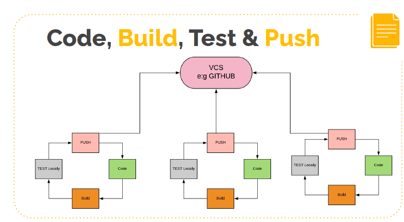
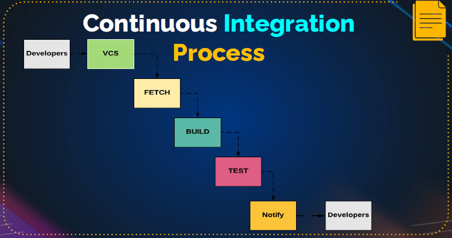
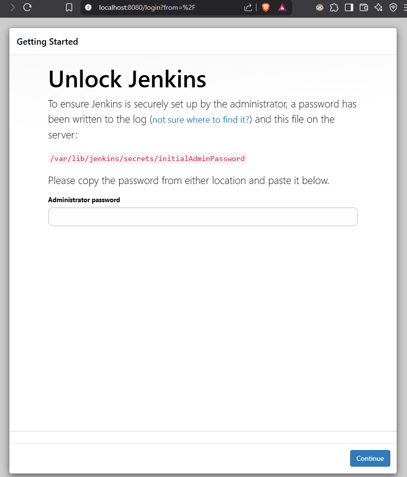
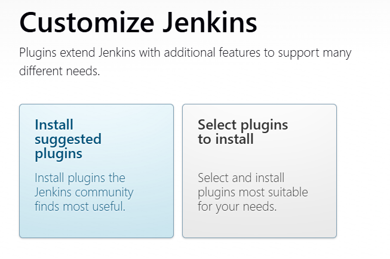

# Jenkins

## 🔄 **Understanding Continuous Integration (CI) & Why Jenkins Matters**  

### **🚀 What is Continuous Integration (CI)?**  
Developers **code → build → test → push** changes to a centralized version control system (like Git). This cycle repeats daily, but here’s the **problem**:  
- **Code merges frequently**, but **integration happens late**.  
- Bugs **pile up** over weeks/months → **painful, time-consuming fixes** near deadlines.  



### **💡 CI Solves This By:**  
✅ **Automating builds & tests** on **every commit**.  
✅ **Catching bugs early** → Developers fix issues **immediately**.  
✅ **Preventing "integration hell"** (last-minute chaos).  



### **🛠️ Jenkins: The Ultimate CI Tool**  
Jenkins **automates CI** by:  
1️⃣ **Monitoring code changes** (Git, SVN, etc.).  
2️⃣ **Triggering builds & tests** automatically.  
3️⃣ **Sending alerts** if something fails.  


#### **🌟 Why Jenkins?**  
- **Open-source & free** (no licensing costs).  
- **Extensible with 1,500+ plugins** (Git, Maven, Docker, AWS, etc.).  
- **Runs on any OS** (Linux, Windows, macOS). 

Jenkins Installation Prerequisites:
- **Java 8** or later.  
- **Any OS** (Linux, Windows, macOS).

### **🔧 Jenkins in Action**  
We’ll install Jenkins on an **EC2 (Ubuntu)** instance and:  
- Set up **auto-builds on Git commits**.  
- Integrate with **Maven, Nexus, etc.**  
- Explore plugins for **cloud automation & testing**.  

### **📌 Key Takeaways**  
1. **CI = Frequent code integration + automated testing**.  
2. **Jenkins automates CI/CD** and **scales with plugins**.  
3. **Next step**: Hands-on Jenkins installation!  

🚀 **Let’s dive in!** (Next: Launching EC2 & Installing Jenkins)

---

## 🚀 **Installing Jenkins with Vagrant: A Local Development Guide**  

### 🔍 **Why Vagrant Instead of EC2 or Docker?**  
- **Avoid AWS costs**: Vagrant runs locally for free (no cloud charges)  
- **Full VM environment**: More production-like than Docker containers  
- **Reproducible setup**: `Vagrantfile` ensures consistent configuration  
- **Better isolation**: Unlike Docker, provides complete OS-level separation  

*(We're not using EC2 to avoid cloud costs, and not using Docker to get full VM isolation for testing Jenkins in a more production-like environment. EC2 `t2.micro` which belongs to the free tier often fails to builds.)*

*(Note: For production use, consider migrating to cloud infrastructure after local testing.)*

### **🔧 Prerequisites**  
- **Vagrant** ([Install Guide](https://www.vagrantup.com/downloads))  
- **VirtualBox** ([Install Guide](https://www.virtualbox.org/wiki/Downloads))  
- **4GB+ RAM** recommended for smooth operation  

### **📥 Step 1: Set Up Vagrant Environment**  
Create a new directory and `Vagrantfile`:

```bash
mkdir 08_jenkins && cd 08_jenkins
mkdir jenkins-vagrant && cd jenkins-vagrant
vagrant init ubuntu/jammy64  # Ubuntu 22.04 base image
```

Edit the `Vagrantfile`:

```ruby
Vagrant.configure("2") do |config|
  config.vm.box = "ubuntu/jammy64"
  config.vm.hostname = "jenkins-vm"
  config.vm.boot_timeout = 500
  
  # Network configuration
  config.vm.network "forwarded_port", guest: 8080, host: 8080
  config.vm.network "private_network", ip: "192.168.33.10"
  
  # Resource allocation
  config.vm.provider "virtualbox" do |vb|
    vb.memory = "2048"  # 2GB RAM
    vb.cpus = 2
  end
  
  # Provisioning script
  config.vm.provision "shell", inline: <<-SHELL
    sudo touch /etc/cloud/cloud-init.disabled

    echo "Provisioning Jenkins..."
    # Install Java
    sudo apt update
    echo "Installing Java..."
    sudo apt install -y openjdk-17-jdk
    
    # Install Jenkins
    echo "Installing Jenkins..."
    curl -fsSL https://pkg.jenkins.io/debian-stable/jenkins.io-2023.key | sudo tee /usr/share/keyrings/jenkins-keyring.asc > /dev/null
    echo "deb [signed-by=/usr/share/keyrings/jenkins-keyring.asc] https://pkg.jenkins.io/debian-stable binary/" | sudo tee /etc/apt/sources.list.d/jenkins.list > /dev/null
    sudo apt update
    sudo apt install -y jenkins
    
    # Start Jenkins
    sudo systemctl start jenkins
    sudo systemctl enable jenkins
  SHELL
end
```

If provisioning is too slow then first create image and then execute commands manually. Use `apt-fast` to speed up the process:-
```bash
sudo add-apt-repository -y ppa:apt-fast/stable && \
sudo apt update && \
sudo apt install -y apt-fast && \

curl -fsSL https://pkg.jenkins.io/debian-stable/jenkins.io-2023.key | \
  sudo tee /usr/share/keyrings/jenkins-keyring.asc > /dev/null && \

echo "deb [signed-by=/usr/share/keyrings/jenkins-keyring.asc] https://pkg.jenkins.io/debian-stable binary/" | \
  sudo tee /etc/apt/sources.list.d/jenkins.list > /dev/null && \

sudo apt-fast update && \
sudo apt-fast install -y openjdk-21-jdk jenkins && \
sudo systemctl enable --now jenkins
```

### **🚀 Step 2: Launch and Provision VM**  
```bash
vagrant up  # This will download the box and run provisioning
```

```bash
vagrant ssh
ls /var/lib/jenkins
java -version
systemctl status jenkins
```

The `/var/lib/jenkins` directory contains the Jenkins installation files. It is the HOME directory for Jenkins.

### **🔐 Step 3: Access Jenkins**  
1. Get the initial admin password:  
   ```bash
   vagrant ssh -c "sudo cat /var/lib/jenkins/secrets/initialAdminPassword"
   ```
2. Access Jenkins at:  
   - `http://localhost:8080` (port-forwarded)  
   - OR `http://192.168.33.10:8080` (private network)  





### **⚙️ Step 4: Configure Jenkins**  
1. **Install suggested plugins**. Click on the "Select Plugins to Install" button to install plugins. Click on "Install" button to proceed. It will take sometime.
2. **Create first admin user** with secure credentials. Example: `admin`, `password`  
3. **Set Jenkins URL** to `http://localhost:8080` or `http://192.168.33.10:8080`  
4. Save and Finish. Click on the button:- "Start using Jenkins".

In the "Manage Jenkins" page, you can configure Jenkins by adding plugins, customizing the UI, and more.

### **📂 Key Directories (Inside VM)**  
- `/var/lib/jenkins` - Jenkins home  
- `/var/log/jenkins` - Log files  

Access them via:  
```bash
vagrant ssh
```

### **💡 Pro Tips**  
- **Suspend/resume VM**:  
  ```bash
  vagrant suspend  # Pause
  vagrant resume   # Continue
  vagrant halt     # Power off
  ```
- **Destroy and recreate**:  
  ```bash
  vagrant destroy -f && vagrant up
  ```

---

## Jobs in Jenkins

## 🤖 Jenkins Jobs: Freestyle vs Pipeline as Code 🚀

Before we dive deep into Jenkins, let's take a moment to understand what **jobs** in Jenkins really mean — and more importantly, how **Freestyle Jobs** compare with **Pipeline as Code** 🛠️.

Think of a Jenkins job like a **bash script** — it's an automated set of steps Jenkins executes for you. But how you define these steps can vary significantly.

### 📝 Freestyle Jobs: Click, Configure, Repeat

Freestyle jobs are the **GUI-based, form-filling** way of defining jobs in Jenkins. You click "Create Job", fill in some fields, save, and run it. It’s straightforward and great for beginners who are just getting started with Jenkins. You'll be using these in your first few lessons to get familiar with the platform.

But here’s the catch: if you need a full pipeline (fetching code ➡️ building ➡️ testing ➡️ deploying), you have to create **separate freestyle jobs** and manually link them. Now imagine doing that across multiple projects — it's a lot of repetitive "click, click, click" 😩. This manual setup becomes a nightmare to maintain or replicate elsewhere.

### 💻 Pipeline as Code: Automate Everything with Groovy

Enter **Pipeline as Code** 🧑‍💻. Instead of clicking around, you write your entire pipeline in **Groovy** — a simple scripting language. This script goes into a Jenkins job, and Jenkins reads it to know exactly what to do, step by step.

The benefits?

* ✅ **Everything is version-controlled** (just like your application code)
* ✅ **Reusable** across environments and projects
* ✅ **Scalable** and far easier to maintain
* ✅ Aligns perfectly with modern **DevOps best practices** — everything as code! 🔥

Today, Freestyle jobs are best used for learning. In real-world DevOps, **Pipeline as Code is the way forward**.

But don’t worry — before jumping into pipelines, we’ll explore Freestyle jobs first so you can understand Jenkins fundamentals 🧠.

🎥 So stick around and join me in the next video — we’ll get hands-on and see it all in action!

---

## 🛠️ Installing and Managing Tools in Jenkins: A Complete Guide

In this lecture, let’s dive into how Jenkins handles tools and plugins—two core pieces you’ll need to run successful builds. 🚀

Let’s say we want to build the **V Profile** project. What do we need? Well, we’d require:

* **Git** to clone the source code 🧬
* **Maven** to build the project 📦
* **JDK (Java Development Kit)** because Maven needs it to compile the code ☕

Now, while Jenkins gives us a friendly UI and plugins to manage tools, under the hood, it’s just executing commands on the underlying OS—in our case, a **Linux (Ubuntu)** machine. For example, when you run a build, Jenkins might simply run `mvn install` in the background.

### 💡 Tools vs Plugins – What You Must Know

Every time you add a new tool in Jenkins, remember two things:

1. You need the **plugin** (this enables the tool feature in Jenkins UI).
2. You need the **actual tool installed on the OS**.

For instance, you may install Maven in Jenkins, but it won’t work unless Maven is installed on the OS itself—or Jenkins installs it for you.

### 🧩 Managing Tools in Jenkins UI

To install tools via the UI:

1. Navigate to **Manage Jenkins → Global Tool Configuration**.
2. You’ll see options like **JDK**, **Git**, **Gradle**, **Maven**, **Node.js**, etc.

Are these the only tools? ❌ Not at all!

These options show up **only if the relevant plugins are installed**. For example, we see **Node.js** because we installed the **NodeJS plugin** earlier. If we had installed the **MSBuild** plugin, it would show up too.

### ⚙️ Example: Installing Maven 3.9.9 via Jenkins

1. Click **Add Maven**.
2. Name it something like `MAVEN_3.9`.
3. Select the version **3.9.9** (our V Profile project works best with 3.9.x).
4. Check the option **Install automatically** ✅.

Jenkins will handle the rest during the build.

### ☕ Installing JDK 17 (System-level)

Jenkins already has JDK 21, but let’s say we need JDK 17 for a specific project. Here’s what to do:

1. SSH into your Jenkins server 🖥️.

2. Run the command:

   ```bash
   sudo apt install openjdk-17-jdk -y  
   ```

3. Check installed JDKs:

   ```bash
   ls /usr/lib/jvm  
   ```

   You’ll likely see folders for both JDK 17 and 21.

4. Copy the path to JDK 17 (e.g. `/usr/lib/jvm/java-17-openjdk-amd64`).

5. In Jenkins, under **Add JDK**, name it `JDK_17`, uncheck “Install automatically,” and **manually paste the Java home path**.

This tells Jenkins where to find the correct JDK version during builds.

### ✅ Final Notes

So to summarize:

* Jenkins needs **both plugins and tools** to be set up correctly.
* Use **Jenkins UI** for tools like Maven that support automated installs.
* Use **OS-level commands** for tools like Java where manual path setup is needed.
* For this section of the course, make sure you have:

  * ✅ **Maven 3.9.9**
  * ✅ **JDK 17**

Also, take a few minutes to explore:

* 🔧 Tool configurations
* 📦 Plugin settings
* 🧩 Nodes
* 🛠️ Global configurations

We’ll cover each one through hands-on exercises in upcoming lectures—because that’s how we learn here: **by doing**! 💪

See you in the next one! 👨‍💻👩‍💻

---

## 🚀 Creating Your First Jenkins Job: A Hands-On Introduction 👨‍💻🔧

Welcome to Jenkins! 🎉 In this section, we’ll dive into the core of Jenkins—**creating a job**. A *job* in Jenkins is essentially a sequence of tasks or instructions that Jenkins executes to automate your development workflow. These tasks might include actions like cloning code, building it, generating artifacts, and even deploying them. 💡

Jenkins gives you the flexibility to run these jobs either on the Jenkins server itself or on additional connected agents (nodes), allowing for **distributed builds**. 🌐 You can scale Jenkins by adding agents and offloading work to them, improving performance and efficiency.

### 🛠 Setting Up Your First Freestyle Job

Let’s start by creating a **Freestyle Project** (we’ll explore Pipelines later). Click on **“New Item”**, give your job a name (e.g., `first-job`), select **Freestyle Project**, and click **OK**.

You’ll now see several important sections:

* **General**: Add a description to explain what your job does ✍️
* **Source Code Management (SCM)**: Where your code is coming from (e.g., Git). Choose "None".
* **Build Triggers**: When your job should run ⏱️. Skip for now..
* **Build Environment & Steps**: What Jenkins should do (e.g., run shell commands).
* **Post-build Actions**: What happens after the build completes

Start by adding some basic shell commands under **Build Steps** → **Execute Shell**. Try:

```bash
whoami
pwd
w
id
```

These commands will show the user running the job (usually `jenkins`), the working directory, and logged-in users.

Once saved, click **Build Now** and observe the job run. You’ll see build IDs like `#1`, `#2`, etc., with a ✅ indicating success. Click on a build’s ✅ to view the **Console Output** and understand what happened.

To edit the job, click on the job name and select **Configure**. Add one more separate build step (**Add build step** => **Execute Shell**):-

```bash
sudo apt update
```

### ⚠️ Understanding Permissions and Failures

Try adding a command like:

```bash
sudo apt update
```

This will fail because the `jenkins` user does **not** have sudo privileges. It's important to understand this—many build errors are permission-related, especially when working with system-level tools like Docker. 🐳

Jenkins visually tracks **build stability** through icons:

* 🌞 Sunny: Recent builds are successful
* 🌥 Cloudy: Some failures
* ⛈️ Thunderstorm: Consistent failures

### 📂 Working with Workspaces

Now let’s generate output from a job. **Replace the existing shell command (`sudo apt update`) with**:

```bash
cat /proc/cpuinfo > cpuinfo.txt
```

This saves CPU details to a text file in the job’s **workspace**. After the job runs, go to the job → **Workspace** to view or download the file. Workspaces are **temporary**—used during job execution and meant for transient data. You can clean them up by selecting **“Wipe Out Current Workspace”** 🧹.

### 📘 Console Output: Your Debugging Friend

When jobs fail or misbehave, always check the **Console Output**. If you need help, **share the full console log** when asking for support. It helps identify the root cause, especially in complex pipelines with hundreds of lines of output.

### 🧪 Experiment and Explore

Now it’s your turn—experiment with different settings, explore all job configuration options, and become familiar with Jenkins jobs. 💪 Look into:

* **Post-build Actions**
* **Plugins** that extend job capabilities
* **Nodes** and **tool configurations**

As we move forward, we’ll build more complex jobs, introduce Pipelines, and leverage plugins to supercharge our DevOps automation. Jenkins is an amazing playground to master CI/CD concepts—get hands-on, break things, fix them, and learn by doing! 🔄💥

Stay tuned for the next lecture—more exciting builds ahead! 🚧✨

---

## 🚀 Building Your First Jenkins Job: From GitHub to Artifact with Maven

Welcome to this exciting hands-on session! 👋 In this part of the journey, we’ll walk through creating a **Jenkins build job** that fetches source code from GitHub, builds it using Maven, and archives the resulting artifact. Along the way, we’ll explore tool configuration, build steps, error handling, and best practices for plugin usage. Let’s dive in! 💡

### 🛠️ Tool Setup: JDK & Maven

First, we head to **Manage Jenkins > Tools > JDK Installations**.
We’ve already configured **JDK 17**, now we’ll add **JDK 21** by simply duplicating the existing configuration and updating the path. This will let us select the appropriate JDK per project—handy when your codebase supports multiple versions! ✅

### 📦 Creating the Freestyle Project

Click on **New Item** → choose a **Freestyle Project** and name it something like `vprofile-build`.
In the description, mention the purpose—e.g., *Build artifact from vprofile source code*.

Scroll to the **JDK section** and select your desired JDK version. Projects may depend on different Java versions (e.g., JDK 17, 21, etc.), and Jenkins makes switching easy. 🔁

### 🔗 Fetching Code from GitHub

Under **Source Code Management**, choose **Git**.
Paste the repository URL (e.g., `https://github.com/Atcoder/vprofile-project`) and select the appropriate branch (like `atom`).

No credentials are needed for public repos, but for private ones, Jenkins lets you add various types of credentials—SSH keys, GitHub apps, passwords, and more. 🔐 You can add them under **Add > Jenkins**, and select them from the dropdown.

Need help with an unfamiliar option? Just click the ❓ icon next to any field for a quick explanation.

### 🧪 Build Steps: Use Plugins Over Shell

In **Build Steps**, avoid using `Execute Shell` unless absolutely necessary.
Instead, use the **"Invoke top-level Maven targets"** plugin—it’s easier to manage and offers more options.

* **Maven version**: Select the installed version (e.g., `3.9`)
* **Goals**: Add `install`
* Advanced settings let you tweak `pom.xml` location, JVM options, etc.

💡 **Pro tip:** Always prefer plugins—they're robust, offer version control, and reduce errors compared to shell scripts.

### 📁 Post-Build Actions: Archive the Artifact

Scroll to **Post-build Actions** and select **"Archive the artifacts"**.
Use a pattern like `**/*.war` to find and archive any WAR files created during the build.

This ensures even if the workspace is wiped, your artifacts are preserved and accessible via Jenkins. 🔍

### 💥 Simulating Errors and Fixes

Let’s try changing the Maven version to **default system Maven**—which might not exist.
When you run the job, it fails, and the console output will show a file-not-found or execution error.

🔍 Use the **Console Output** to debug these issues. Jenkins error logs, though verbose, provide critical clues.

Now, install Maven manually on the Jenkins server using:

```bash
sudo apt update && sudo apt install maven -y
```

Check version via `mvn -version`. If it’s not compatible (e.g., 3.8 vs required 3.9), the build will fail due to version mismatch—just like in real-world projects! 😅

### 🔬 Experiment Freely: Create a Test Job

Rather than starting from scratch, **copy the existing job**:

* Go to **New Item**
* Name it `vprofile-test`
* Choose “Copy from” → select `vprofile-build`

Now change:

* **Goal** to `test`
* Remove **Archive Artifact** step

This isolated setup lets you test different JDKs, Maven versions, and branches without affecting the main job.

### 🧩 Exercise for You

There’s a branch called `jdk-11` in the source code. Your challenge:

1. SSH into the Jenkins server and install **JDK 11**
2. Add it in Jenkins’ Global Tool Configuration
3. Create a new job using this JDK and the `jdk-11` branch
4. Select different Maven versions and make the build successful ✅

This practical task strengthens your Jenkins fundamentals and prepares you for real-world CI/CD challenges. 🔧

---

In the next lecture, we’ll explore **plugins**, **versioning**, and smarter ways to manage your build artifacts. Stay tuned and keep experimenting! 🚀

---