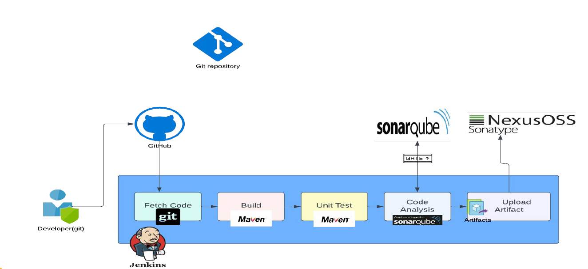

# Jenkins Pipeline: A Hands-On Introduction

## 1. 🔁 Understanding the Continuous Integration Pipeline Flow

Hello and welcome! 👋 In this session, we’re going to break down the **Continuous Integration (CI) pipeline** that we’ll be setting up over the next few videos. Before jumping into implementation, it’s crucial to **understand the flow** – how code travels from development to deployment-ready artifacts. 🛠️



We're focusing on a set of tools to demonstrate this CI pipeline:

- 🧰 **Jenkins** (for orchestration)
- 🧠 **Git** (for version control)
- 🏗️ **Maven** (for building Java projects)
- 🧪 **SonarQube** and **Checkstyle** (for code quality and analysis)
- 📦 **Nexus** (for artifact storage)

These tools are just examples. Your actual project might use different ones, but the **core flow remains the same** – so grasp the concept, and you’ll be able to apply it with any toolset. 💡

### 👨‍💻 The Developer's Role

The journey begins with the **developer** writing and testing code locally. Once confident, they **push the code to a GitHub repository**. This is the centralized source from where the pipeline kicks off.

### ⚙️ Jenkins Triggers the Pipeline

Jenkins is configured with Git plugins that detect code changes. As soon as a commit is made, Jenkins:

1. 📥 **Fetches the latest code** using Git.
2. 🧱 **Builds the project** using Maven (in our case, for Java – but it can be adapted to other languages and tools).

### ✅ Testing and Code Quality Checks

After building the code, Jenkins runs **unit tests** using Maven's testing frameworks. These tests verify that each piece of functionality works as expected. The output is usually in XML format – ready for reporting.

Next comes **code analysis** 🕵️. Tools like SonarQube and Checkstyle assess:

- Bugs 🐞
- Vulnerabilities 🔐
- Coding standards 🧹
- Code smells and maintainability 💭

These tools generate detailed reports and dashboards. You can even enforce **quality gates** in SonarQube – if the code doesn’t meet the criteria, the build fails and the pipeline stops 🚫.

### 📦 Artifact Creation and Distribution

If everything passes, Jenkins proceeds to **version the artifact** and upload it to a **Nexus repository**. This versioned artifact is now ready for deployment to any environment. 🌍

### 🔁 Tool Agnostic Flow

Even though we’re using Jenkins, GitHub, SonarQube, and Nexus here, you can replicate the same pipeline with other CI tools like:

- 🧪 GitLab CI
- 🌀 CircleCI
- 🎍 Bamboo
- And many others!

The flow remains: **Fetch → Build → Test → Analyze → Publish**.

### 🎬 What’s Next?

In the next video, we’ll start implementing this CI pipeline step by step. For now, take a moment to review the flow. Once you're confident with it, join me in the next video and let's bring this pipeline to life! 🚀

## 2. 🚀 Steps for Continuous Integration Pipeline

Alright, let’s walk through the essential steps to build a complete **Continuous Integration (CI) pipeline** from scratch! 🌟

Steps:-

1. Jenkins Setup
2. Nexus Setup
3. SonarQube Setup
4. Configure Security Groups
5. Install Plugins
6. Integrate:- Jenkins with Nexus and SonarQube
7. Write the Pipeline Script
8. Set Up Notifications

### 🧰 Step 1: Set Up Jenkins

We’ll begin by setting up **Jenkins**. If you already have it installed, great—you can reuse the existing setup. Otherwise, we’ll guide you through launching a new Jenkins server.

### 📦 Step 2: Set Up Nexus & SonarQube

Next, we’ll provision **Nexus** (artifact repository) and **SonarQube** (code quality scanner). All three servers—Jenkins, Nexus, and SonarQube—will be launched on EC2 instances using **user data bash scripts** for automation. 🖥️💡

### 🔐 Step 3: Configure Security Groups

As we spin up these services, we’ll also check and configure the **security groups** to ensure smooth communication between the servers. 🔄🔐

### 🧩 Step 4: Install Jenkins Plugins

We’ll install all the essential **Jenkins plugins** one by one—Nexus plugin, SonarQube plugin, Git plugin, Maven plugin, and more. 🔌

### 🔗 Step 5: Integrate Jenkins with Nexus & SonarQube

Time to connect the dots!

- **Nexus integration** is quick—just save your credentials.
- **SonarQube** requires a few extra steps, and we’ll walk through each one together. 🧭

### 📝 Step 6: Create the Pipeline Script

With everything set up, we’ll write the **pipeline script** that ties all these components together. Then, we’ll execute it to see our CI pipeline in action! ⚙️🚦

### 📣 Step 7: Set Up Notifications

Finally, we’ll configure **automated notifications** 📩 so that if any part of the pipeline fails, you’re immediately alerted.

Now, some of this may not fully click just yet—and that’s okay! This section is your **roadmap**. Whenever you're unsure or feel lost, come back here to reorient yourself. 🗺️✨

---

## 3. 🧑‍💻 Setting Up Nexus & SonarQube on EC2: A Hands-On Guide ☁️📦🧪

> 💡 **Note:** Due to cost constraints, Jenkins is already running locally on a VM instead of an EC2 instance. Nexus and SonarQube, also will be hosted on local VM instead of EC2.

⚠️ Why Not EC2 for Nexus/SonarQube (in our case):

- ❌ `t2.micro` (free tier) is **not sufficient** — both tools are memory-intensive (Nexus \~2–3 GB, SonarQube \~3–4 GB)
- 💰 Upgrading to `t2.medium` or `t3.medium` is **not free tier** — you'll incur hourly costs
- 💤 Keeping them stopped when not in use can help, but you’ll still risk forgetting or getting billed

| Tool      | Where to Run     | Reason                                    |
| --------- | ---------------- | ----------------------------------------- |
| Jenkins   | Local Vagrant VM | Already done ✅ – stable, cost-free       |
| Nexus     | Local Vagrant VM | Needs more RAM than free EC2 provides     |
| SonarQube | Local Vagrant VM | Needs 3–4 GB RAM — too heavy for free EC2 |

In this section, we’ll launch and configure two essential services for our CI pipeline—**Nexus** (artifact repository) on Amazon Linux 2023 and **SonarQube** (code quality analysis)—on Ubuntu 24.04. These services will be hosted on separate EC2 instances.

### 📦 Nexus Setup (Amazon Linux 2023)

We'll deploy **Nexus** on an Amazon Linux 2023 EC2 instance using a **User Data script**. Here's how it works:

- Clone the setup scripts from: `https://github.com/vikas9dev/vprofile-project` (branch: `atom`)
- Navigate to the `userdata` folder and locate `nexus-setup.sh`
- The script performs:
  - JDK 17 installation
  - Directory setup under `/opt/nexus`
  - Binary download and extraction
  - Nexus user creation
  - Systemd service configuration and activation ✅

🔐 **Security Group Setup for Nexus:**

- Allow SSH (port 22) from **your IP**
- Allow HTTP (port 8081) from:

  - **Your IP** (to access via browser)
  - **Jenkins Security Group** (to upload artifacts)

💡 _Important:_ Jenkins must be able to communicate with Nexus on port 8081.

==================================================================================

**For VM Environment**

> Go to [nexus-vagrant](/08_jenkins/nexus-vagrant/) and start the VM. It will use specified `nexus-setup.sh` script to setup Nexus. Once done, you can access Nexus at: `http://localhost:8081`

Vagrant Networking:- Ensure both VMs (Jenkins and Nexus) are on the same private network and can talk to each other. For example, in both Vagrantfiles:

```ruby
config.vm.network "private_network", ip: "192.168.56.10"  # Jenkins VM
config.vm.network "private_network", ip: "192.168.56.11"  # Nexus VM
```

**Firewall (firewalld)**

CentOS 9 may have **`firewalld`** enabled, which can block ports **just like a security group** would.

Check and either **allow port 8081** or disable `firewalld`:

Option A: Allow port 8081

```bash
sudo firewall-cmd --permanent --add-port=8081/tcp
sudo firewall-cmd --reload
```

Option B: Disable firewalld entirely (not for production):

```bash
sudo systemctl stop firewalld
sudo systemctl disable firewalld
```

✅ 3. **Ensure Nexus is Listening on 0.0.0.0**

This is already done in your `nexus.properties`:

```properties
application-host=0.0.0.0
```

==================================================================================

### 🧪 SonarQube Setup (Ubuntu 24.04)

SonarQube will be set up on **Ubuntu 24.04** using `sonar-setup.sh`, which handles:

- JDK 17 installation
- PostgreSQL setup and database creation
- SonarQube binary installation and extraction
- NGINX configuration as a reverse proxy (port 80 → 9000)
- System-level tuning to meet SonarQube’s performance needs:

  - Update `/etc/sysctl.conf` and `/etc/security/limits.conf`
  - Reboot the instance to apply these changes 🔄

📁 Configuration:

- `sonar.properties` contains database credentials (`sonar`/`admin123`) and other runtime settings.
- Systemd is used to manage and enable the SonarQube service.

🔐 **Security Group Setup for SonarQube:**

- Allow SSH (port 22) and HTTP (port 80) from:

  - **Your IP** (for browser access)
  - **Jenkins Security Group** (to upload analysis results)

💡 _Also_: SonarQube needs to **send feedback to Jenkins**. So, make sure Jenkins’ security group allows incoming traffic on **port 8080** from **SonarQube’s Security Group**.

### 🧪⚙️ Quick Tips:

- Use **T2 or T3 medium instances** (Nexus and SonarQube need more RAM).
- Always **shut down** instances when not in use to save costs 💰.
- If using a VPN or proxy, disable it temporarily during setup and update your security group IP rules accordingly 🌐.

==================================================================================

**For VM Environment**

> Go to [sonar-vagrant](/08_jenkins/sonar-vagrant/) and start the VM. It will use specified `sonar-setup.sh` script to setup SonarQube. Once done, you can access SonarQube at: `http://localhost:9000`

==================================================================================

### ✅ Verifying the Setup:

- **Nexus:** Visit `http://<nexus-public-ip>:8081`, login as `admin`, and retrieve the initial password `/opt/nexus/sonatype-work/nexus3/admin.password`. Complete setup and set a new password (like `xI#84HPn9,3_`).
- **SonarQube:** Visit `http://<sonarqube-public-ip>`, login with `admin/admin`, and reset the password (like `;87c42nJyvaX`). You’ll soon see beautiful dashboards once we connect Jenkins!

Nexus:-
username: `admin`
password: `xI#84HPn9,3_`

SonarQube:-
username: `admin`
password: `;87c42nJyvaX`

We need to use these credentials to connect Jenkins to SonarQube.

Once both services are running successfully, go ahead and **shut them down** to avoid unnecessary billing. We’ll bring them back up when we’re ready to integrate them into the pipeline.

---

## 4. 🔌 Jenkins Plugin Setup: Powering Up with Nexus, SonarQube & More 🚀

Now that we’ve successfully set up **Jenkins**, **Nexus**, and **SonarQube** 🎉 — and opened the required ports in the security group:

- 🔓 **Port 8080** for Jenkins (open to all)
- 🔓 **Port 8081** for Nexus (open to all)
- 🔓 **Ports 80 & 9000** for SonarQube (open to all)

…it’s time to extend Jenkins’ capabilities by installing some essential plugins! 🛠️

### 🔧 Plugins to Install

These plugins will help us integrate our CI/CD pipeline seamlessly with the tools we’ve set up:

1. **Nexus Artifact Uploader** 📦
   Enables Jenkins to upload build artifacts directly to Nexus.

2. **SonarQube Scanner** 📊
   Integrates SonarQube code analysis into your Jenkins pipeline.

3. **Pipeline Maven Integration** 🔁
   Required for using Maven inside Jenkins pipelines.

4. **Pipeline Utility Steps** 🧩
   Adds helpful functions like reading files or manipulating strings in pipeline scripts.

5. **Build Timestamp Plugin** 🕓
   Useful for versioning artifacts with timestamps (search for "timestamp" in the plugin list).

> 💡 **Note:** The **Git plugin** is already installed by default — no need to install it manually.

### 📥 How to Install

1. Go to **Manage Jenkins** → **Manage Plugins** → **Available** tab.
2. 🔍 Search and check the following plugins one by one:

   - `Nexus Artifact Uploader`
   - `SonarQube Scanner`
   - `Build Timestamp`
   - `Pipeline Maven Integration`
   - `Pipeline Utility Steps`

3. ✅ Once selected, click **Install without restart**.

That’s it! You're now ready to build powerful pipelines with Jenkins, Nexus, and SonarQube. More plugins will be added in upcoming lessons! 💪

---

## 5. 📜 Understanding Pipeline as Code in Jenkins: A Beginner’s Guide 🚀

So, what exactly is _Pipeline as Code_? It’s Jenkins’ powerful way of automating your entire CI/CD pipeline using a simple text file called the **Jenkinsfile** (yep, capital "J" 📄). This file can live alongside your source code in your repository or be written directly inside a Jenkins job.

A **Jenkinsfile** defines each stage of your CI/CD pipeline—from pulling the code, building, testing, to deploying. It’s written in a DSL (Domain-Specific Language) that’s close to Groovy, but don’t worry—you don’t need to be a Groovy expert to write one! 💡

There are two styles of writing Jenkins pipelines:

- **Scripted** (legacy, complex)
- **Declarative** (modern, cleaner, easier) ✅
  In our project, we’re using the **declarative** syntax.

### 🔍 Core Concepts of a Jenkinsfile

- **pipeline**: The main block that defines your pipeline.
- **agent**: Specifies where the pipeline should run (e.g., `agent any` allows Jenkins to pick any available node).
- **tools**: Declare build tools like Maven, JDK, or SonarScanner.
- **environment**: Set environment variables to be used across stages.
- **stages**: Define the main segments of the pipeline, like build, test, deploy.
- **steps**: Commands or actions to be executed inside each stage.
- **post**: Actions to run after a stage completes (e.g., archive artifacts, send emails 📧).

```groovy
pipeline {
  agent {

  }
  tools {

  }
  environment {

  }
  stages {
    // it can have multiple stage
    stage("Clone code from VCS"){
      // each stage can have steps & post actions
    }
    stage("Maven Build"){

    }
    stage("Publish to Nexus Repository Manager"){

    }
  }
}
```

```groovy
pipeline {
  stage("BuildAndTest"){
    steps{
      sh "mvn clean install"
    }
    post{
      success{
        echo "Build and Test Success"
        echo "Now Archiving Artifact"
        archiveArtifacts artifacts: '**/target/*.war'
      }
    }
  }
}
```

In VS Code you can install the `Jenkinsfile Support` extension by `ivory-lab` to get syntax highlighting and auto-completion for Jenkinsfiles. [Not required:-] You can also install Groovy extension to get syntax highlighting and auto-completion for Groovy files.

Here’s a simple example of a [`Jenkinsfile`](/08_jenkins/pipeline/01_jenkins_pipeline_intro/Jenkinsfile) with stages:

```groovy
pipeline {
    agent any
    tools {
        maven 'MAVEN_3.9'
        jdk 'JDK_21'
    }
    stages {
        stage('Fetch Code') {
            steps {
                git branch: 'main', url: 'https://github.com/your-repo/project.git'
            }
        }
        stage('Unit Test') {
            steps {
                sh 'mvn test'
            }
        }
        stage('Build') {
            steps {
                sh 'mvn install -DskipTests'
            }
            post {
                success {
                    echo '🎉 Build Successful! Archiving artifact...'
                    archiveArtifacts artifacts: '**/*.war'
                }
            }
        }
    }
}
```

You can save this file as **Jenkinsfile** in your repo, or paste it directly in the _Pipeline_ section of a Jenkins job. Then hit _Build Now_ and watch Jenkins do its magic! 🧙‍♂️✨

Go to Jenkins => New Item => Add Item Name `vprofile-pipeline` => Item Type: `Pipeline` => Next => Pipeline => Choose `Pipeline Script` (from the dropdown) - (It has also option to fetch from SCM like GitHub) => Paster your Jenkinsfile code in script section => Save => Build Now.

In the stages section, you can see the steps that Jenkins will execute for each stage.After Build, In the Pipeline Overview section, you can see the overall structure of the pipeline.

### 🛠️ Need Help? Use Documentation & ChatGPT Wisely

Explore the [official Jenkins pipeline documentation](https://www.jenkins.io/doc/book/pipeline/) to understand each section and syntax deeply. Or ask ChatGPT for help—but remember, it’s only useful _if you understand the basics_. AI can't replace your understanding, but it sure can _enhance_ it!

As we move forward, we’ll start adding real-world steps like:

- Code analysis with SonarQube 🔍
- Quality gate enforcement ✅
- Artifact versioning 📦
- Deployment pipelines and more! 🚀

If you're clear with this basic structure, you're ready to join the next phase of DevOps automation. Let’s go build something awesome! 💪

---

## 6. 🛠️ Integrating SonarQube with Jenkins for Code Analysis 🚀

Welcome aboard! 👋 By now, you've had a taste of pipeline-as-code, and you're ready to take the next big step in setting up a complete Continuous Integration (CI) pipeline. You’ve already learned how to **fetch**, **build**, and **test** your code. Now, it’s time to level up with **code analysis** 🧪.

### 🤔 What is Code Analysis?

Code analysis is essentially a deeper inspection of your codebase—not to test the software functionality, but to test the **quality** of the code itself. It checks your code against best practices, identifies potential bugs 🐞, flags vulnerabilities 🔐 (like those from the [OWASP Top 10](https://owasp.org/www-project-top-ten/)), and helps developers write cleaner, more secure, and maintainable code.

Think of it as a linter + security scanner + bug detector — all in one! 🔍

Since it’s impossible for developers to keep up with every best practice across all languages, code analysis tools automate this process. These tools identify issues **early** in the development cycle so you can avoid surprises in production 🚫🐛.

### 🧰 Popular Code Analysis Tools

There are many tools available such as:

- ✅ Checkstyle
- ✅ Cobertura
- ✅ PMD
- ✅ OWASP Dependency-Check
- ✅ **SonarQube** (our star for today 🌟)

In this course, we’ll use **Checkstyle** and **SonarQube** to implement code analysis in our pipeline.

### 🔗 Integrating SonarQube with Jenkins

Before we write our pipeline code for code analysis, we need to integrate SonarQube with Jenkins. Here's how:

#### 1️⃣ Install the SonarQube Scanner Tool in Jenkins

- Go to **Manage Jenkins > Tools**.
- Scroll to **SonarQube Scanner installations** (not the `SonarScanner for MSBuild installations`) and click **Add SonarQube Scanner**.
- Choose version `6.2.1.4610` (or a stable version you prefer).
- Name it something like `Sonar6.2`—you’ll use this name in your pipeline code.
- Save it.

#### 2️⃣ Add SonarQube Server Details in Jenkins

- Go to **Manage Jenkins > Configure System**.
- Find **SonarQube Servers**, check mark on the “Environment Variables”, and click **Add SonarQube**.
- Provide:
  - A name (e.g., `sonar-server`) - we’ll use this name in our pipeline code.
  - URL (e.g., `http://<private-ip>` private IP of the SonarQube server from EC2 instance — since Jenkins and SonarQube are in the same VPC). For VM env, use `http://192.168.56.12`. Port info is not required because internally Nginx is used to listen on port 80.
  - Authentication Token (generated from SonarQube).

> 🎟️ To generate a token:
>
> - Log in to **SonarQube Server**
> - Go to **My Account** (Right Top Corner where "A" icon is) > **Security**
> - Generate a **User Token** (e.g., name `jenkins`)
> - Copy it and **store it in Jenkins as a Secret Text credential** (`Manage Jenkins > Credentials` > Kind: `Secret text` > Secret: `copied-sonar-token` > ID: `sonar-token`, Description: `sonar-token`)

Make sure to allow **port 80** from the Jenkins security group to the SonarQube security group if you're using AWS or any other cloud platform.

### ✅ Summary

By now, you've:

- Understood **why code analysis matters** ✅
- Installed the **SonarQube Scanner tool** in Jenkins 🛠️
- Added your **SonarQube server details and authentication token** 🔐

You're all set to integrate code analysis into your Jenkins pipeline! 🎯 In the next step, we’ll write the code to scan your source code and upload the results to the SonarQube server.

Stay tuned and get ready to boost your code quality! 💪

---

## 7. 🛠️ Adding Checkstyle & SonarQube to Your Jenkins Pipeline

Alright, let's take our Jenkins pipeline to the next level! 🛠️

Start by opening the pipeline code from our previous session. We're going to **add a new stage** to run **Checkstyle** and test it right away. Let's get moving! 🏃‍♂️💨 See Jenkinsfile [here](/08_jenkins/pipeline/02_checkstyle_integration/Jenkinsfile).

First, insert the **test stage** right after the **build stage**. If you're unsure about block closures in your editor (like matching braces), just click on any opening or closing tag—Sublime Text (which I'm using) will underline the corresponding pair for you. You can use any editor you prefer: Sublime, VS Code, or anything else. 🧑‍💻

Now, let's add the new stage to run Checkstyle using Maven. Here's the process:

1. **Copy the test stage**, paste it below, and rename it to something like `Checkstyle Analysis`.
2. Replace the Maven command from `test` to `checkstyle:checkstyle`. This tells Maven to perform static code analysis using the Checkstyle plugin.
3. Jenkins will download the necessary dependencies, run the analysis, and generate results.

```groovy
stage('Checkstyle Analysis') {
    steps {
        sh 'mvn checkstyle:checkstyle'
    }
}
```

Next, let’s head to Jenkins:

- Click **New Item**, name it something like `checkstyle-pipeline`, and choose **Pipeline**.
- Paste your updated pipeline script, click **Save**, and hit **Build Now**.

Once it finishes, check the **Console Output** to confirm that the Checkstyle stage ran successfully. You’ll notice it’s downloading plugins and then performing the code analysis. 🎉

To view the results:

- Go to the job’s **Workspace** > `target/` > and find the file named `checkstyle-result.xml`. 🗂️
- It’s an XML file—readable, but not exactly friendly for humans 🦸‍♂️. That’s where **SonarQube** comes in.

💡 Instead of reading raw XML, we'll use **SonarQube Dashboard** to visualize all our analysis reports (Checkstyle, JUnit, JaCoCo, etc.).

### 🔍 Integrating SonarQube Scanner in Jenkins

Next, we’ll configure a pipeline stage to run **SonarQube Scanner** via the CLI and upload the results to the SonarQube server. See the Jenkinsfile [here](/08_jenkins/pipeline/03_sonarqube_integration/Jenkinsfile). Here’s the plan:

1. Define a new stage: `Sonar Code Analysis`.
2. Use the `withSonarQubeEnv()` block and set the environment name (you configured this earlier in Jenkins as `sonar-server`).
3. Create an `environment` variable to point to your scanner tool, e.g., `Sonar 6.2`.
4. Inside the stage’s `steps`, use a **multi-line shell command** to run the scanner. Use triple quotes for multiline bash commands.
5. Add all necessary parameters:

   - `sonar.projectKey`, `sonar.projectName`, `sonar.projectVersion`
   - `sonar.sources` (e.g., `src`)
   - Paths to reports: surefire, JaCoCo, Checkstyle

📌 Remember: the scanner binary path usually looks like `${SCANNER_HOME}/bin/sonar-scanner`.

```groovy
stage('Sonar Code Analysis') {
    environment {
        scannerHome = tool 'Sonar6.2' // Name as configured in Jenkins: Manage Jenkins > Global Tool Configuration
    }
    steps {
        echo '======== Sonar Code Analysis ========'
        withSonarQubeEnv('sonar-server') { // Name as configured under Jenkins > Configure System > SonarQube servers
            sh '''
                ${scannerHome}/bin/sonar-scanner \
                -Dsonar.projectKey=vprofile \
                -Dsonar.projectName=vprofile-repo \
                -Dsonar.projectVersion=1.0 \
                -Dsonar.sources=src/ \
                -Dsonar.java.binaries=target/test-classes/com/visualpathit/account/controllerTest/ \
                -Dsonar.junit.reportsPath=target/surefire-reports/ \
                -Dsonar.jacoco.reportsPath=target/jacoco.exec \
                -Dsonar.java.checkstyle.reportPaths=target/checkstyle-result.xml
            '''
        }
    }
}
```

Once ready, create a **new Jenkins job**, New Item => name it `code-analysis`, paste the updated pipeline script, and hit **Build Now**.

After the build completes:

- Check the **Console Output**.
- You should see a message like `ANALYSIS SUCCESSFUL` and logs indicating the results were uploaded.
- Open **SonarQube Dashboard**, go to **Projects**, and you'll see the new project listed with all your code quality metrics! 🎯📈

Using this setup, you’ve now automated static code analysis and visualization—two big steps toward a robust CI/CD pipeline. Next up: we’ll explore **Quality Gates** and how to enforce code quality thresholds in your pipeline. Stay tuned! 🧪✅

---

## 8.🚦 Mastering SonarQube Quality Gates & Webhooks in Jenkins 🧠🔧

Imagine seeing **30 bugs** and hundreds of **code smells** in your project—😱 overwhelming, right? SonarQube makes sense of it all using something called **Quality Gates** ✅❌. By default, SonarQube uses a predefined gate to decide if your code passes or fails, but you can (and should) create your **own customized quality gates** for better control 🎯.

Let’s walk through how you can create one:

* Head over to **Quality Gates**, click **Create**, and name it something like `vprofile-G`.
* Unlock editing ✏️ and **add a condition** like (Use `On Overall Code`):
  *“If overall bugs > 10, mark the analysis as failed.”*
  (Since you already have 30 bugs, this threshold ensures your code will fail if issues persist 🐞).

Now, link this new gate to your project:

* Go to the project, click the dropdown for **Quality Gate**, and select your custom gate instead of the default one 🔄. It will say:- "Changes will be applied after the next analysis."

But here’s the catch: your Jenkins pipeline might just **upload the analysis results** without actually checking the Quality Gate status 😬. To enable real-time gate validation, we need to **integrate SonarQube with Jenkins using a webhook** 🔁.

Here’s how to set it up:

1. Navigate to your **SonarQube Project Settings** → **Webhooks** → click **Create**.
2. Name it `jenkins-ci-webhook`.
3. Use the format:
   `http://<JENKINS_PRIVATE_IP>:8080/sonarqube-webhook`
   (No trailing slash! 🛑).
   For VM use:- `http://192.168.56.10:8080/sonarqube-webhook`
4. Double-check the spelling. One typo and it won't work 😅.
5. Make sure Jenkins’ **security group allows inbound traffic** on port 8080 from the SonarQube server 🔐.

Once that’s in place:

* Update your **Jenkins pipeline code** to include the **`Quality Gate` stage** 🧱.
* This stage will pause and wait for SonarQube’s response—**pass or fail based on your custom rules** ⚖️. See the Jenkinsfile [here](/08_jenkins/pipeline/04_sonarqube_with_quality_gates_integration/Jenkinsfile).

```groovy
stage('Quality Gate') {
    steps {
        timeout(time: 1, unit: 'HOURS') {
            waitForQualityGate abortPipeline: true
        }
    }
}
```

When you re-run the pipeline:

* SonarQube will analyze the code and trigger the webhook.
* Jenkins will receive the result and fail the stage if the **bug threshold is breached** ❌.
* Check the **console output**—you should see `Pipeline aborted due to quality gate failure` 🛑.

Finally, once you're done testing, in SonarQube > Projects > Quality Gates, you can:

* Either raise the bug threshold to 50 🧹
* Or switch back to the default **Sonar Way** quality gate for smoother builds 🟢.

🔁 Now you're all set to continue with the pipeline and deploy confidently, knowing your code meets the quality standards you defined!

---

## 9. 🚀 Uploading Artifacts to Nexus Repository with Jenkins

Now that we’ve successfully built, tested, and analyzed our code 🧪, it’s time for the next big step: **uploading our artifacts to a Nexus repository** 📦. But before jumping in, let’s understand what Nexus is and why it’s so useful in a CI/CD pipeline.

### 🤔 What is Nexus Sonatype Repository?

**Nexus (by Sonatype)** is a **universal artifact repository** — a centralized location to store, retrieve, and manage build artifacts and dependencies. It supports a wide range of repository formats like:

* 📦 **Maven** – for Java dependencies
* 🐧 **APT/YUM** – for Debian/RHEL packages
* 🐳 **Docker** – for container images
* 🧪 **NuGet** – for .NET packages
* 📦 **npm** – for Node.js packages

While we’ll use Nexus to **upload our own artifacts**, it can also act as a **proxy repository**, caching third-party dependencies to speed up builds and reduce external network dependency 🌐.

### 🛠️ Setting Up the Nexus Repository

We’ve already installed and launched the Nexus server (runs on Java ☕). To start using it:

1. Access Nexus in your browser using the **public IP** on port **8081**
2. Log in with the admin credentials you set earlier
3. Navigate to **Settings → Repositories → Create Repository**
4. Select **Maven2 (hosted)** as the repository type – since we want to upload artifacts
5. Name it something like `vprofile-repo`
6. Click **Create Repository**

> 🧠 Use “hosted” for uploading, “proxy” for downloading, and “group” to combine both.

### 🔐 Add Nexus Credentials in Jenkins

Before integrating Nexus with Jenkins, we need to securely store our Nexus login credentials.

1. Go to **Jenkins → Manage Jenkins → Credentials**
2. Select **Global credentials → Add Credentials**
3. Choose **“Username with password”**
4. Enter your Nexus credentials (e.g., `admin` / `xI#84HPn9,3_`)
5. Set the **ID** as `nexus-login` and give it a description

> ⚠️ Never expose credentials publicly — this is just for local testing!

In the next section, we’ll write the Jenkins pipeline code to **publish the artifact** to our Nexus repository, handle versioning, and make it accessible to deployment or ops teams 🚀.

See you in the next part, where the real DevOps magic begins! ✨

---

## 10. 📦 Automating Artifact Upload to Nexus via Jenkins Pipeline

Now that our CI pipeline is building and testing code smoothly ✅, it’s time to take things a step further — by **automatically uploading the artifact to a Nexus repository** using Jenkins! Let’s walk through how to achieve this with a plugin and some smart scripting 🚀.

### 🔌 Using the Nexus Artifact Uploader Plugin

To upload artifacts to Nexus, we’ll use the **Nexus Artifact Uploader** plugin. If you’re not familiar with the syntax, don’t worry! You can quickly search online or ask tools like **ChatGPT** 🧠 for guidance. Just search for:

```
Nexus Artifact Uploader pipeline syntax
```

You'll find examples from plugin documentation and GitHub repositories. The key parameters we’ll use include:

* `nexusVersion`: e.g., `nexus3`
* `protocol`: usually `http`
* `nexusUrl`: your Nexus server’s IP and port
* `groupId`: logical grouping (we used `QA`)
* `version`: this should be **dynamic** — we'll combine Jenkins environment variables to generate unique versions like `BuildID-Timestamp`
* `repository`: your hosted Nexus repository (e.g., `vprofile-repo`)
* `credentialsId`: Jenkins credentials to authenticate with Nexus (e.g., `nexus-login`)
* `artifactId`, `file`, and `type`: details of the artifact to be uploaded

### 🕒 Configuring Dynamic Versioning

To ensure each build has a **unique version**, we’ll use Jenkins environment variables:

* `${env.BUILD_ID}` – current build number
* `${env.BUILD_TIMESTAMP}` – we enable this via the **Build Timestamp Plugin**

To set up the timestamp:

1. Go to **Manage Jenkins → Configure System**
2. Scroll to **Build Timestamp**, enable it ✅
3. Customize the format (e.g., `yyMMdd_HHmm` for clarity)

This gives you version strings like `37-250526_1015`, ensuring that every artifact remains distinct 💡.

### 🧩 Building the Jenkins Pipeline Stage

We’ll add a new `stage` in our [Jenkinsfile](/08_jenkins/pipeline/05_nexus_upload_artifact/Jenkinsfile) to upload the artifact to Nexus:

```groovy
stage('Upload Artifact') {
  steps {
    nexusArtifactUploader(
      nexusVersion: 'nexus3',
      protocol: 'http',
      nexusUrl: '192.168.56.11:8081',
      groupId: 'QA',
      version: "${env.BUILD_ID}-${env.BUILD_TIMESTAMP}",
      repository: 'vprofile-repo',
      credentialsId: 'nexus-login',
      artifacts: [
        [artifactId: 'vprofile-app',
         classifier: '',
         file: 'target/vprofile-v2.war',
         type: 'war']
      ]
    )
  }
}
```

Just ensure:

* You’ve created the right **Nexus credentials** in Jenkins (we used `nexus-login`)
* The artifact path (`target/vprofile-v2.war`) matches your build output

In Jenkins, Create a new pipeline job, name it something like `vprofile-nexus-pipeline`, and add the Jenkinsfile from the previous section. Build it for 3-4 times to generate different artifact versions and upload them to Nexus.

In Nexus, you should see the artifacts in the **Browse** section. Browse > vprofile-repo > QA.

### 🛠️ Troubleshooting Tips

💥 **Build Not Running?**
If Jenkins hangs at *“Waiting for next available executor”*, it could be due to:

* Master node out of disk space 💾
  Fix it by SSH-ing into the Jenkins server and clearing the workspace:

```bash
cd /var/lib/jenkins/workspace
rm -rf *
```

Then restart Jenkins:

```bash
sudo systemctl restart jenkins
```

💥 **Artifact Upload Fails?**
Check:

* The **Nexus URL/IP** — make sure it’s correct
* Your **repository name**
* The **artifact file path**
* The **Jenkins credentials** being used

### 🧪 Confirming the Upload

Once the pipeline succeeds, go to **Nexus → Browse → vprofile-repo**, and you’ll see folders like:

```
QA/
  └── 37-250526_1015/
         └── webapp-37-250526_1015.war
```

Each build gets its own versioned folder — mission accomplished! 🎯

### ⏭️ What’s Next?

Manually checking pipeline success can be tedious 😓. In the **next stage**, we’ll integrate **notifications**, so Jenkins can automatically inform us whether the build succeeded or failed via email, Slack, or any preferred channel 📩🔔.

If you’re continuing, keep your instances running. If not, remember to shut them down 📴.

---

## 11. 🚀 Automating Notifications in Jenkins with Slack Integration

So far, we’ve built a solid **Continuous Integration (CI) pipeline**—but there's still something missing. 🤔 While our configuration from start to finish looks great, it *lacks* automation at the very beginning **and** proper notifications at the end.

Currently, we're triggering the pipeline **manually**—clicking a button each time. Ideally, the pipeline should trigger **automatically** whenever a developer pushes code to the repository. We’ll cover that auto-trigger setup in an upcoming section. For now, let's focus on the **end part** of the pipeline: **notifications**. 📢

When a pipeline run **passes or fails**, developers should be notified instantly. Jenkins supports a wide variety of notification plugins like:

* 📩 Email
* 💬 Slack
* 🗨️ Google Chat
* 📱 SMS
* 🛰️ Amazon SNS
* 🧑‍💻 Skype
* 🧰 Webhooks
* 🧵 Zoom, Jabber, and many more...

In this session, we'll integrate **Slack**, one of the most popular collaboration tools in the industry. If you're not already using it, now's a great time to get started—it combines real-time chat with powerful integrations.

### 🛠️ Step-by-Step: Integrating Slack with Jenkins

1. **Install the Slack Notification Plugin in Jenkins**

   * Go to **Manage Jenkins → Plugins → Available**
   * Search for `Slack Notification`
   * Install and restart Jenkins if prompted

2. **Set Up a Slack Workspace**

   * Visit [Slack](https://slack.com) and sign up or log in
   * Create a **workspace** (e.g., `vikas9devops`)
   * Set up a **channel** (e.g., `#devops-ci-cd`)

3. **Add Jenkins Integration in Slack**

   * Go to Slack **Apps Marketplace**. On Google, search for `Slack Marketplace`.
   * Search for `Jenkins CI` and click **Add to Slack**
   * Choose your channel (e.g., `#devops-ci-cd`) and allow access
   * Slack will generate a **token**—save it securely

4. **Configure Slack in Jenkins**

   * In **Manage Jenkins → Configure System**
   * Find the **Slack section**
   * Enter your **Workspace name** (e.g., `vikas9dev`) and **channel name** (e.g., `#devops-ci-cd`)
   * Add the token as a **Secret Text credential**
   * Test the connection to ensure it works ✅. Slack channel will get notified about this test.

### ✍️ Modify the Jenkins Pipeline

Now let’s update the pipeline to send Slack notifications after every build—whether it succeeds or fails.

```groovy
def color_map(String buildStatus) {
    return buildStatus == 'SUCCESS' ? 'good' : 'danger'
}

pipeline {
    agent any

    stages {
        // your regular stages here
    }

    post {
        always {
            echo 'Sending Slack notification...'
            slackSend (
                channel: '#devops-ci-cd',
                color: color_map(currentBuild.currentResult),
                message: "${currentBuild.currentResult}: Job '${env.JOB_NAME} [${env.BUILD_NUMBER}]' \n ${env.BUILD_URL}"
            )
        }
    }
}
```

✅ On success, the message will show up in green.
❌ On failure, it’ll appear in red.

### 🧪 Testing It Out

To test both success and failure notifications:

* Run your existing pipeline—it should send a green ✅ Slack message.
* Add a dummy stage with an invalid command to simulate a failure. For example:

```groovy
stage('Test Slack') {
    steps {
        sh 'this-will-fail'
    }
}
```

Then re-run the pipeline, and you’ll see a red ❌ notification in Slack.

This integration ensures that your team stays informed, without needing to check Jenkins constantly. 🧘‍♂️ Now that we’ve wrapped up notifications, we're ready to move on to the next phase: **containerization**! 🐳 In the next section, we’ll package our artifacts into Docker images and learn how to manage them effectively. 🎯

---

